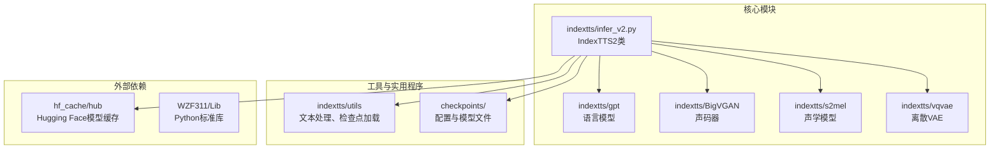
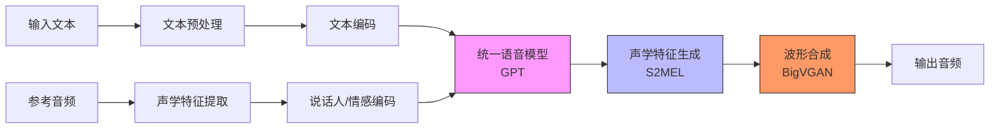
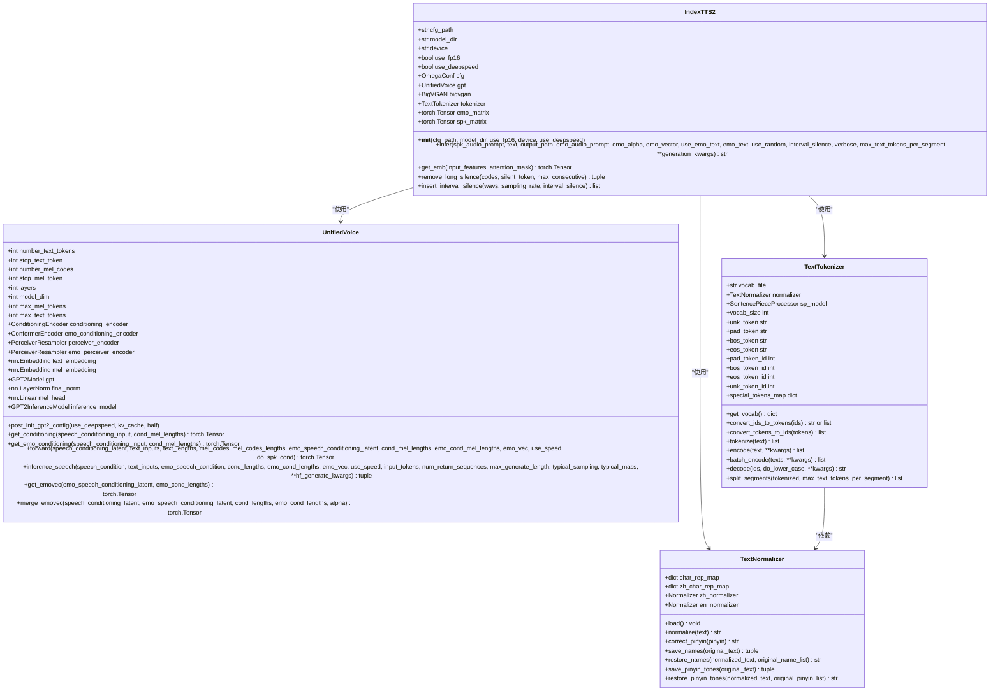
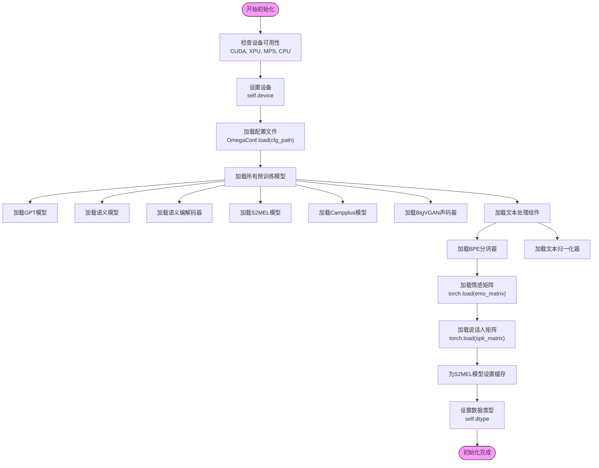
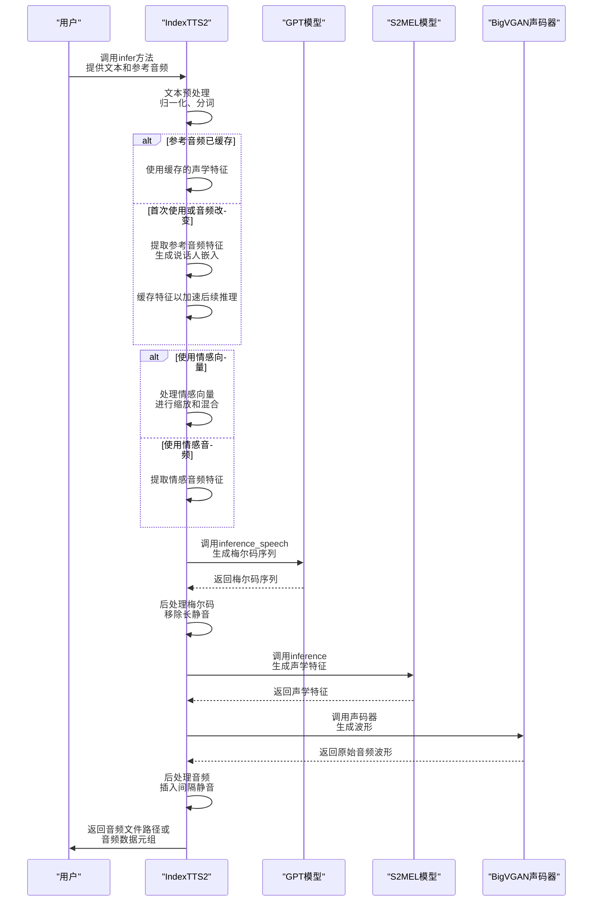

# Python API使用

<cite>
**本文档中引用的文件**   
- [infer_v2.py](file://indextts/infer_v2.py)
- [front.py](file://indextts/utils/front.py)
- [model_v2.py](file://indextts/gpt/model_v2.py)
- [text_utils.py](file://indextts/utils/text_utils.py)
- [common.py](file://indextts/utils/common.py)
</cite>

## 目录
1. [简介](#简介)
2. [项目结构](#项目结构)
3. [核心组件](#核心组件)
4. [架构概述](#架构概述)
5. [详细组件分析](#详细组件分析)
6. [依赖分析](#依赖分析)
7. [性能考虑](#性能考虑)
8. [故障排除指南](#故障排除指南)
9. [结论](#结论)

## 简介
本文档旨在为开发者提供IndexTTS2类的全面Python API参考。该类是IndexTTS语音合成系统的核心，提供了从文本到语音的高级接口。文档详细介绍了类的初始化方法`__init__`和主要的语音合成方法`tts`（在代码中为`infer`），包括所有参数说明、返回值、使用示例和性能优化选项。通过本指南，开发者可以轻松地将高质量的语音合成功能集成到自己的Python项目中。

## 项目结构
IndexTTS项目是一个模块化的语音合成系统，其核心功能位于`indextts`目录下。系统通过多个子模块协同工作，实现从文本预处理、声学建模到音频生成的完整流程。

**Diagram sources**
- [infer_v2.py](file://indextts/infer_v2.py#L37-L608)
- [gpt/model_v2.py](file://indextts/gpt/model_v2.py#L0-L747)
- [BigVGAN/bigvgan.py](file://indextts/BigVGAN/bigvgan.py#L0-L100)
- [s2mel/models.py](file://indextts/s2mel/models.py#L0-L50)
- [vqvae/xtts_dvae.py](file://indextts/vqvae/xtts_dvae.py#L0-L50)

**Section sources**
- [infer_v2.py](file://indextts/infer_v2.py#L0-L739)
- [project_structure](file://workspace)

## 核心组件
`IndexTTS2`类是整个语音合成系统的入口点。它封装了复杂的模型加载、文本处理和音频生成逻辑，为开发者提供了一个简洁的API。该类在初始化时会加载多个预训练模型，包括用于文本编码的GPT模型、用于声学特征生成的S2MEL模型和用于波形合成的BigVGAN声码器。其核心方法`infer`实现了端到端的语音合成流程，从输入文本和参考音频开始，经过多阶段的神经网络推理，最终输出高质量的音频文件。

**Section sources**
- [infer_v2.py](file://indextts/infer_v2.py#L37-L608)

## 架构概述
IndexTTS2的架构是一个典型的级联式语音合成系统，由多个深度学习模型按顺序连接而成。该架构设计旨在实现高质量、高自然度的语音合成。

**Diagram sources**
- [infer_v2.py](file://indextts/infer_v2.py#L37-L608)
- [gpt/model_v2.py](file://indextts/gpt/model_v2.py#L0-L747)
- [s2mel/models.py](file://indextts/s2mel/models.py#L0-L50)
- [BigVGAN/bigvgan.py](file://indextts/BigVGAN/bigvgan.py#L0-L100)

## 详细组件分析

### IndexTTS2类分析
`IndexTTS2`类是IndexTTS系统的主接口，提供了完整的语音合成功能。其设计遵循了面向对象的最佳实践，将复杂的语音合成流程封装在简洁的API之下。

#### 类图

**Diagram sources**
- [infer_v2.py](file://indextts/infer_v2.py#L37-L608)
- [gpt/model_v2.py](file://indextts/gpt/model_v2.py#L0-L747)
- [utils/front.py](file://indextts/utils/front.py#L0-L536)

#### 初始化方法分析
`__init__`方法是`IndexTTS2`类的构造函数，负责初始化所有必要的模型和配置。它接受多个参数来控制模型的行为和性能。

**Diagram sources**
- [infer_v2.py](file://indextts/infer_v2.py#L37-L150)

#### 语音合成方法分析
`infer`方法是`IndexTTS2`类的核心，实现了从文本到语音的完整合成流程。它是一个复杂的多阶段推理过程。

**Diagram sources**
- [infer_v2.py](file://indextts/infer_v2.py#L608-L1000)

### 核心参数详解
本节详细解释`IndexTTS2`类中关键参数的含义和取值范围。

#### 初始化参数
| 参数 | 类型 | 默认值 | 描述 |
| :--- | :--- | :--- | :--- |
| `cfg_path` | str | "checkpoints/config.yaml" | 配置文件路径，包含模型超参数和路径信息 |
| `model_dir` | str | "checkpoints" | 模型文件目录，包含所有预训练权重 |
| `use_fp16` | bool | False | 是否使用FP16半精度进行推理，可提升速度但可能轻微降低质量 |
| `device` | str | None | 计算设备，如'cuda:0'、'cpu'。若为None，则自动检测可用设备 |
| `use_cuda_kernel` | bool | None | 是否使用BigVGAN的自定义CUDA内核进行优化 |
| `use_deepspeed` | bool | False | 是否使用DeepSpeed进行推理加速，可显著提升推理速度 |

**Section sources**
- [infer_v2.py](file://indextts/infer_v2.py#L37-L150)

#### 语音合成参数
| 参数 | 类型 | 默认值 | 描述 |
| :--- | :--- | :--- | :--- |
| `spk_audio_prompt` | str | 无 | 参考音频文件路径，用于提取说话人声音特征 |
| `text` | str | 无 | 要合成的文本内容 |
| `output_path` | str | 无 | 输出音频文件的保存路径 |
| `emo_audio_prompt` | str | None | 情感参考音频路径，用于控制合成语音的情感 |
| `emo_alpha` | float | 1.0 | 情感混合系数，控制情感参考音频的影响程度 |
| `emo_vector` | list | None | 8维情感向量，直接控制语音的情感特征 |
| `use_emo_text` | bool | False | 是否从文本中自动检测情感 |
| `emo_text` | str | None | 用于情感检测的文本，若为None则使用主文本 |
| `use_random` | bool | False | 是否随机选择情感模式 |
| `interval_silence` | int | 200 | 段落间插入的静音时长（毫秒） |
| `verbose` | bool | False | 是否输出详细日志信息 |
| `max_text_tokens_per_segment` | int | 120 | 每个文本段落的最大token数，用于长文本分段 |

**Section sources**
- [infer_v2.py](file://indextts/infer_v2.py#L608-L1000)

#### 情感向量详解
`emo_vector`参数是一个8维浮点数列表，用于精确控制合成语音的情感特征。每个维度对应一种特定的情感，其值范围通常在0.0到1.2之间。

| 索引 | 情感 | 描述 | 取值范围 |
| :--- | :--- | :--- | :--- |
| 0 | 高兴 (happy) | 表达快乐、兴奋的情绪 | 0.0 - 1.2 |
| 1 | 愤怒 (angry) | 表达生气、激动的情绪 | 0.0 - 1.2 |
| 2 | 悲伤 (sad) | 表达难过、低落的情绪 | 0.0 - 1.2 |
| 3 | 恐惧 (afraid) | 表达害怕、紧张的情绪 | 0.0 - 1.2 |
| 4 | 反感 (disgusted) | 表达厌恶、嫌弃的情绪 | 0.0 - 1.2 |
| 5 | 低落 (melancholic) | 表达忧郁、沉思的情绪 | 0.0 - 1.2 |
| 6 | 惊讶 (surprised) | 表达惊讶、意外的情绪 | 0.0 - 1.2 |
| 7 | 自然 (calm) | 表达平静、中性的情绪 | 0.0 - 1.2 |

**重要说明**：这些情感向量是相互竞争的。通常，应将一种情感的值设为1.0，其他情感设为0.0，以获得最清晰的情感表达。例如，`[1.0, 0.0, 0.0, 0.0, 0.0, 0.0, 0.0, 0.0]`表示纯粹的高兴情绪。

**Section sources**
- [infer_v2.py](file://indextts/infer_v2.py#L608-L1000)
- [infer_v2.py](file://indextts/infer_v2.py#L1000-L1200)

## 依赖分析
`IndexTTS2`类依赖于多个外部库和内部模块，这些依赖关系构成了其功能的基础。

**Diagram sources**
- [infer_v2.py](file://indextts/infer_v2.py#L0-L739)

## 性能考虑
`IndexTTS2`类提供了多种性能优化选项，开发者可以根据硬件条件进行选择。

### 性能优化选项
| 选项 | 描述 | 适用场景 | 性能影响 |
| :--- | :--- | :--- | :--- |
| `use_fp16=True` | 启用FP16半精度推理 | GPU内存充足，追求速度 | 显著提升推理速度，轻微降低音质 |
| `use_deepspeed=True` | 启用DeepSpeed推理优化 | 支持CUDA的GPU | 显著提升推理速度，减少内存占用 |
| `use_cuda_kernel=True` | 使用BigVGAN自定义CUDA内核 | 支持CUDA的GPU | 提升声码器生成速度 |
| `device="cuda:0"` | 强制使用GPU | 拥有高性能GPU | 大幅提升推理速度 |
| `device="cpu"` | 使用CPU推理 | 无GPU环境 | 速度较慢，但兼容性最好 |

**性能提示**：在大多数情况下，同时启用`use_fp16`和`use_deepspeed`可以获得最佳的性能/质量平衡。对于长文本合成，建议调整`max_text_tokens_per_segment`参数以避免内存溢出。

**Section sources**
- [infer_v2.py](file://indextts/infer_v2.py#L37-L150)

## 故障排除指南
本节提供常见问题的解决方案。

### 常见问题
| 问题 | 可能原因 | 解决方案 |
| :--- | :--- | :--- |
| 推理速度慢 | 使用CPU或未启用优化选项 | 尝试使用GPU并启用`use_fp16`和`use_deepspeed` |
| 生成音频有爆音 | 情感向量不匹配 | 检查`emo_vector`是否正确，确保总和不超过1.2 |
| 内存不足 | 文本过长或批次过大 | 减小`max_text_tokens_per_segment`或使用CPU模式 |
| DeepSpeed加载失败 | DeepSpeed未正确安装 | 运行`pip install deepspeed`并重新启动 |
| 参考音频无效 | 音频文件损坏或格式不支持 | 确保音频为WAV格式且采样率为16kHz或22kHz |

**Section sources**
- [infer_v2.py](file://indextts/infer_v2.py#L37-L150)
- [infer_v2.py](file://indextts/infer_v2.py#L608-L1000)

## 结论
`IndexTTS2`类提供了一个强大而灵活的Python API，用于高质量的语音合成。通过精心设计的初始化参数和语音合成方法，开发者可以轻松地将语音合成功能集成到各种应用中。无论是基础的文本转语音，还是复杂的零样本语音克隆和情感控制合成，该API都能提供出色的性能和音质。建议开发者根据具体需求和硬件条件，合理选择性能优化选项，以获得最佳的用户体验。