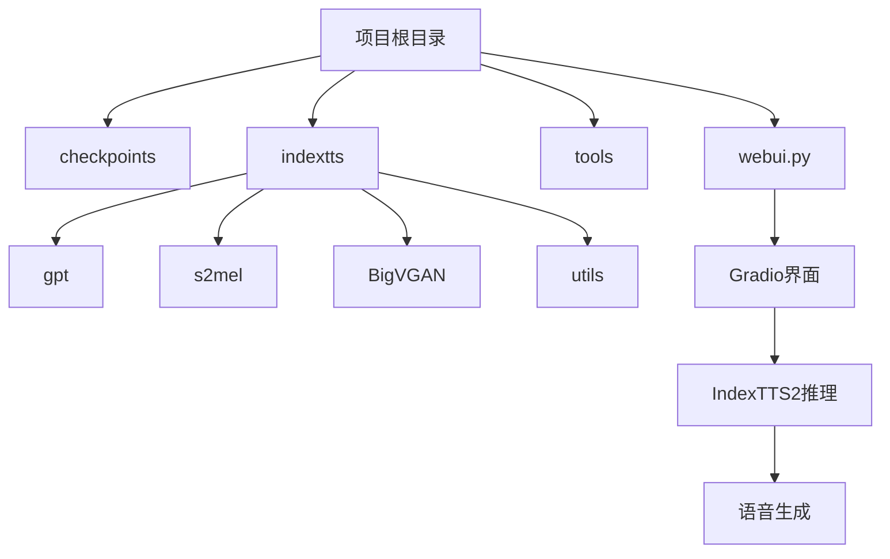
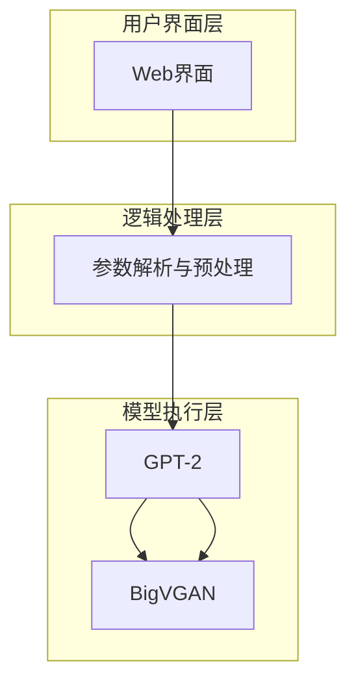
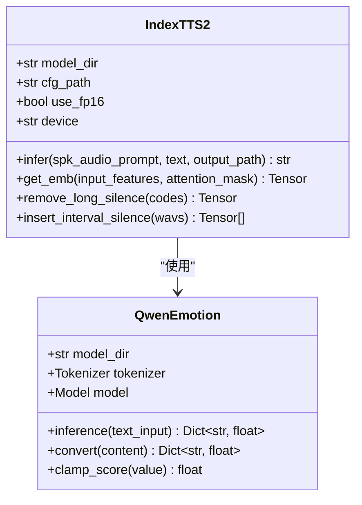
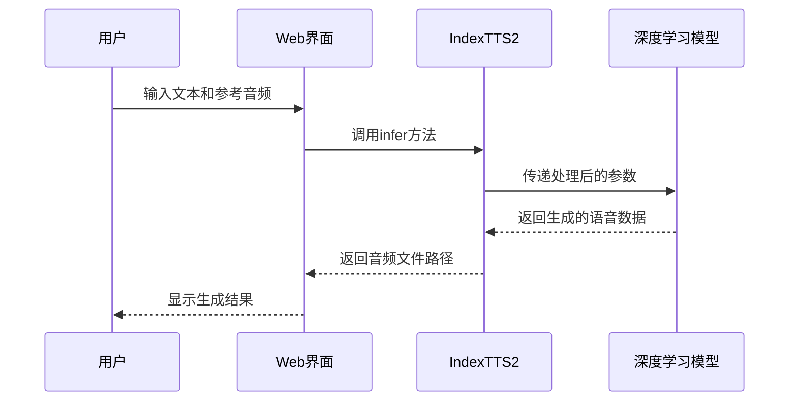
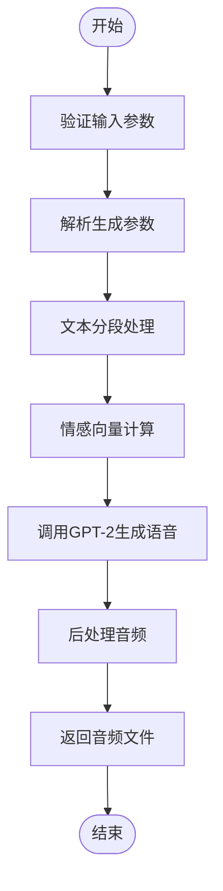
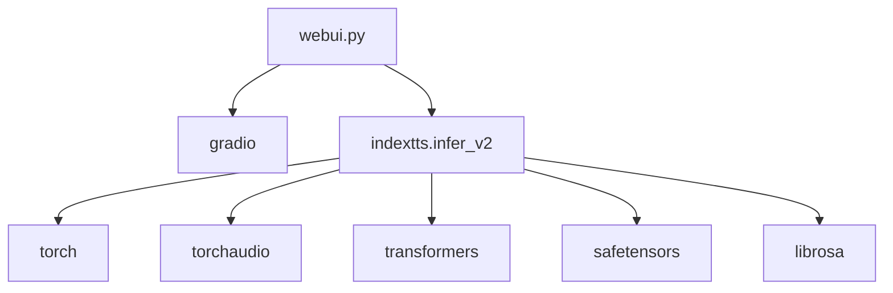

# Web界面使用

<cite>
**本文档引用的文件**  
- [webui.py](file://webui.py)
- [indextts/infer_v2.py](file://indextts/infer_v2.py)
- [indextts/utils/webui_utils.py](file://indextts/utils/webui_utils.py)
- [indextts/utils/text_utils.py](file://indextts/utils/text_utils.py)
</cite>

## 目录
1. [简介](#简介)
2. [项目结构](#项目结构)
3. [核心组件](#核心组件)
4. [架构概述](#架构概述)
5. [详细组件分析](#详细组件分析)
6. [依赖分析](#依赖分析)
7. [性能考虑](#性能考虑)
8. [故障排除指南](#故障排除指南)
9. [结论](#结论)

## 简介
本指南旨在帮助用户通过Gradio构建的Web界面使用IndexTTS2语音合成系统。该系统支持情感控制、多语言输入和高级参数调节，使用户能够生成高质量、富有表现力的语音。本文档将详细介绍界面各组件的功能、操作流程以及常见问题的解决方案，确保即使没有编程背景的用户也能顺利使用。

## 项目结构
IndexTTS2项目采用模块化设计，主要包含模型检查点、推理脚本、工具库和Web界面。核心功能由`indextts`目录下的模块实现，而`webui.py`文件负责构建用户友好的图形界面。

**图示来源**  
- [webui.py](file://webui.py#L1-L402)
- [indextts/infer_v2.py](file://indextts/infer_v2.py#L1-L739)

**本节来源**  
- [webui.py](file://webui.py#L1-L402)
- [indextts/infer_v2.py](file://indextts/infer_v2.py#L1-L739)

## 核心组件
Web界面的核心是`webui.py`文件，它利用Gradio框架创建交互式界面，并通过`IndexTTS2`类处理语音合成请求。用户输入的文本和音频参考通过一系列预处理步骤，最终生成自然流畅的语音输出。

**本节来源**  
- [webui.py](file://webui.py#L1-L402)
- [indextts/infer_v2.py](file://indextts/infer_v2.py#L1-L739)

## 架构概述
系统架构分为三层：用户界面层、逻辑处理层和模型执行层。用户界面层由Gradio构建，提供直观的操作体验；逻辑处理层负责参数解析和数据预处理；模型执行层调用预训练的深度学习模型完成语音合成。

**图示来源**  
- [webui.py](file://webui.py#L1-L402)
- [indextts/infer_v2.py](file://indextts/infer_v2.py#L1-L739)

## 详细组件分析
### 音频生成组件分析
Web界面提供了完整的音频生成流程，从输入文本到输出语音，每一步都经过精心设计以确保最佳用户体验。

#### 对象导向组件

**图示来源**  
- [indextts/infer_v2.py](file://indextts/infer_v2.py#L1-L739)

#### API/服务组件

**图示来源**  
- [webui.py](file://webui.py#L1-L402)
- [indextts/infer_v2.py](file://indextts/infer_v2.py#L1-L739)

#### 复杂逻辑组件

**图示来源**  
- [webui.py](file://webui.py#L1-L402)
- [indextts/infer_v2.py](file://indextts/infer_v2.py#L1-L739)

**本节来源**  
- [webui.py](file://webui.py#L1-L402)
- [indextts/infer_v2.py](file://indextts/infer_v2.py#L1-L739)

## 依赖分析
系统依赖于多个Python库和预训练模型，这些依赖关系确保了语音合成的高效性和准确性。

**图示来源**  
- [webui.py](file://webui.py#L1-L402)
- [indextts/infer_v2.py](file://indextts/infer_v2.py#L1-L739)

**本节来源**  
- [webui.py](file://webui.py#L1-L402)
- [indextts/infer_v2.py](file://indextts/infer_v2.py#L1-L739)

## 性能考虑
为了优化性能，系统采用了多种技术，包括FP16推理、CUDA内核加速和DeepSpeed支持。这些技术显著提高了语音生成的速度，同时保持了高质量的输出。

## 故障排除指南
### 常见问题及解决方案
- **模型加载失败**：确保`checkpoints`目录下存在所有必需的模型文件，如`bpe.model`、`gpt.pth`等。
- **音频上传错误**：检查上传的音频文件格式是否为WAV，并确保文件大小不超过限制。
- **生成速度慢**：尝试启用FP16或CUDA内核加速选项，或减少文本长度以提高处理速度。

**本节来源**  
- [webui.py](file://webui.py#L1-L402)
- [indextts/infer_v2.py](file://indextts/infer_v2.py#L1-L739)

## 结论
通过本指南，用户可以全面了解如何使用IndexTTS2的Web界面进行语音合成。从简单的文本输入到复杂的情感控制，系统提供了丰富的功能来满足不同需求。希望这份文档能帮助您顺利使用这一强大的语音合成工具。