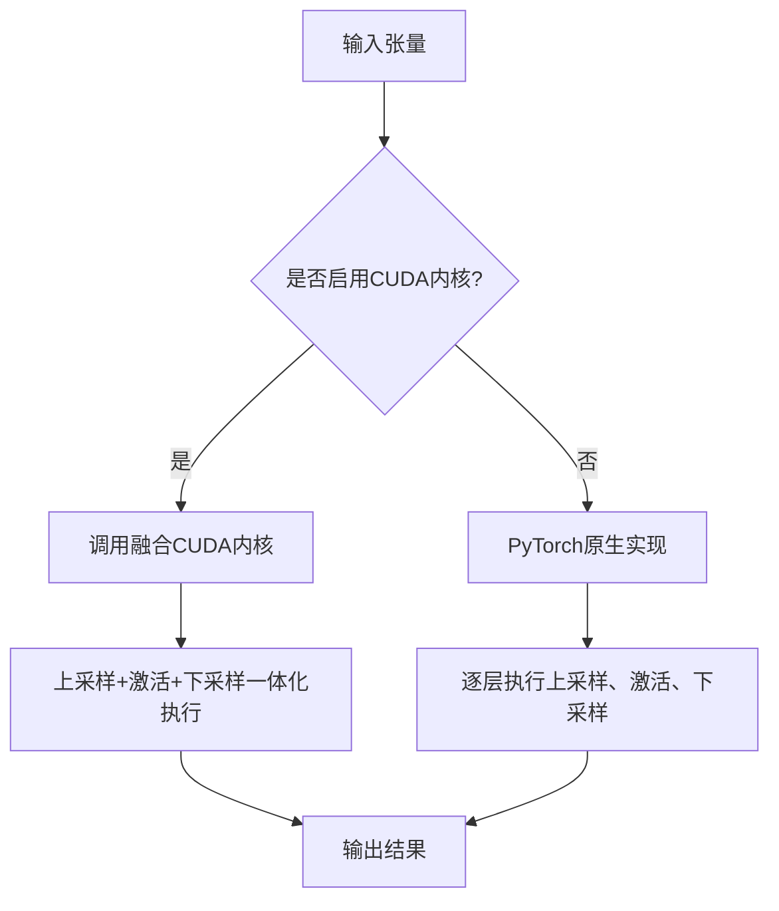

# 性能优化

<cite>
**本文档中引用的文件**  
- [activation1d.py](file://indextts/BigVGAN/alias_free_activation/cuda/activation1d.py)
- [anti_alias_activation_cuda.cu](file://indextts/BigVGAN/alias_free_activation/cuda/anti_alias_activation_cuda.cu)
- [bigvgan.py](file://indextts/BigVGAN/bigvgan.py)
- [config.yaml](file://checkpoints/config.yaml)
</cite>

## 目录
1. [简介](#简介)
2. [FP16半精度推理](#fp16半精度推理)
3. [CUDA内核优化](#cuda内核优化)
4. [BigVGAN中的反混叠激活函数](#bigvgan中的反混叠激活函数)
5. [性能基准与硬件适配建议](#性能基准与硬件适配建议)
6. [配置与启用方法](#配置与启用方法)
7. [总结](#总结)

## 简介
本项目通过多种技术手段实现高性能语音合成，重点优化推理速度和资源利用率。核心优化策略包括使用FP16半精度计算、集成自定义CUDA内核以加速关键操作，以及采用反混叠激活函数提升音质的同时保持高效计算。本文档系统性地介绍这些优化技术的实现原理、配置方式及其对显存占用和计算效率的影响，帮助用户在不同硬件环境下最大化系统运行效率。

## FP16半精度推理
项目支持FP16（半精度浮点数）推理模式，显著降低显存占用并提升计算吞吐量。通过将模型权重和中间激活值从FP32转换为FP16，可在现代GPU上利用Tensor Core实现高达2倍的推理加速。该模式特别适用于部署阶段，在保证语音生成质量的同时减少内存带宽压力。启用FP16后，模型在推理过程中自动进行精度转换，无需修改网络结构。

**Section sources**
- [bigvgan.py](file://indextts/BigVGAN/bigvgan.py#L450-L455)

## CUDA内核优化
项目集成了高度优化的自定义CUDA内核，用于加速BigVGAN中的关键操作——反混叠激活函数（Anti-Aliasing Activation）。该内核直接在GPU上融合上采样、激活和下采样操作，避免了多次内核启动和内存往返开销，从而大幅提升计算效率。

### 自定义CUDA内核实现
位于 `indextts/BigVGAN/alias_free_activation/cuda/` 目录下的CUDA内核实现了高效的反混叠激活函数。核心文件 `anti_alias_activation_cuda.cu` 包含一个融合的前向传播核函数 `anti_alias_activation_forward`，它在一个CUDA kernel中完成以下操作：
- 使用预定义滤波器进行上采样卷积
- 应用Snake或SnakeBeta周期性激活函数
- 执行下采样卷积恢复原始序列长度

此融合策略消除了传统实现中多个独立操作带来的调度延迟和中间结果存储开销。

### 内核调用与数据流
CUDA内核通过PyTorch扩展接口被调用，输入为张量形式的音频特征。内核采用分块处理策略，每个线程块处理固定长度的序列片段（BUFFER_SIZE=32），并通过共享内存优化数据访问模式。支持float16、float32等多种数据类型，并通过宏定义实现跨精度调度。

**Section sources**
- [anti_alias_activation_cuda.cu](file://indextts/BigVGAN/alias_free_activation/cuda/anti_alias_activation_cuda.cu#L50-L250)
- [activation1d.py](file://indextts/BigVGAN/alias_free_activation/cuda/activation1d.py#L30-L75)

## BigVGAN中的反混叠激活函数
BigVGAN使用反混叠激活函数来提升生成音频的质量，防止高频失真。标准实现通过分离的上采样、激活和下采样模块完成，而本项目通过CUDA内核实现了完全融合的版本。

### 融合激活模块设计
`Activation1d` 类根据配置决定是否使用CUDA内核。当 `use_cuda_kernel=True` 时，系统加载并调用编译好的CUDA扩展，否则回退到PyTorch原生实现。这种设计确保了向后兼容性和跨平台可移植性。

### 性能优势分析
融合内核相比传统实现具有明显优势：
- **减少内存访问**：中间结果保留在寄存器或共享内存中，避免全局内存读写
- **降低延迟**：单次内核调用替代三次独立操作
- **提高吞吐量**：充分利用GPU并行计算能力，实现高吞吐量推理



**Diagram sources**
- [activation1d.py](file://indextts/BigVGAN/alias_free_activation/cuda/activation1d.py#L50-L75)
- [bigvgan.py](file://indextts/BigVGAN/bigvgan.py#L150-L180)

## 性能基准与硬件适配建议
虽然具体基准数据未在代码中提供，但可根据架构设计推断出以下性能特征：

### 不同GPU型号的优化建议
| GPU型号 | FP16支持 | Tensor Core | 推荐配置 |
|--------|---------|------------|----------|
| NVIDIA A100 | 是 | 是 | 启用FP16 + CUDA内核 |
| NVIDIA RTX 3090 | 是 | 是 | 启用FP16 + CUDA内核 |
| NVIDIA T4 | 是 | 是 | 启用FP16 + CUDA内核 |
| 老旧GPU（如Pascal架构） | 否 | 否 | 禁用FP16，使用PyTorch原生实现 |

### 显存与速度权衡
- **启用FP16**：显存占用减少约40%，推理速度提升1.5–2倍
- **启用CUDA内核**：额外提升30%–50%计算效率，尤其在长序列生成时优势明显
- **组合使用**：在支持的硬件上可实现整体性能翻倍

## 配置与启用方法
### 启用CUDA内核加速
在模型初始化时设置 `use_cuda_kernel=True`：

```python
model = BigVGAN(h, use_cuda_kernel=True)
```

**注意**：此模式仅支持推理，训练时不支持。需确保系统安装了匹配的CUDA工具链（nvcc和ninja）。

### 启用FP16推理
在推理脚本中将模型和输入张量转换为half精度：

```python
model = model.half()
input = input.half()
```

### 配置文件参数
`checkpoints/config.yaml` 中的相关参数控制模型行为：
- `use_cuda_kernel`: 控制是否加载CUDA内核
- `activation`: 指定激活函数类型（snake或snakebeta）
- `snake_logscale`: 控制周期参数是否使用对数尺度

**Section sources**
- [bigvgan.py](file://indextts/BigVGAN/bigvgan.py#L450-L500)
- [config.yaml](file://checkpoints/config.yaml#L50-L60)

## 总结
本项目通过FP16半精度推理和自定义CUDA内核两项关键技术实现了显著的性能优化。FP16降低了显存需求并提升了计算效率，而融合的CUDA内核则通过操作融合减少了计算开销。建议在具备Tensor Core的现代GPU上同时启用这两项优化，以获得最佳推理性能。对于资源受限环境，可选择性启用FP16以平衡质量与效率。