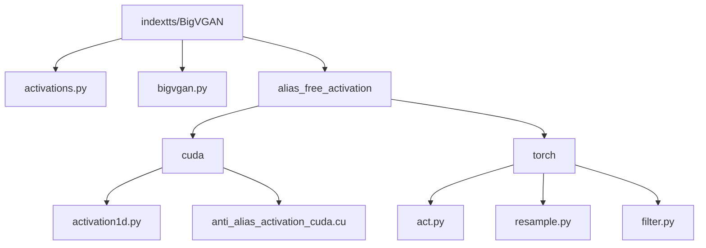
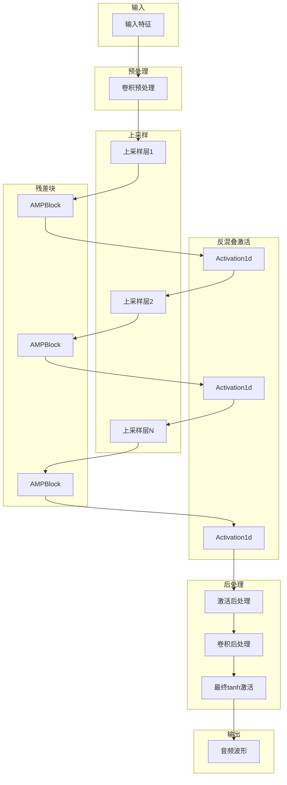
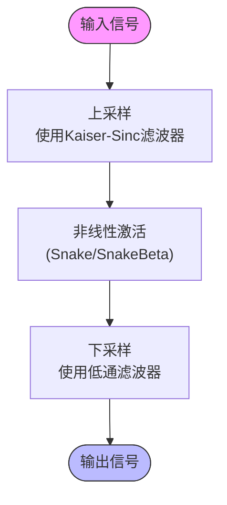
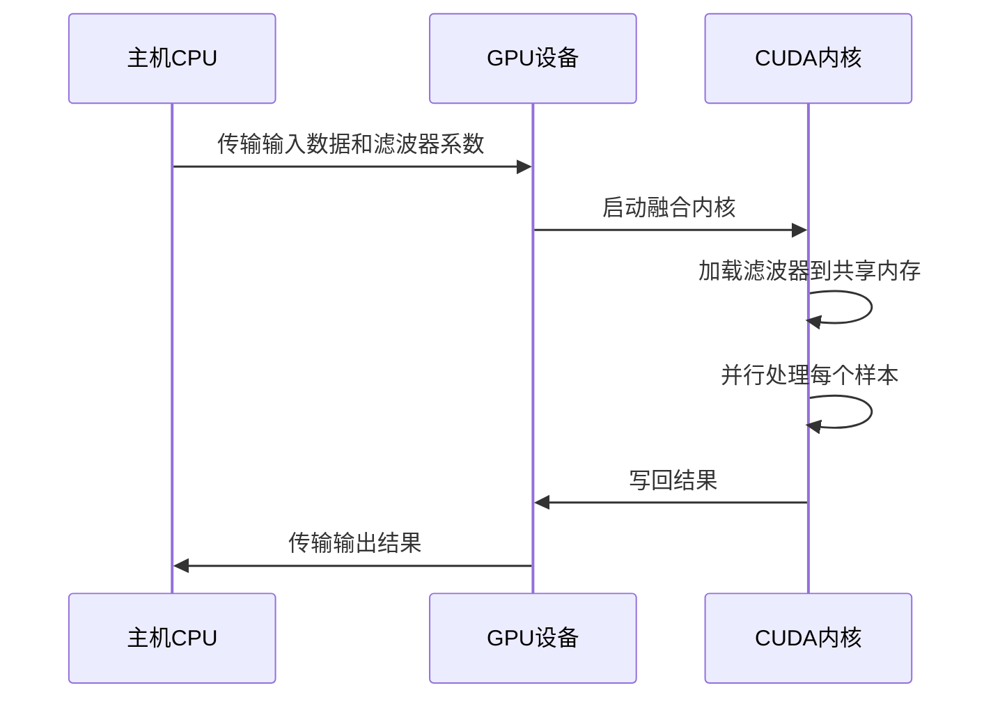
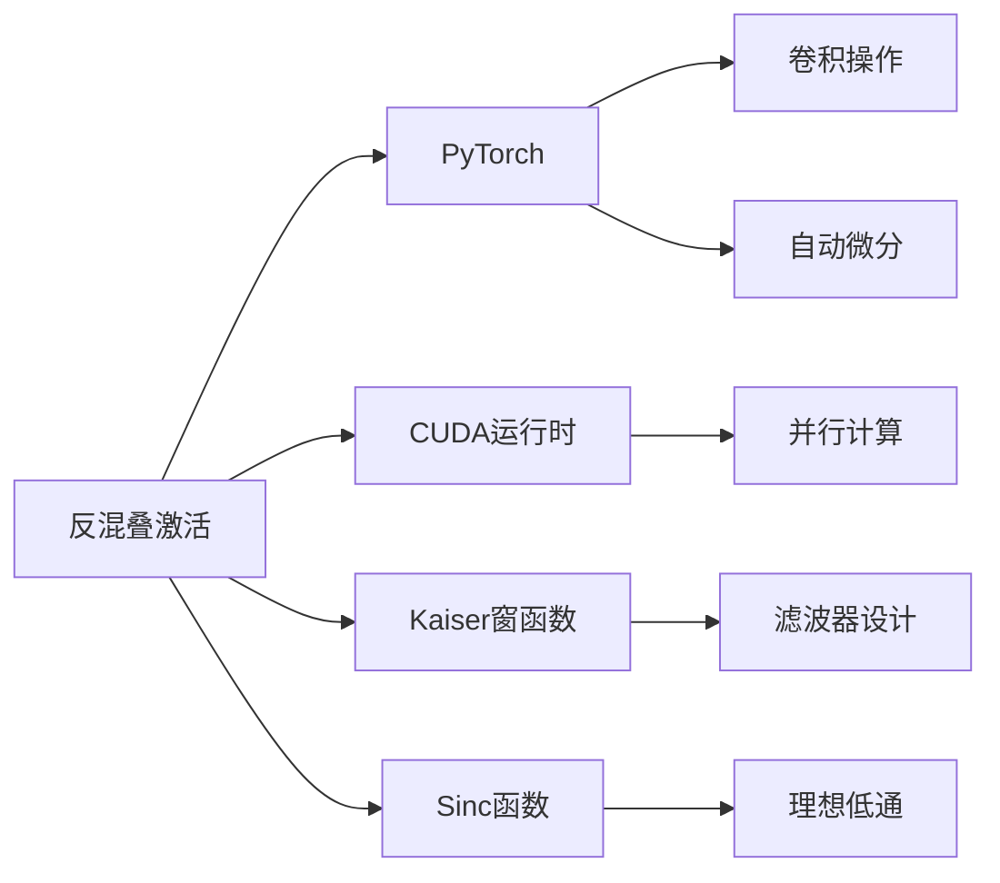

# BigVGAN反混叠激活函数

<cite>
**本文档中引用的文件**
- [activations.py](file://indextts/BigVGAN/activations.py)
- [bigvgan.py](file://indextts/BigVGAN/bigvgan.py)
- [alias_free_activation/torch/act.py](file://indextts/BigVGAN/alias_free_activation/torch/act.py)
- [alias_free_activation/torch/resample.py](file://indextts/BigVGAN/alias_free_activation/torch/resample.py)
- [alias_free_activation/torch/filter.py](file://indextts/BigVGAN/alias_free_activation/torch/filter.py)
- [alias_free_activation/cuda/activation1d.py](file://indextts/BigVGAN/alias_free_activation/cuda/activation1d.py)
- [alias_free_activation/cuda/anti_alias_activation_cuda.cu](file://indextts/BigVGAN/alias_free_activation/cuda/anti_alias_activation_cuda.cu)
</cite>

## 目录
1. [引言](#引言)
2. [项目结构](#项目结构)
3. [核心组件](#核心组件)
4. [架构概述](#架构概述)
5. [详细组件分析](#详细组件分析)
6. [依赖分析](#依赖分析)
7. [性能考虑](#性能考虑)
8. [故障排除指南](#故障排除指南)
9. [结论](#结论)

## 引言
BigVGAN是一种先进的神经声码器模型，通过引入反混叠激活函数显著提升了生成音频的音质。该技术的核心在于解决传统激活函数在上采样过程中产生的混叠效应问题。通过在激活函数中集成低通滤波器，BigVGAN能够有效消除高频伪影，从而保留音频信号中的高频细节。本文档将深入解析反混叠激活函数的数学原理、CUDA内核实现优化策略以及其在训练和推理阶段的一致性保持机制。

## 项目结构
BigVGAN的实现位于`indextts/BigVGAN`目录下，其结构清晰地划分为多个模块，以支持反混叠激活函数的不同实现方式。主要包含Python和CUDA两种实现路径，分别用于通用计算和高性能推理场景。

**图示来源**
- [activations.py](file://indextts/BigVGAN/activations.py)
- [bigvgan.py](file://indextts/BigVGAN/bigvgan.py)
- [alias_free_activation/torch/act.py](file://indextts/BigVGAN/alias_free_activation/torch/act.py)

**本节来源**
- [activations.py](file://indextts/BigVGAN/activations.py)
- [bigvgan.py](file://indextts/BigVGAN/bigvgan.py)
- [alias_free_activation/torch/act.py](file://indextts/BigVGAN/alias_free_activation/torch/act.py)

## 核心组件
BigVGAN的核心组件包括反混叠激活函数的实现、上采样与下采样模块以及CUDA优化内核。这些组件共同协作，确保在音频生成过程中有效抑制混叠效应。

**本节来源**
- [activations.py](file://indextts/BigVGAN/activations.py#L1-L122)
- [alias_free_activation/torch/act.py](file://indextts/BigVGAN/alias_free_activation/torch/act.py#L1-L31)
- [alias_free_activation/torch/resample.py](file://indextts/BigVGAN/alias_free_activation/torch/resample.py#L1-L58)

## 架构概述
BigVGAN采用分层架构设计，其中反混叠激活函数作为关键组件嵌入到残差块（AMPBlock）中。该架构支持两种实现模式：基于PyTorch的通用实现和基于CUDA的高性能实现。通过配置参数`use_cuda_kernel`，用户可以在推理阶段选择使用优化的CUDA内核以获得更高的生成效率。

**图示来源**
- [bigvgan.py](file://indextts/BigVGAN/bigvgan.py#L200-L500)
- [alias_free_activation/torch/act.py](file://indextts/BigVGAN/alias_free_activation/torch/act.py#L10-L30)

## 详细组件分析

### 反混叠激活函数分析
反混叠激活函数通过在激活操作前后分别进行上采样和下采样来消除混叠效应。其核心思想是在激活前将信号上采样至更高采样率，在该高采样率下进行非线性变换，然后通过低通滤波器下采样回原始采样率。

#### 数学原理
传统激活函数在上采样过程中会产生高频伪影，这是因为非线性操作会引入新的频率成分。反混叠设计通过以下步骤解决此问题：
1. 上采样：使用升采样滤波器将输入信号扩展至更高采样率
2. 激活：在高采样率下应用非线性激活函数
3. 下采样：通过低通滤波器去除高于奈奎斯特频率的成分

**图示来源**
- [alias_free_activation/torch/act.py](file://indextts/BigVGAN/alias_free_activation/torch/act.py#L10-L30)
- [alias_free_activation/torch/resample.py](file://indextts/BigVGAN/alias_free_activation/torch/resample.py#L10-L58)

#### 滤波器设计
Kaiser-Sinc滤波器是反混叠系统的关键组件，其设计参数包括截止频率、过渡带宽和窗函数参数。滤波器的冲激响应由以下公式定义：

$$ h[n] = 2fc \cdot w[n] \cdot \text{sinc}(2fc \cdot n) $$

其中$w[n]$为Kaiser窗，$fc$为归一化截止频率。

**本节来源**
- [alias_free_activation/torch/filter.py](file://indextts/BigVGAN/alias_free_activation/torch/filter.py#L50-L100)
- [alias_free_activation/torch/resample.py](file://indextts/BigVGAN/alias_free_activation/torch/resample.py#L10-L58)

### CUDA内核实现分析
CUDA内核实现通过融合上采样、激活和下采样操作来最大化计算效率。这种融合策略减少了内存访问次数并充分利用了GPU的并行计算能力。

#### 内存访问优化
CUDA内核采用预加载滤波器系数到共享内存的策略，避免了重复的全局内存访问。同时，通过合理的线程块划分，确保了内存访问的合并性。

**图示来源**
- [alias_free_activation/cuda/activation1d.py](file://indextts/BigVGAN/alias_free_activation/cuda/activation1d.py#L50-L75)
- [alias_free_activation/cuda/anti_alias_activation_cuda.cu](file://indextts/BigVGAN/alias_free_activation/cuda/anti_alias_activation_cuda.cu)

#### 并行计算策略
每个CUDA线程负责处理输出序列中的一个位置，通过卷积运算计算该位置的值。线程块之间独立工作，实现了高度并行化。

**本节来源**
- [alias_free_activation/cuda/activation1d.py](file://indextts/BigVGAN/alias_free_activation/cuda/activation1d.py#L1-L76)
- [alias_free_activation/cuda/anti_alias_activation_cuda.cu](file://indextts/BigVGAN/alias_free_activation/cuda/anti_alias_activation_cuda.cu)

## 依赖分析
BigVGAN的反混叠激活函数实现依赖于多个外部库和内部模块。主要依赖关系如下：

**图示来源**
- [alias_free_activation/torch/filter.py](file://indextts/BigVGAN/alias_free_activation/torch/filter.py)
- [alias_free_activation/cuda/load.py](file://indextts/BigVGAN/alias_free_activation/cuda/load.py)

**本节来源**
- [alias_free_activation/torch/filter.py](file://indextts/BigVGAN/alias_free_activation/torch/filter.py#L1-L102)
- [alias_free_activation/cuda/activation1d.py](file://indextts/BigVGAN/alias_free_activation/cuda/activation1d.py#L1-L76)

## 性能考虑
反混叠激活函数在提升音质的同时也带来了额外的计算开销。CUDA实现通过内核融合和内存优化显著降低了这一开销，使得在推理阶段能够实现实时音频生成。建议在训练阶段使用PyTorch实现以保证灵活性，在推理阶段切换到CUDA实现以获得最佳性能。

## 故障排除指南
当遇到反混叠激活函数相关问题时，请检查以下方面：
1. 确认CUDA环境配置正确，特别是nvcc和ninja的安装
2. 验证滤波器参数设置是否合理，避免截止频率过高或过低
3. 检查输入信号的采样率是否与模型配置匹配
4. 确保在使用CUDA内核时没有进行反向传播操作

**本节来源**
- [bigvgan.py](file://indextts/BigVGAN/bigvgan.py#L400-L450)
- [alias_free_activation/cuda/activation1d.py](file://indextts/BigVGAN/alias_free_activation/cuda/activation1d.py#L60-L70)

## 结论
BigVGAN的反混叠激活函数通过创新的信号处理技术有效解决了传统声码器中的混叠问题。其分层架构设计既保证了实现的灵活性，又通过CUDA优化实现了高性能推理。该技术在保留音频高频细节方面表现出显著优势，为高质量语音合成提供了可靠的基础。