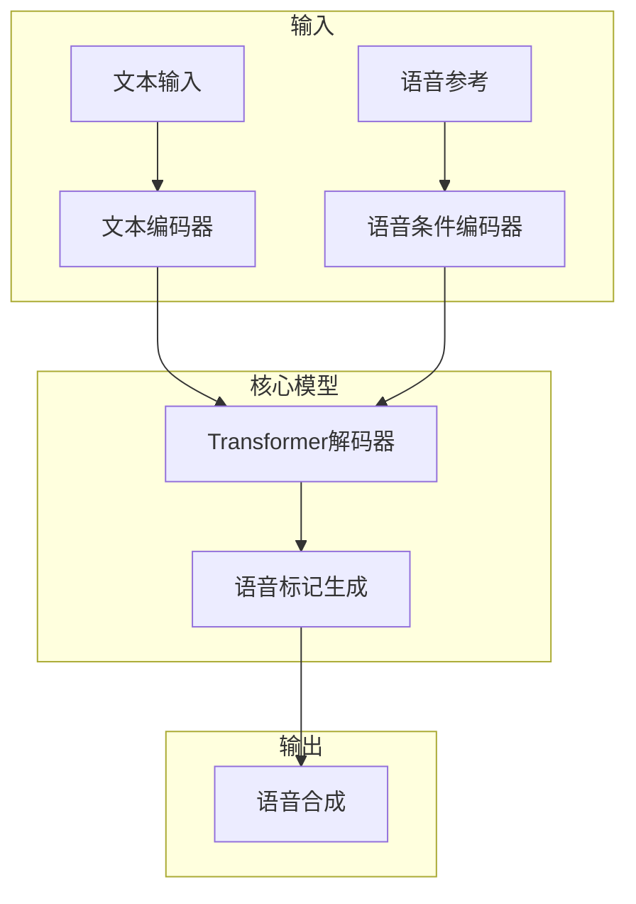
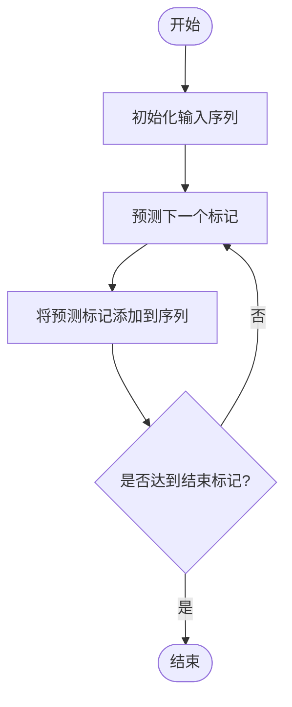
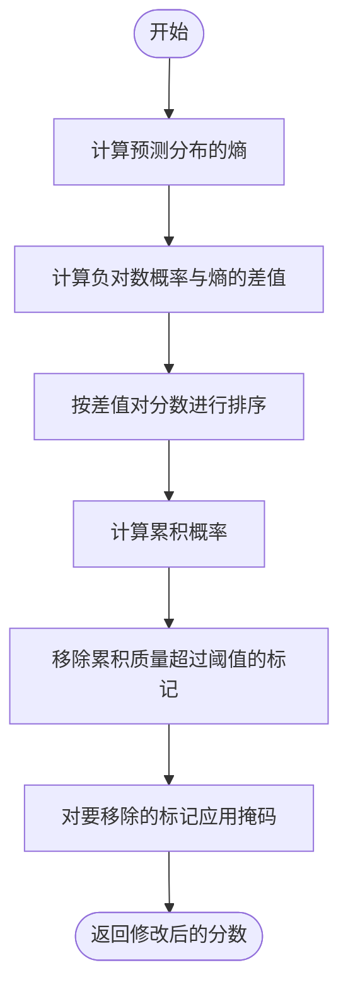
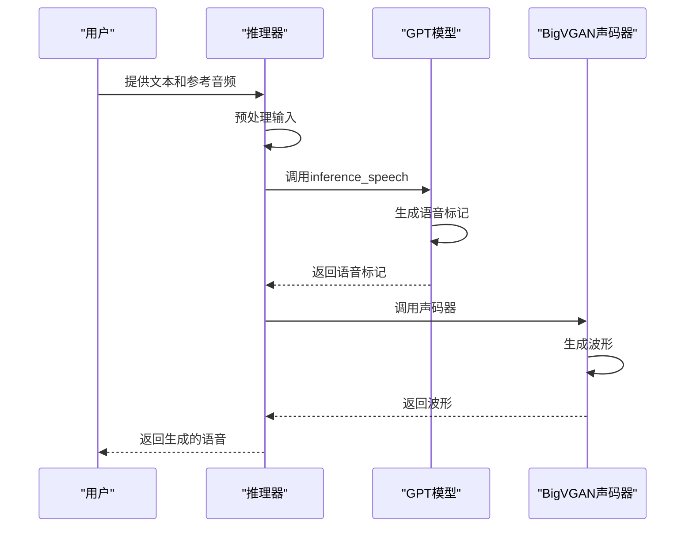

# GPT自回归生成算法

<cite>
**本文档中引用的文件**   
- [model.py](file://indextts/gpt/model.py)
- [typical_sampling.py](file://indextts/utils/typical_sampling.py)
- [transformers_generation_utils.py](file://indextts/gpt/transformers_generation_utils.py)
- [infer.py](file://indextts/infer.py)
- [model_v2.py](file://indextts/gpt/model_v2.py)
</cite>

## 目录
1. [引言](#引言)
2. [模型架构概述](#模型架构概述)
3. [自回归生成过程](#自回归生成过程)
4. [典型采样策略](#典型采样策略)
5. [生成参数详解](#生成参数详解)
6. [推理流程分析](#推理流程分析)
7. [注意力机制与上下文管理](#注意力机制与上下文管理)
8. [结论](#结论)

## 引言
本文档深入分析基于GPT架构的语音生成模型的自回归生成算法。该模型采用Transformer架构，通过自回归方式逐帧生成语音特征。文档详细解释了模型的解码过程、注意力机制、上下文管理以及典型采样策略的实现原理。重点对比了典型采样与传统采样方法（如top-k、top-p）的差异，并解释了温度参数、重复惩罚等生成参数对语音自然度的影响。

## 模型架构概述

该语音生成模型采用统一语音（UnifiedVoice）架构，结合了GPT-2的Transformer解码器和语音条件编码器。模型接收文本输入和语音参考信号，通过自回归方式生成语音标记序列。

**图源**
- [model.py](file://indextts/gpt/model.py#L1-L714)

**节源**
- [model.py](file://indextts/gpt/model.py#L1-L714)

## 自回归生成过程

自回归生成是该模型的核心机制，模型通过逐个预测语音标记来生成完整的语音序列。生成过程从起始标记开始，每次预测下一个标记，并将其作为下一次预测的输入。

**图源**
- [model.py](file://indextts/gpt/model.py#L1-L714)

**节源**
- [model.py](file://indextts/gpt/model.py#L1-L714)

## 典型采样策略

典型采样是一种先进的采样策略，旨在生成更自然、更符合人类语言模式的语音。与传统的top-k和top-p采样不同，典型采样基于预测分布的典型集进行采样。

### 典型采样原理
典型采样的核心思想是选择那些具有典型概率的标记，而不是简单地选择最高概率的标记。算法首先计算预测分布的熵，然后选择那些与负对数概率最接近熵值的标记。

**图源**
- [typical_sampling.py](file://indextts/utils/typical_sampling.py#L1-L31)

**节源**
- [typical_sampling.py](file://indextts/utils/typical_sampling.py#L1-L31)

### 与传统采样的对比
典型采样相比传统采样方法具有明显优势。top-k采样简单地选择概率最高的k个标记，而top-p采样选择累积概率达到p的最小标记集合。这两种方法都可能选择概率极低但被包含在集合中的标记，导致生成结果不自然。

典型采样通过考虑整个分布的统计特性，避免了选择那些"异常"的标记，从而生成更连贯、更自然的语音。

## 生成参数详解

生成参数对语音的自然度和质量有重要影响。以下是最关键的几个参数：

### 温度参数
温度参数控制预测分布的"锐度"。较低的温度会使高概率标记的概率更高，生成结果更确定但可能缺乏多样性；较高的温度会使分布更平坦，增加随机性但可能导致不连贯。

### 重复惩罚
重复惩罚参数用于抑制模型重复生成相同标记的倾向。通过在重复标记的logits上施加惩罚，可以有效减少语音中的重复现象，提高自然度。

### 最大生成长度
最大生成长度限制了生成序列的长度，防止模型无限生成。这对于控制生成时间和资源消耗非常重要。

**节源**
- [infer.py](file://indextts/infer.py#L1-L691)

## 推理流程分析

模型的推理流程包括多个关键步骤，从输入处理到最终语音生成。

**图源**
- [infer.py](file://indextts/infer.py#L1-L691)

**节源**
- [infer.py](file://indextts/infer.py#L1-L691)

## 注意力机制与上下文管理

模型的注意力机制在语音生成中起着关键作用。通过多头自注意力，模型能够捕捉长距离依赖关系，保持上下文一致性。

### 条件编码器
语音条件编码器将参考音频转换为条件嵌入，这些嵌入作为生成过程的上下文。模型使用Perceiver Resampler来压缩和提炼条件信息。

### 位置编码
模型使用学习的位置编码来保留序列的顺序信息。这对于语音生成至关重要，因为语音信号具有强烈的时间依赖性。

**节源**
- [model.py](file://indextts/gpt/model.py#L1-L714)

## 结论

本文档详细分析了GPT语音生成模型的自回归生成算法。该模型通过先进的典型采样策略和精心设计的注意力机制，能够生成高质量、自然的语音。理解这些核心算法对于优化模型性能和生成效果至关重要。通过合理配置生成参数，可以在语音自然度和多样性之间取得良好平衡。