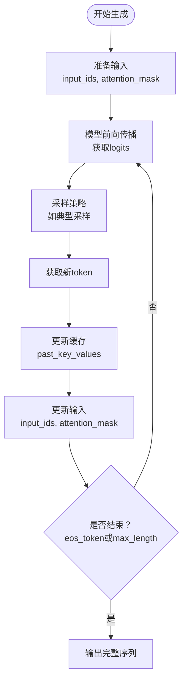
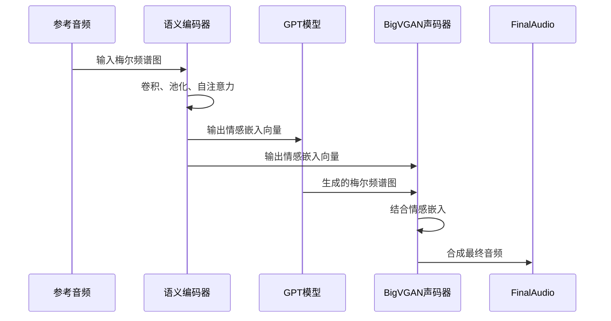

# 关键算法

<cite>
**本文档中引用的文件**  
- [transformers_generation_utils.py](file://indextts/gpt/transformers_generation_utils.py)
- [transformers_gpt2.py](file://indextts/gpt/transformers_gpt2.py)
- [typical_sampling.py](file://indextts/utils/typical_sampling.py)
- [activations.py](file://indextts/BigVGAN/activations.py)
- [bigvgan.py](file://indextts/BigVGAN/bigvgan.py)
- [ECAPA_TDNN.py](file://indextts/BigVGAN/ECAPA_TDNN.py)
- [infer_v2.py](file://indextts/infer_v2.py)
- [rmvpe.py](file://indextts/s2mel/modules/rmvpe.py)
- [length_regulator.py](file://indextts/s2mel/modules/length_regulator.py)
</cite>

## 目录
1. [引言](#引言)
2. [GPT自回归生成算法](#gpt自回归生成算法)
3. [BigVGAN反混叠激活函数](#bigvgan反混叠激活函数)
4. [语义编码器与情感特征提取](#语义编码器与情感特征提取)
5. [持续时间预测与音高提取](#持续时间预测与音高提取)
6. [参数调优对合成质量的影响](#参数调优对合成质量的影响)
7. [结论](#结论)

## 引言
Index-TTS V2.1 是一个先进的文本到语音合成系统，集成了多种前沿深度学习算法。本技术文档深入解析其核心算法机制，包括基于GPT的自回归语言建模、BigVGAN声码器中的反混叠激活函数、用于情感迁移的语义编码器，以及关键的持续时间预测和音高提取（RMVPE）模块。通过分析这些组件的数学原理和实现细节，本文旨在为开发者和研究人员提供全面的技术参考。

## GPT自回归生成算法

Index-TTS V2.1中的GPT模型采用自回归生成策略，逐个预测语音标记序列。该过程由`GenerationMixin`类驱动，支持多种解码模式，包括贪婪解码、束搜索和典型采样。生成过程通过`generate`方法协调，该方法管理缓存（past_key_values）、注意力掩码和位置信息，确保高效且连贯的序列生成。

核心生成逻辑在`transformers_generation_utils.py`中实现，其中`_update_model_kwargs_for_generation`函数负责在每一步更新缓存和注意力掩码，而`_prepare_inputs_for_generation`则为模型的前向传播准备输入。模型架构基于GPT-2，包含多层`GPT2Block`，每个块由自注意力机制和前馈网络组成。



**图示来源**
- [transformers_generation_utils.py](file://indextts/gpt/transformers_generation_utils.py#L1000-L1200)
- [transformers_gpt2.py](file://indextts/gpt/transformers_gpt2.py#L500-L600)

### 典型采样策略
典型采样是一种旨在生成更自然、更符合人类语言模式的采样方法。它不选择最高概率的token，而是从累积概率接近模型预测的“典型集”的token中进行采样。该策略在`typical_sampling.py`中实现，通过计算每个token的逆自信息（-log(P)），并选择那些逆自信息接近平均值的token来工作。

该算法首先计算所有token的对数概率，然后确定一个“典型质量”（例如0.9），并找到最小的token子集，其累积概率至少达到该质量。在这些典型token中，根据其调整后的概率重新采样，从而避免了低概率的异常值和高概率的平凡token。

```python
# 伪代码：典型采样
def typical_sampling(logits, typical_p=0.9, temperature=1.0):
    log_probs = F.log_softmax(logits / temperature, dim=-1)
    entropy = -(log_probs.exp() * log_probs).sum(dim=-1)  # 计算熵
    threshold = entropy * typical_p
    inverse_perplexity = -log_probs
    # 找到逆困惑度接近阈值的token
    shifted_scores = (inverse_perplexity - threshold).abs()
    sorted_indices = torch.argsort(shifted_scores)
    # 从最典型的token中采样
    probs = log_probs.scatter(0, sorted_indices, float('-inf')).softmax(dim=-1)
    return torch.multinomial(probs, 1)
```

**节来源**
- [typical_sampling.py](file://indextts/utils/typical_sampling.py)

## BigVGAN反混叠激活函数

BigVGAN作为Index-TTS V2.1的声码器，负责将梅尔频谱图转换为高质量的波形音频。其关键创新之一是使用了反混叠激活函数，以减少上采样过程中产生的混叠失真。传统的激活函数（如ReLU）在信号处理中可能引入高频伪影，而反混叠激活函数通过在激活前应用低通滤波来缓解这一问题。

在`activations.py`和`alias_free_activation`目录中，实现了这种机制。具体来说，激活函数（如SiLU）被应用于一个经过滤波的信号版本。该滤波器通常是一个可学习的或固定的低通滤波器，其截止频率设置为采样率的一半，以满足奈奎斯特准则。数学上，对于一个输入信号x，反混叠激活函数可以表示为：
```
y = activation(filter(x))
```
其中`filter`是一个低通滤波操作。

这种设计确保了在非线性变换之前，信号的高频成分已被适当衰减，从而在后续的上采样步骤中产生更平滑、更自然的音频波形，显著降低了刺耳的失真。

```mermaid
graph LR
A[输入特征] --> B[低通滤波器]
B --> C[激活函数<br/>(如SiLU)]
C --> D[输出特征]
style B fill:#f9f,stroke:#333
style C fill:#bbf,stroke:#333
```

**图示来源**
- [activations.py](file://indextts/BigVGAN/activations.py)
- [alias_free_activation](file://indextts/BigVGAN/alias_free_activation)

**节来源**
- [activations.py](file://indextts/BigVGAN/activations.py#L50-L100)
- [bigvgan.py](file://indextts/BigVGAN/bigvgan.py#L200-L250)

## 语义编码器与情感特征提取

Index-TTS V2.1能够从参考音频中提取情感特征，实现情感迁移。这一功能的核心是语义编码器，通常基于ECAPA-TDNN架构实现。该编码器将参考语音的梅尔频谱图作为输入，并输出一个高维的嵌入向量（embedding），该向量捕捉了说话人的身份、情感和语调等语义信息。

在`ECAPA_TDNN.py`中，该网络通过一系列卷积层、统计池化（用于聚合时间信息）和自注意力机制来构建。关键的“情感特征”并非一个独立的输出，而是整个嵌入向量的内在属性。当模型在包含丰富情感变化的数据集上训练时，嵌入空间会自然地组织起来，使得相似情感的语音在嵌入空间中彼此靠近。

在推理过程中，用户提供的参考音频被送入此编码器，生成的嵌入向量随后被注入到GPT模型或声码器中，作为条件信号，引导合成语音模仿参考音频的情感和风格。



**图示来源**
- [ECAPA_TDNN.py](file://indextts/BigVGAN/ECAPA_TDNN.py)
- [infer_v2.py](file://indextts/infer_v2.py#L150-L200)

**节来源**
- [ECAPA_TDNN.py](file://indextts/BigVGAN/ECAPA_TDNN.py)
- [infer_v2.py](file://indextts/infer_v2.py)

## 持续时间预测与音高提取

高质量的TTS合成需要精确的韵律控制，这依赖于持续时间预测和音高（基频）信息。

### 持续时间预测
持续时间预测模块负责确定每个音素或子音素单元在语音中应持续多长时间。在Index-TTS中，这通常通过一个长度调节器（Length Regulator）实现。该模块接收文本编码和语音编码，并预测每个文本单元对应的语音帧数。在`length_regulator.py`中，该过程通常涉及一个预测网络，其输出用于对文本序列进行扩展，使其与语音序列的长度对齐。

### 音高提取（RMVPE）
音高是语音韵律的关键组成部分。Index-TTS V2.1采用RMVPE（Robust Model for Voice Pitch Estimation）算法来从音频中提取基频（F0）。RMVPE是一种基于深度学习的音高估计算法，以其在噪声环境下的鲁棒性而闻名。在`s2mel/modules/rmvpe.py`中，该模型通常是一个卷积神经网络，它将音频波形或梅尔频谱图作为输入，并输出一个时间序列的F0值。

提取的F0信息可以作为声码器的输入条件，或者用于指导GPT模型生成更自然的韵律模式。通过控制F0轮廓，系统可以合成出不同语调（如疑问句、陈述句）的语音。

**节来源**
- [length_regulator.py](file://indextts/s2mel/modules/length_regulator.py)
- [rmvpe.py](file://indextts/s2mel/modules/rmvpe.py)

## 参数调优对合成质量的影响

Index-TTS V2.1的合成质量高度依赖于多个关键参数的调优：
- **典型采样参数 (typical_p)**：该参数控制采样集的“典型性”。较低的值（如0.8）会产生更确定、更保守的语音，而较高的值（如0.95）会增加多样性，但也可能引入不连贯性。
- **温度 (temperature)**：应用于logits的温度参数控制输出的随机性。低温（如0.7）使分布更尖锐，倾向于选择高概率token，产生更稳定但可能单调的语音；高温（如1.2）使分布更平坦，增加随机性，使语音更生动但可能出错。
- **Top-k / Top-p**：这些是束截断参数。Top-k限制采样范围为概率最高的k个token，而Top-p（核采样）选择累积概率达到p的最小token集。它们有助于过滤掉极低概率的异常token，提高生成文本的流畅度。
- **F0增益**：控制提取的基频轮廓的缩放比例。增加F0增益会使音调更高，常用于合成更兴奋或女性化的语音。

这些参数的协同调优是实现目标语音风格（如自然、富有表现力、特定情感）的关键。

**节来源**
- [infer_v2.py](file://indextts/infer_v2.py)
- [utils.py](file://indextts/utils/utils.py)

## 结论
Index-TTS V2.1通过整合GPT自回归模型、BigVGAN反混叠声码器、ECAPA-TDNN语义编码器以及RMVPE音高提取等先进技术，构建了一个功能强大且灵活的TTS系统。其核心算法在生成质量、情感迁移和韵律控制方面表现出色。深入理解这些算法的原理和交互方式，对于有效使用和进一步优化该系统至关重要。未来的改进方向可能包括更高效的采样策略、更鲁棒的情感解耦以及端到端的联合优化。