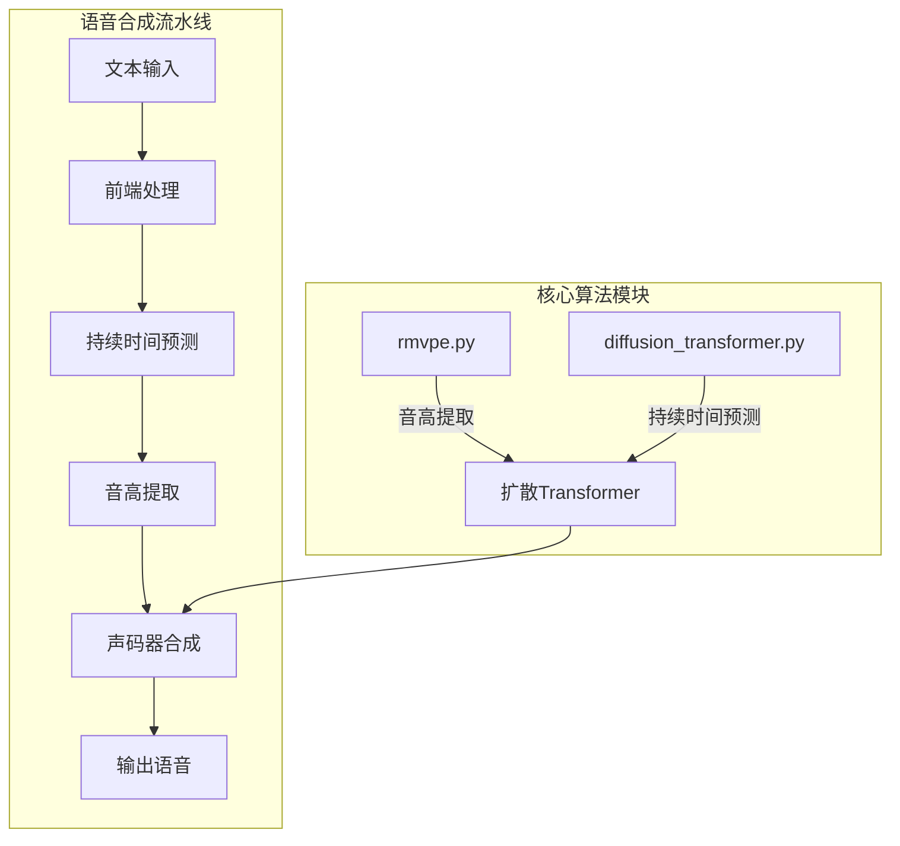
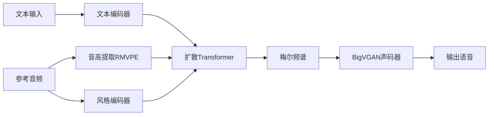
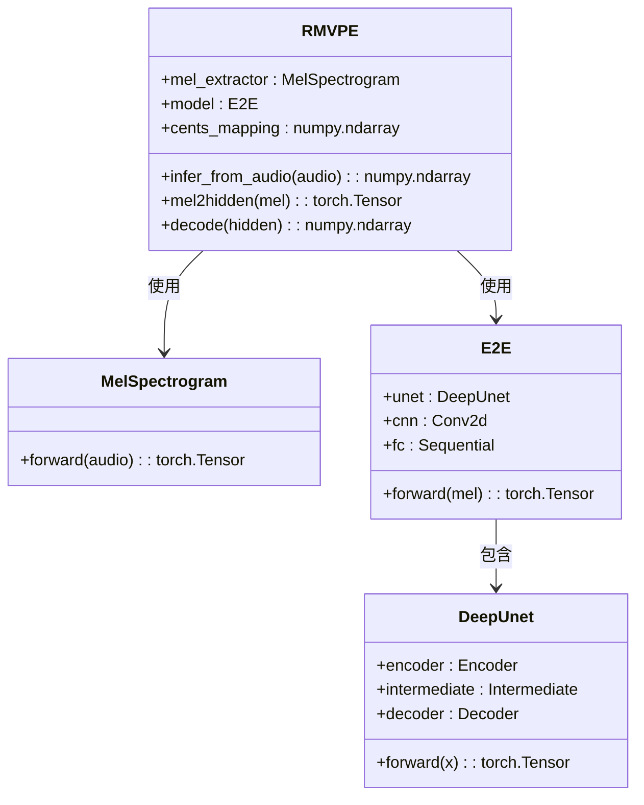
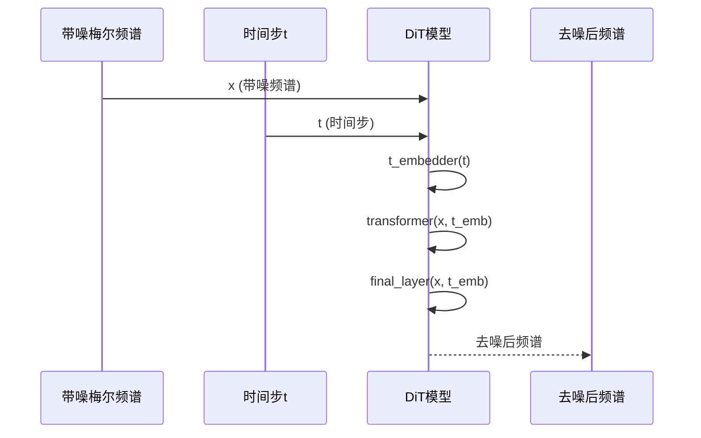
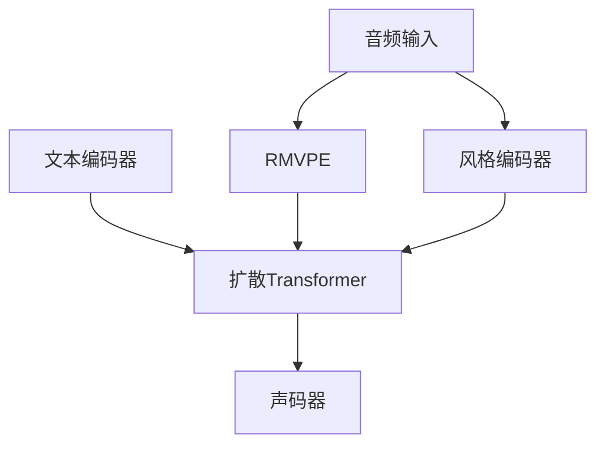

# 持续时间与音高算法

<cite>
**本文档中引用的文件**  
- [rmvpe.py](file://indextts\s2mel\modules\rmvpe.py)
- [diffusion_transformer.py](file://indextts\s2mel\modules\diffusion_transformer.py)
</cite>

## 目录
1. [引言](#引言)
2. [项目结构](#项目结构)
3. [核心组件](#核心组件)
4. [架构概述](#架构概述)
5. [详细组件分析](#详细组件分析)
6. [依赖分析](#依赖分析)
7. [性能考虑](#性能考虑)
8. [故障排除指南](#故障排除指南)
9. [结论](#结论)

## 引言
本文深入探讨语音合成系统中两个关键算法的技术细节：持续时间预测与音高提取。重点分析扩散Transformer如何精确控制语音持续时间，以及RMVPE（Robust Multi-F0 Pitch Estimation）算法如何从音频信号中准确提取基频轨迹。文档还将描述这两个算法在端到端语音合成管道中的集成方式及其协同工作机制，旨在生成自然流畅的语音韵律。同时提供算法性能指标和优化建议，涵盖处理极端音高和复杂节奏的策略。

## 项目结构
项目结构显示了语音合成系统的核心模块组织。`indextts`目录包含多个子模块，其中`s2mel/modules`是关键算法实现所在。`rmvpe.py`实现了鲁棒的多基频音高估计算法，用于从音频中提取F0轨迹；`diffusion_transformer.py`实现了基于扩散机制的Transformer模型，用于持续时间预测和声学建模。这些模块与BigVGAN、GPT等其他组件协同工作，构成完整的语音合成流水线。

**图源**  
- [rmvpe.py](file://indextts\s2mel\modules\rmvpe.py)
- [diffusion_transformer.py](file://indextts\s2mel\modules\diffusion_transformer.py)

## 核心组件
本系统的核心组件包括RMVPE音高估计算法和基于扩散机制的Transformer持续时间预测模型。RMVPE通过深度卷积网络从梅尔频谱中提取音高信息，具有较强的抗噪能力和高精度。扩散Transformer则利用时间步嵌入和风格嵌入，通过扩散过程逐步优化语音特征，实现对语音持续时间的精细控制。这两个组件共同决定了合成语音的自然度和表现力。

**节源**  
- [rmvpe.py](file://indextts\s2mel\modules\rmvpe.py#L1-L631)
- [diffusion_transformer.py](file://indextts\s2mel\modules\diffusion_transformer.py#L1-L257)

## 架构概述
系统采用端到端的深度学习架构，将文本特征转换为高质量语音波形。整体流程包括文本编码、持续时间预测、音高提取、声学特征生成和波形合成。扩散Transformer作为核心声学模型，接收文本语义编码和风格向量，通过多步扩散过程生成目标梅尔频谱。RMVPE模块则在训练和推理阶段提供精确的音高监督信号，确保生成语音的韵律自然。

**图源**  
- [diffusion_transformer.py](file://indextts\s2mel\modules\diffusion_transformer.py#L50-L257)
- [rmvpe.py](file://indextts\s2mel\modules\rmvpe.py#L300-L631)

## 详细组件分析

### RMVPE音高估计算法分析
RMVPE算法通过深度U-Net结构从梅尔频谱中估计基频。其核心是一个E2E模型，包含DeepUnet编码器-解码器结构和BiGRU时序建模模块。算法首先将输入音频转换为对数梅尔频谱，然后通过卷积网络提取高维特征，最后使用全连接层输出360维的音高类别概率分布。解码阶段采用局部平均法将类别概率转换为连续的F0值。

**图源**  
- [rmvpe.py](file://indextts\s2mel\modules\rmvpe.py#L300-L631)

**节源**  
- [rmvpe.py](file://indextts\s2mel\modules\rmvpe.py#L300-L631)

### 扩散Transformer持续时间预测分析
扩散Transformer采用DiT（Diffusion Transformer）架构，将语音生成建模为去噪扩散过程。模型接收带噪的梅尔频谱和时间步t，通过Transformer编码器逐步去除噪声。关键组件包括时间步嵌入（TimestepEmbedder）、风格嵌入（StyleEmbedder）和自适应层归一化（adaLN）。模型通过调节时间步嵌入来控制扩散过程的进度，从而精确预测语音的持续时间分布。

**图源**  
- [diffusion_transformer.py](file://indextts\s2mel\modules\diffusion_transformer.py#L50-L257)

**节源**  
- [diffusion_transformer.py](file://indextts\s2mel\modules\diffusion_transformer.py#L50-L257)

## 依赖分析
系统各组件之间存在紧密的依赖关系。扩散Transformer模型依赖于RMVPE提供的音高特征作为条件输入，确保生成的语音具有正确的韵律特征。同时，RMVPE的训练过程依赖于高质量的梅尔频谱提取器，该提取器的参数与主模型共享。这种双向依赖关系使得两个模块能够协同优化，共同提升语音合成质量。

**图源**  
- [diffusion_transformer.py](file://indextts\s2mel\modules\diffusion_transformer.py)
- [rmvpe.py](file://indextts\s2mel\modules\rmvpe.py)

**节源**  
- [diffusion_transformer.py](file://indextts\s2mel\modules\diffusion_transformer.py#L1-L257)
- [rmvpe.py](file://indextts\s2mel\modules\rmvpe.py#L1-L631)

## 性能考虑
RMVPE算法在GPU上可实现实时音高提取，推理速度受音频长度和模型精度影响。使用半精度（half）计算可显著提升速度，但可能影响极端音高的准确性。扩散Transformer的推理速度较慢，因其需要多步扩散过程。建议在部署时使用知识蒸馏技术将多步扩散过程压缩为单步前向传播，以满足实时性要求。对于复杂节奏的处理，可通过增加训练数据的多样性来提升模型鲁棒性。

## 故障排除指南
当音高提取出现异常时，首先检查输入音频的信噪比和采样率是否符合要求（16kHz）。若F0轨迹出现跳变，可尝试调整`thred`阈值参数。对于扩散Transformer生成的语音存在不自然停顿的问题，应检查文本编码器输出的持续时间预测是否合理。模型加载失败通常与设备类型（CUDA/DirectML）有关，需确保`rmvpe_root`环境变量正确设置。

**节源**  
- [rmvpe.py](file://indextts\s2mel\modules\rmvpe.py#L350-L450)
- [diffusion_transformer.py](file://indextts\s2mel\modules\diffusion_transformer.py#L150-L200)

## 结论
本文详细分析了Index-TTS系统中持续时间预测和音高提取的核心算法。扩散Transformer通过扩散机制实现了对语音持续时间的精细控制，而RMVPE算法则提供了高精度的音高估计。两个模块的协同工作确保了合成语音的自然度和表现力。未来优化方向包括模型轻量化、推理加速和对更多语言/方言的支持。