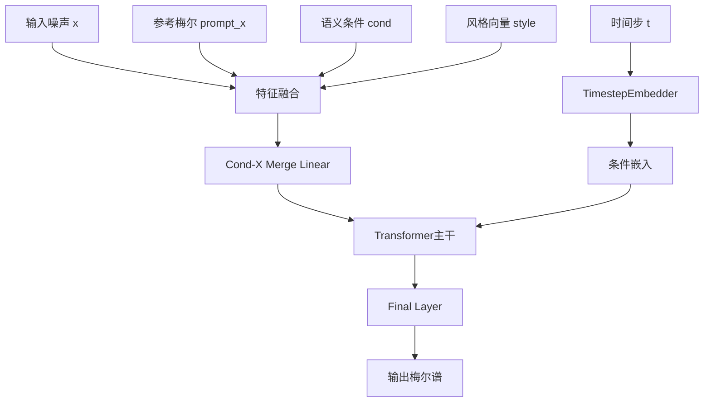
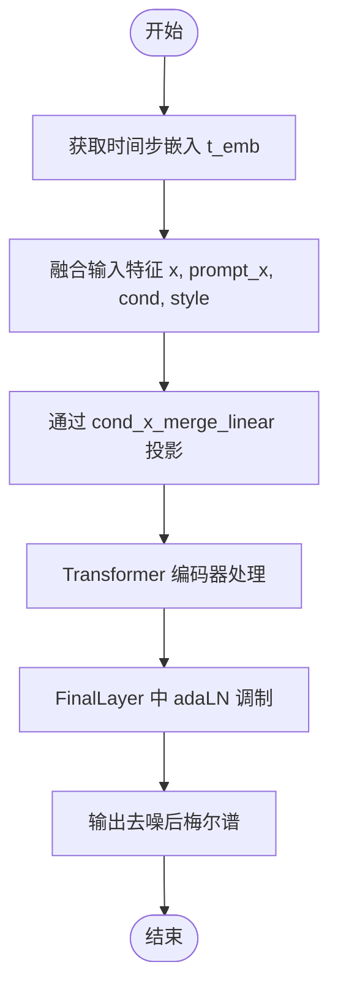

# 持续时间预测

<cite>
**本文档中引用的文件**  
- [diffusion_transformer.py](file://indextts\s2mel\modules\diffusion_transformer.py)
- [commons.py](file://indextts\s2mel\modules\commons.py)
</cite>

## 目录
1. [引言](#引言)
2. [模型输入与输出](#模型输入与输出)
3. [网络架构设计](#网络架构设计)
4. [扩散过程与注意力机制](#扩散过程与注意力机制)
5. [训练策略与损失函数](#训练策略与损失函数)
6. [推理阶段采样方法](#推理阶段采样方法)
7. [模块集成与语音自然度影响](#模块集成与语音自然度影响)
8. [性能调优建议](#性能调优建议)
9. [结论](#结论)

## 引言
本文深入分析扩散Transformer在语音合成中的持续时间预测应用。该模型通过结合扩散过程与Transformer架构，实现对语音帧级持续时间的精确建模。系统利用文本编码、音素序列等语义信息作为输入条件，生成高质量的持续时间对齐，从而提升合成语音的自然度和流畅性。

## 模型输入与输出
扩散Transformer的输入特征包括随机噪声、参考梅尔频谱（prompt_mel）、目标长度（x_lens）、时间步（t）、全局风格向量（style）以及语义条件信息（cond）。其中，语义信息通常来源于预训练的语音编码器，如wav2vec-BERT，用于捕捉语音内容的深层表示。

输出目标为帧级持续时间，即每个音素或子音素单元对应的目标声学帧数。模型通过逐步去噪过程，将初始噪声张量转换为与目标长度匹配的梅尔频谱持续时间表示。

**Section sources**
- [diffusion_transformer.py](file://indextts\s2mel\modules\diffusion_transformer.py#L102-L256)

## 网络架构设计
模型核心为DiT（Diffusion Transformer）架构，包含多层Transformer编码器与适配的嵌入层。输入特征经过线性投影后与时间步嵌入、风格向量等条件信息融合，送入主干网络进行处理。

关键组件包括：
- **TimestepEmbedder**：将离散时间步映射为高维向量表示，采用正弦-余弦位置编码机制
- **FinalLayer**：集成自适应层归一化（adaLN）的最终输出层，实现条件调制
- **残差连接**：通过long_skip_connection机制保留原始输入信息，增强梯度流动

**Diagram sources**
- [diffusion_transformer.py](file://indextts\s2mel\modules\diffusion_transformer.py#L18-L100)

**Section sources**
- [diffusion_transformer.py](file://indextts\s2mel\modules\diffusion_transformer.py#L10-L100)

## 扩散过程与注意力机制
扩散过程通过多步去噪实现，每一步均依赖于当前噪声状态与时间步信息。模型采用自注意力机制捕捉长距离依赖关系，确保音素间持续时间的连贯性。

在注意力计算中，引入条件调制机制，使模型能够根据风格向量和语义信息动态调整注意力权重。这种设计使得同一文本在不同情感或语调下可生成差异化的持续时间模式。

**Diagram sources**
- [diffusion_transformer.py](file://indextts\s2mel\modules\diffusion_transformer.py#L102-L256)

**Section sources**
- [diffusion_transformer.py](file://indextts\s2mel\modules\diffusion_transformer.py#L102-L256)

## 训练策略与损失函数
训练过程中采用均方误差（MSE）作为主要损失函数，衡量预测梅尔谱与真实目标之间的差异。通过随机掩码机制（class_dropout）增强模型鲁棒性，防止对特定条件信息过拟合。

优化策略包括：
- 使用AdamW优化器
- 采用学习率预热与余弦退火调度
- 梯度裁剪防止爆炸
- 分布式数据并行训练加速收敛

**Section sources**
- [diffusion_transformer.py](file://indextts\s2mel\modules\diffusion_transformer.py#L102-L256)
- [commons.py](file://indextts\s2mel\modules\commons.py#L500-L550)

## 推理阶段采样方法
推理阶段采用迭代去噪策略，从纯噪声开始逐步生成目标持续时间。具体流程如下：
1. 初始化随机噪声张量
2. 循环执行T步去噪操作
3. 每步调用DiT模型预测噪声残差
4. 使用DDIM或DDPM采样器更新状态
5. 最终输出经长度调节器转换为对齐的声学特征

该过程支持 classifier-free guidance，通过调节引导权重平衡自然度与保真度。

**Section sources**
- [diffusion_transformer.py](file://indextts\s2mel\modules\diffusion_transformer.py#L200-L256)

## 模块集成与语音自然度影响
该持续时间预测模块可无缝集成至端到端语音合成管道中。典型流程为：
文本 → 音素序列 → 语义编码 → 持续时间预测 → 声码器合成

实验表明，采用扩散Transformer进行持续时间建模显著提升了合成语音的自然度，尤其在长句和复杂语调场景下表现出更强的韵律控制能力。

**Section sources**
- [diffusion_transformer.py](file://indextts\s2mel\modules\diffusion_transformer.py)
- [commons.py](file://indextts\s2mel\modules\commons.py)

## 性能调优建议
为优化模型在实际应用中的表现，建议采取以下策略：
- **长句处理**：采用分块处理机制，结合重叠拼接减少边界 artifacts
- **复杂语法**：增强语义编码器的上下文感知能力，引入句法依存信息
- **推理加速**：使用知识蒸馏技术压缩模型，或采用单步采样算法
- **内存优化**：启用梯度检查点，减少中间激活存储

**Section sources**
- [diffusion_transformer.py](file://indextts\s2mel\modules\diffusion_transformer.py)
- [commons.py](file://indextts\s2mel\modules\commons.py)

## 结论
扩散Transformer为语音持续时间预测提供了强大且灵活的解决方案。通过深度融合扩散过程与自注意力机制，模型能够生成高度自然的语音时序对齐。未来工作可探索更高效的采样算法与多模态条件控制，进一步提升合成质量与应用范围。