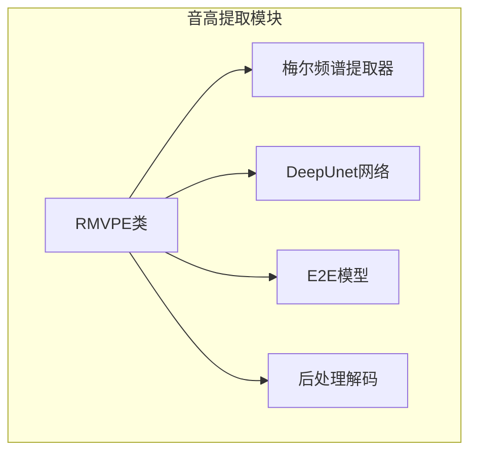
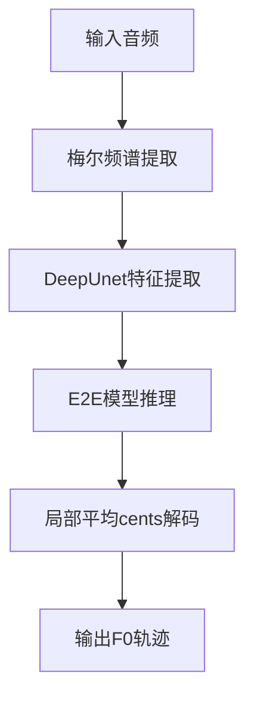
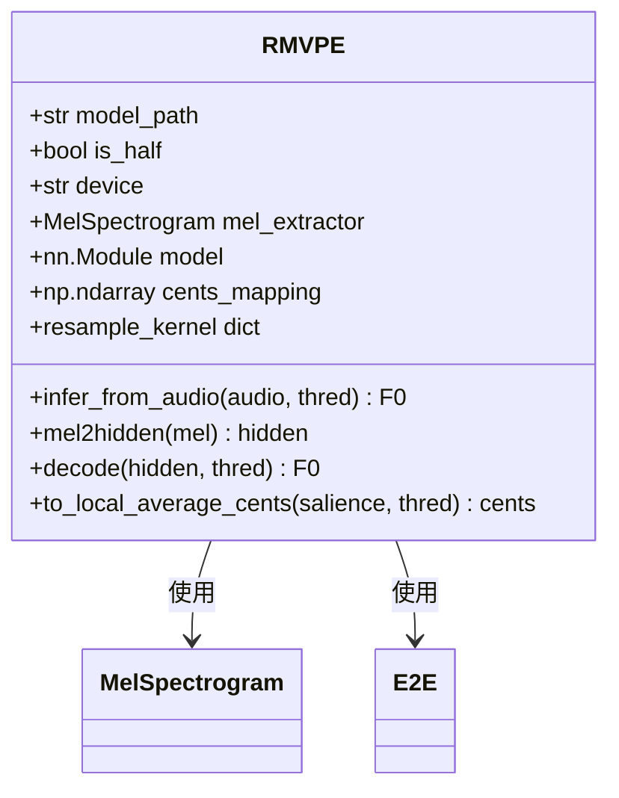
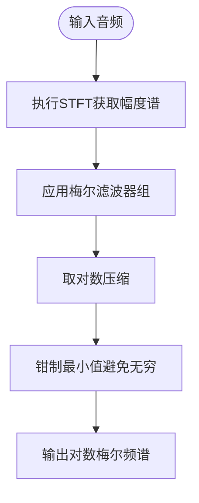
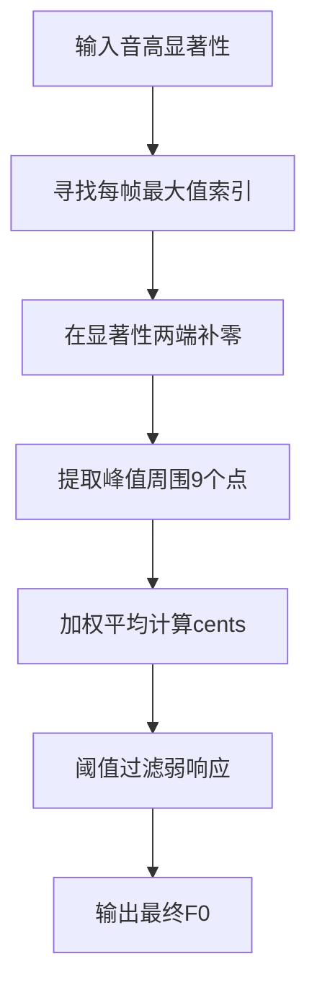
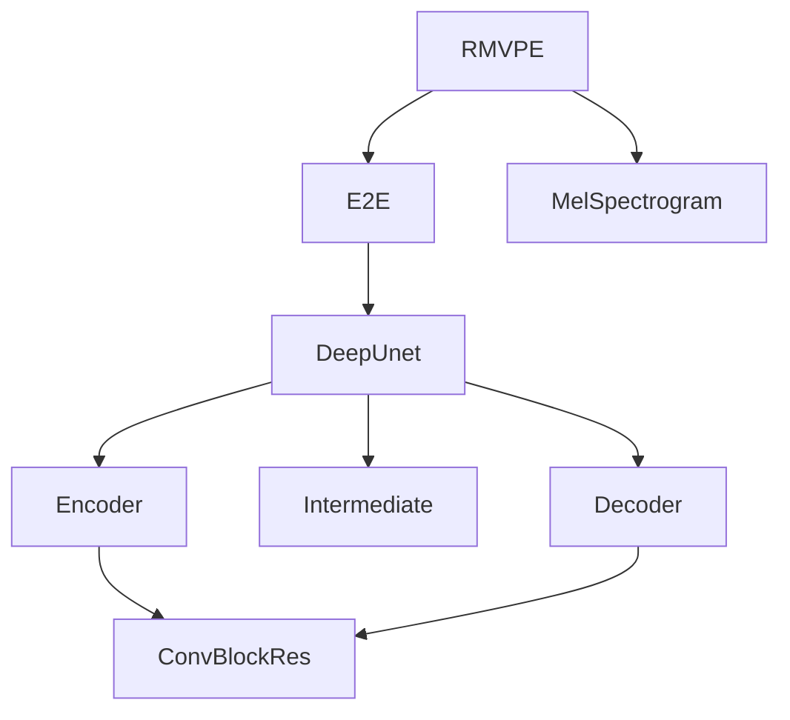

# 音高提取

<cite>
**本文档中引用的文件**  
- [rmvpe.py](file://indextts/s2mel/modules/rmvpe.py)
</cite>

## 目录
1. [简介](#简介)
2. [项目结构](#项目结构)
3. [核心组件](#核心组件)
4. [架构概述](#架构概述)
5. [详细组件分析](#详细组件分析)
6. [依赖分析](#依赖分析)
7. [性能考量](#性能考量)
8. [故障排除指南](#故障排除指南)
9. [结论](#结论)

## 简介
本文档详细解析RMVPE（Robust Multi-F0 Pitch Estimation）算法的实现机制。该算法是一种基于深度学习的鲁棒性多基频估计方法，能够从音频信号中准确提取音高轨迹。文档将说明其如何利用卷积神经网络从梅尔频谱图中提取基频（F0）轨迹，包括网络的前端特征提取、多周期检测和后处理平滑技术。同时解释模型如何应对多音源和噪声环境下的音高估计挑战，并描述其在语音合成中的具体应用，如为声码器提供音高条件信息。此外，还将提供实际调用流程示例，并讨论其精度、实时性和鲁棒性表现。

## 项目结构
项目结构显示RMVPE相关实现位于`indextts/s2mel/modules/`目录下，核心文件为`rmvpe.py`。该模块独立封装了完整的音高提取流程，包括梅尔频谱提取、深度U-Net结构的神经网络模型、后处理解码逻辑等。整个实现基于PyTorch框架，并兼容ONNX运行时以支持不同硬件平台。

**图示来源**  
- [rmvpe.py](file://indextts/s2mel/modules/rmvpe.py#L1-L631)

**本节来源**  
- [rmvpe.py](file://indextts/s2mel/modules/rmvpe.py#L1-L631)

## 核心组件
RMVPE算法的核心组件包括：梅尔频谱提取器（MelSpectrogram）、深度U型网络（DeepUnet）、端到端音高估计模型（E2E）以及后处理解码逻辑。这些组件协同工作，完成从原始音频到基频轨迹的完整映射过程。其中，MelSpectrogram负责将时域音频转换为对数梅尔频谱，DeepUnet通过编码器-中间层-解码器结构提取高层特征，E2E模型整合BiGRU时序建模能力进行音高分类，最后通过局部平均cents算法解码出连续F0轨迹。

**本节来源**  
- [rmvpe.py](file://indextts/s2mel/modules/rmvpe.py#L1-L631)

## 架构概述
RMVPE的整体架构采用“特征提取-深度建模-后处理”的三阶段设计。首先，输入音频经过自定义的MelSpectrogram模块转换为128维对数梅尔频谱图；随后，频谱图送入一个基于U-Net结构的DeepUnet模型，该模型包含编码器、中间层和解码器三个部分，用于捕捉局部与全局音高模式；接着，E2E模型通过卷积层和BiGRU层进一步提炼特征并输出360维的音高概率分布；最后，通过to_local_average_cents函数将概率分布解码为最终的F0轨迹。

**图示来源**  
- [rmvpe.py](file://indextts/s2mel/modules/rmvpe.py#L1-L631)

## 详细组件分析

### RMVPE类分析
RMVPE类是整个音高提取系统的入口，封装了模型加载、特征提取、推理和解码的全流程。其初始化过程根据设备类型选择加载PyTorch或ONNX模型，确保跨平台兼容性。核心方法`infer_from_audio`实现了从音频到F0的端到端推理。

#### 类结构图

**图示来源**  
- [rmvpe.py](file://indextts/s2mel/modules/rmvpe.py#L360-L399)

**本节来源**  
- [rmvpe.py](file://indextts/s2mel/modules/rmvpe.py#L1-L631)

### 梅尔频谱提取分析
梅尔频谱提取模块负责将原始音频转换为适合神经网络处理的对数梅尔频谱图。该模块支持动态键移（keyshift）和变速（speed）参数，增强了对不同音高和语速的适应能力。

#### 处理流程图

**图示来源**  
- [rmvpe.py](file://indextts/s2mel/modules/rmvpe.py#L405-L479)

### 音高解码分析
音高解码阶段采用局部平均cents算法，通过在峰值周围加权平均来提高F0估计的稳定性。该方法有效减少了因频谱噪声导致的抖动，提升了音高轨迹的平滑度。

#### 解码流程图

**图示来源**  
- [rmvpe.py](file://indextts/s2mel/modules/rmvpe.py#L606-L630)

**本节来源**  
- [rmvpe.py](file://indextts/s2mel/modules/rmvpe.py#L606-L630)

## 依赖分析
RMVPE模块依赖于多个PyTorch神经网络组件和Librosa音频处理库。其内部组件间存在清晰的依赖关系：E2E模型依赖DeepUnet进行特征提取，DeepUnet依赖Encoder、Intermediate和Decoder三个子模块，而Encoder又依赖ConvBlockRes等基础卷积块。此外，系统还依赖ONNX Runtime以支持DirectML等特定硬件加速。

**图示来源**  
- [rmvpe.py](file://indextts/s2mel/modules/rmvpe.py#L1-L631)

**本节来源**  
- [rmvpe.py](file://indextts/s2mel/modules/rmvpe.py#L1-L631)

## 性能考量
RMVPE在设计上兼顾了精度与效率。通过使用深度可分离卷积和残差连接，模型在保持高性能的同时控制了计算复杂度。半精度（half-precision）支持进一步提升了推理速度，适用于实时语音合成场景。模型对清音段落具有良好的鲁棒性，通过阈值过滤机制有效避免了误检。对于极端音高，可通过调整keyshift参数进行补偿。

## 故障排除指南
常见问题及解决方案：
- **问题：输出F0全为零**  
  **解决方案**：检查输入音频是否为静音或音量过低，确保音频已正确归一化。
- **问题：音高跳变严重**  
  **解决方案**：适当提高`thred`参数（如设为0.1），增强阈值过滤效果。
- **问题：推理速度慢**  
  **解决方案**：启用`is_half=True`使用半精度计算，或切换至ONNX运行时。
- **问题：高频音估计不准**  
  **解决方案**：尝试调整MelSpectrogram的`mel_fmax`参数以扩展高频响应。

**本节来源**  
- [rmvpe.py](file://indextts/s2mel/modules/rmvpe.py#L547-L573)

## 结论
RMVPE是一种高效且鲁棒的深度学习音高提取算法，通过结合U-Net架构与BiGRU时序建模，在复杂音频环境中实现了高精度的F0估计。其模块化设计便于集成到各类语音合成系统中，为声码器提供可靠的音高条件信息。通过对前端特征提取、深度神经网络和后处理算法的协同优化，RMVPE在精度、实时性和抗噪能力之间取得了良好平衡，适用于多种语音处理任务。