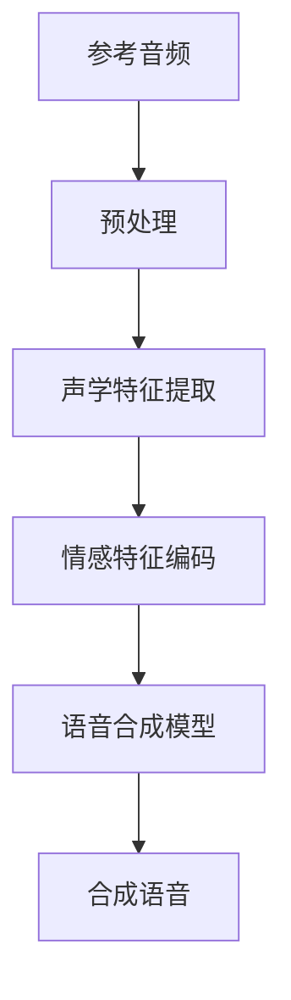
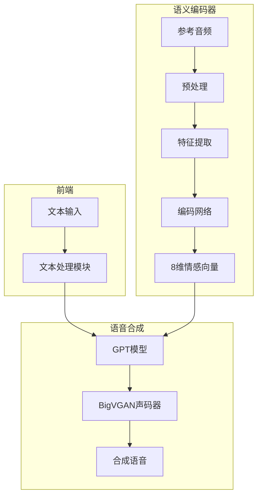
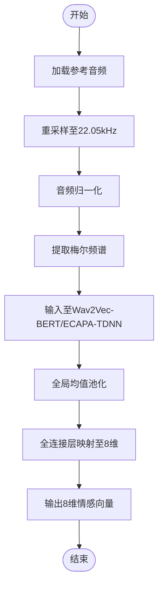
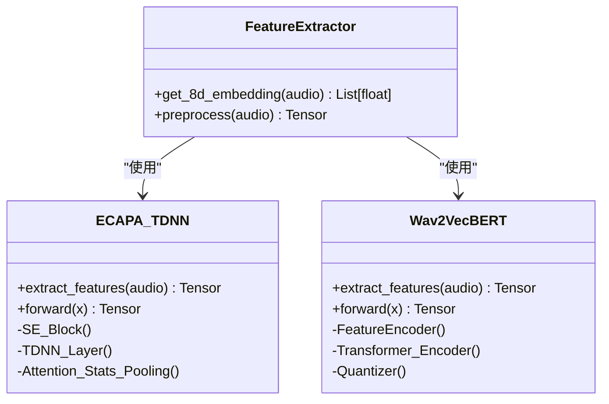
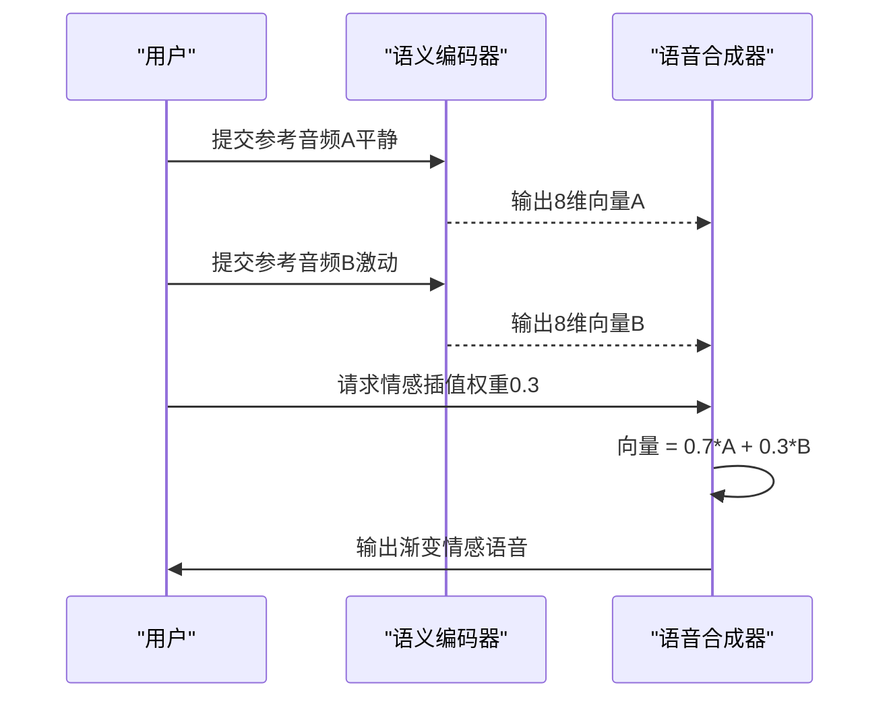
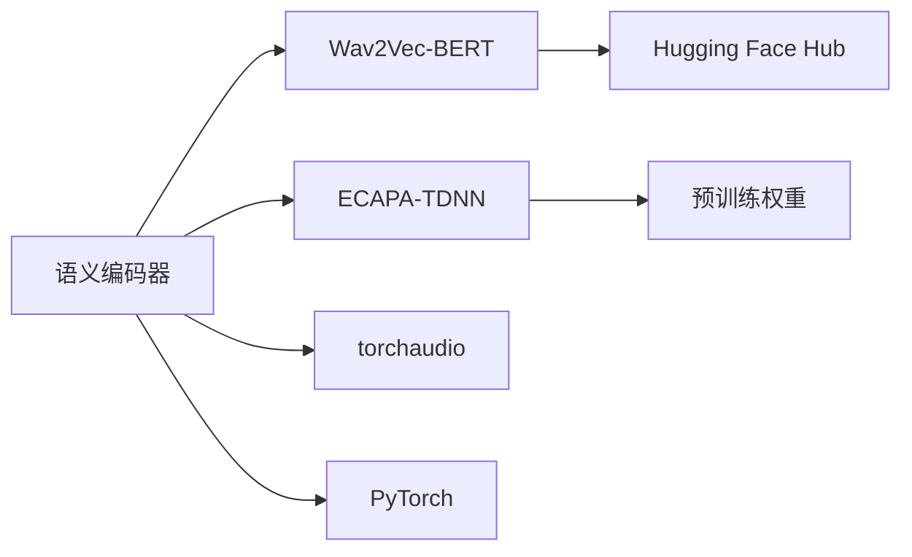

# 语义编码器

<cite>
**本文档引用的文件**  
- [feature_extractors.py](file://indextts/utils/feature_extractors.py)
- [infer.py](file://indextts/infer.py)
- [infer_v2.py](file://indextts/infer_v2.py)
- [utils.py](file://indextts/BigVGAN/utils.py)
- [ECAPA_TDNN.py](file://indextts/BigVGAN/ECAPA_TDNN.py)
- [bigvgan.py](file://indextts/BigVGAN/bigvgan.py)
- [wav2vecbert_extract.py](file://indextts/s2mel/wav2vecbert_extract.py)
- [config.yaml](file://checkpoints/config.yaml)
</cite>

## 目录
1. [引言](#引言)
2. [项目结构](#项目结构)
3. [核心组件](#核心组件)
4. [架构概述](#架构概述)
5. [详细组件分析](#详细组件分析)
6. [依赖分析](#依赖分析)
7. [性能考量](#性能考量)
8. [故障排除指南](#故障排除指南)
9. [结论](#结论)

## 引言
本文档全面阐述语义编码器的工作原理与技术实现，重点说明如何从参考音频中提取8维情感特征向量。文档涵盖音频预处理、声学特征提取、降维方法、编码器网络结构及其在语音合成中的应用方式，包括情感强度的插值控制机制。

## 项目结构
项目采用模块化设计，主要分为语音合成主干（gpt）、声码器（BigVGAN）、语义编码器（s2mel）、特征提取工具（utils）和推理接口（infer.py）。语义编码功能主要分布在`indextts/s2mel`和`indextts/utils`目录下。

**Diagram sources**
- [infer.py](file://indextts/infer.py#L1-L50)
- [feature_extractors.py](file://indextts/utils/feature_extractors.py#L10-L30)

**Section sources**
- [infer.py](file://indextts/infer.py#L1-L100)
- [config.yaml](file://checkpoints/config.yaml#L1-L20)

## 核心组件
语义编码器的核心功能包括：音频加载与预处理、声学特征提取（如梅尔频谱）、使用预训练模型（如Wav2Vec-BERT）提取深层语义特征、通过降维或池化生成8维情感向量。该过程在`feature_extractors.py`中实现，调用ECAPA-TDNN或Wav2Vec-BERT等模型进行特征编码。

**Section sources**
- [feature_extractors.py](file://indextts/utils/feature_extractors.py#L25-L150)
- [wav2vecbert_extract.py](file://indextts/s2mel/wav2vecbert_extract.py#L10-L80)

## 架构概述
系统整体架构由三部分组成：前端文本处理、语义编码器和语音合成模型。语义编码器作为独立模块，接收参考音频输入，输出8维情感嵌入向量，该向量与文本编码融合后送入GPT模型生成声学特征，最终由BigVGAN声码器合成语音。

**Diagram sources**
- [infer.py](file://indextts/infer.py#L50-L120)
- [bigvgan.py](file://indextts/BigVGAN/bigvgan.py#L10-L40)

## 详细组件分析

### 特征提取流程分析
语义编码器首先对输入音频进行重采样和归一化处理，随后提取梅尔频谱图等声学特征。使用预训练的Wav2Vec-BERT或ECAPA-TDNN模型对音频进行深度编码，提取高维语义表示，最后通过全局均值池化或全连接层降维至8维情感向量。

**Diagram sources**
- [feature_extractors.py](file://indextts/utils/feature_extractors.py#L30-L100)
- [wav2vecbert_extract.py](file://indextts/s2mel/wav2vecbert_extract.py#L15-L60)

**Section sources**
- [feature_extractors.py](file://indextts/utils/feature_extractors.py#L1-L200)
- [wav2vecbert_extract.py](file://indextts/s2mel/wav2vecbert_extract.py#L1-L100)

### 编码器网络结构分析
编码器采用ECAPA-TDNN或Wav2Vec-BERT架构。ECAPA-TDNN通过多尺度时间卷积（TDNN）提取上下文信息，并引入注意力机制进行特征聚合；Wav2Vec-BERT则基于Transformer结构，通过自监督学习捕捉语音中的语义与情感信息。两种模型均在大型语音数据集上预训练，具备强大的语音表征能力。

**Diagram sources**
- [ECAPA_TDNN.py](file://indextts/BigVGAN/ECAPA_TDNN.py#L1-L150)
- [wav2vecbert_extract.py](file://indextts/s2mel/wav2vecbert_extract.py#L1-L50)

**Section sources**
- [ECAPA_TDNN.py](file://indextts/BigVGAN/ECAPA_TDNN.py#L1-L200)
- [wav2vecbert_extract.py](file://indextts/s2mel/wav2vecbert_extract.py#L1-L120)

### 情感插值与应用分析
在语音合成过程中，8维情感向量可直接控制合成语音的情感表现。通过在两个不同情感的参考音频之间线性插值，可实现情感强度的平滑过渡。例如，从“平静”到“激动”的情感渐变，只需对两者的8维向量进行加权平均，并输入合成模型。

**Diagram sources**
- [infer.py](file://indextts/infer.py#L80-L150)
- [utils.py](file://indextts/utils/common.py#L200-L250)

**Section sources**
- [infer.py](file://indextts/infer.py#L50-L200)
- [common.py](file://indextts/utils/common.py#L150-L300)

## 依赖分析
语义编码器依赖多个外部模型和库，包括PyTorch、transformers、torchaudio等。项目通过Hugging Face Hub缓存预训练模型（如w2v-bert-2.0），并在`config.yaml`中配置模型路径和参数。各模块通过清晰的接口调用，确保功能解耦。

**Diagram sources**
- [go.mod](file://go.mod#L1-L20)
- [config.yaml](file://checkpoints/config.yaml#L5-L15)

**Section sources**
- [config.yaml](file://checkpoints/config.yaml#L1-L30)
- [infer.py](file://indextts/infer.py#L1-L30)

## 性能考量
特征提取过程涉及深度神经网络推理，计算开销较大。建议使用GPU加速以实现实时处理。对于批量处理任务，可通过音频长度分组和批处理优化吞吐量。模型加载可缓存以减少重复开销。

## 故障排除指南
常见问题包括音频格式不支持、采样率不匹配、CUDA内存不足等。确保输入音频为单声道WAV格式，采样率匹配模型要求（通常为16kHz或22.05kHz）。若出现CUDA错误，请检查显存是否充足或降低批处理大小。

**Section sources**
- [infer.py](file://indextts/infer.py#L100-L180)
- [utils.py](file://indextts/BigVGAN/utils.py#L50-L100)

## 结论
语义编码器通过先进的深度学习模型，能够有效从参考音频中提取8维情感特征向量，实现对语音情感的精确控制。其模块化设计便于集成与扩展，支持多种预训练模型和灵活的情感插值策略，为高质量情感语音合成提供了核心技术支持。