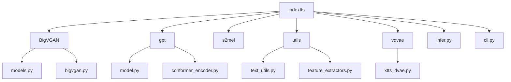
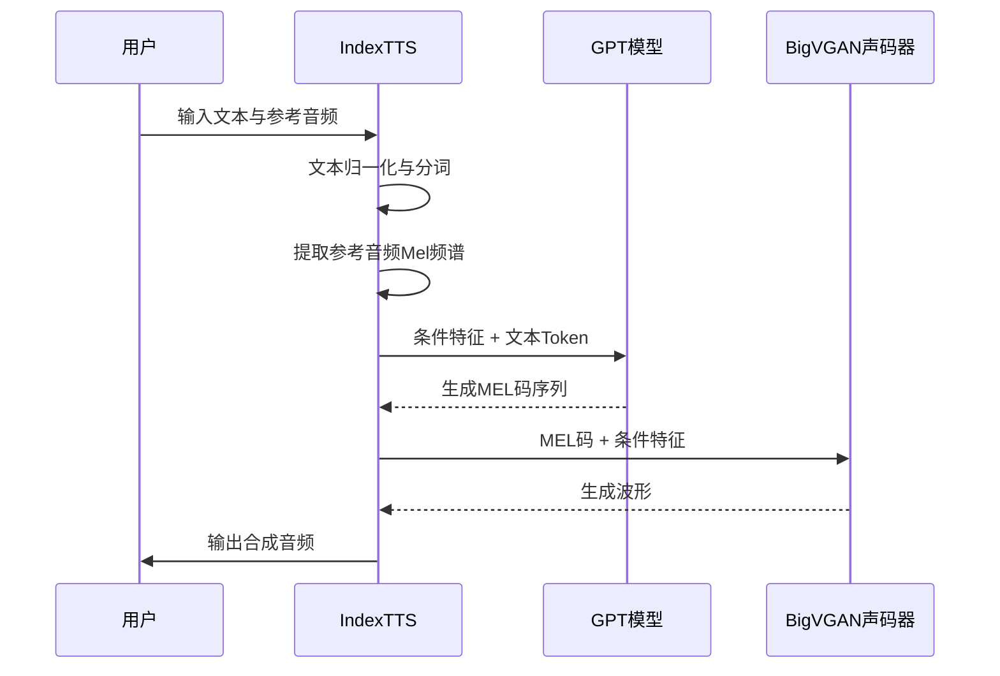
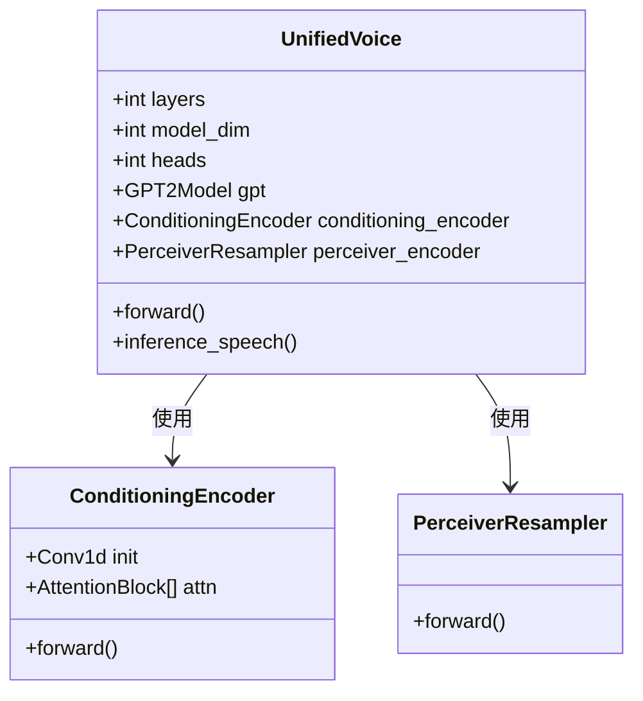
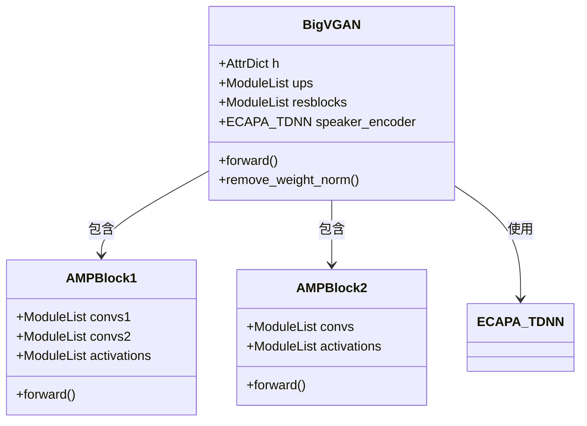

# 技术实现

<cite>
**本文档中引用的文件**  
- [infer.py](file://indextts/infer.py)
- [model.py](file://indextts/gpt/model.py)
- [bigvgan.py](file://indextts/BigVGAN/bigvgan.py)
- [text_utils.py](file://indextts/utils/text_utils.py)
- [config.yaml](file://checkpoints/config.yaml)
</cite>

## 目录
1. [项目结构](#项目结构)  
2. [核心架构与数据流](#核心架构与数据流)  
3. [关键模块分析](#关键模块分析)  
4. [GPT模型自回归生成机制](#gpt模型自回归生成机制)  
5. [BigVGAN声码器与反混叠激活函数](#bigvgan声码器与反混叠激活函数)  
6. [关键技术与优化](#关键技术与优化)  
7. [设计范式与接口设计](#设计范式与接口设计)  
8. [性能分析与推理模式](#性能分析与推理模式)  
9. [总结](#总结)

## 项目结构

项目采用模块化设计，主要组件分布在 `indextts` 目录下，各子模块职责清晰，便于维护与扩展。整体结构如下：



**图示来源**  
- [infer.py](file://indextts/infer.py#L1-L691)
- [model.py](file://indextts/gpt/model.py#L1-L714)
- [bigvgan.py](file://indextts/BigVGAN/bigvgan.py#L1-L535)

## 核心架构与数据流

系统采用分层处理管道架构，整体流程为：文本输入 → 文本预处理 → GPT语义编码与MEL码生成 → BigVGAN声码器解码 → 音频输出。参考音频用于提取语音特征，作为条件输入。



**图示来源**  
- [infer.py](file://indextts/infer.py#L100-L650)
- [model.py](file://indextts/gpt/model.py#L500-L700)
- [bigvgan.py](file://indextts/BigVGAN/bigvgan.py#L300-L500)

## 关键模块分析

系统由三大核心模块构成：文本处理、GPT语音生成、BigVGAN声码器。

### 文本处理模块
负责文本归一化、分词与分段。支持中英文混合处理，通过 `TextNormalizer` 和 `TextTokenizer` 实现。

**模块来源**  
- [infer.py](file://indextts/infer.py#L120-L130)
- [text_utils.py](file://indextts/utils/text_utils.py#L1-L41)

### GPT语音生成模块
基于Transformer架构，结合Conformer编码器与Perceiver重采样器，实现跨模态语音生成。



**图示来源**  
- [model.py](file://indextts/gpt/model.py#L300-L600)

### BigVGAN声码器模块
基于反混叠周期性激活函数（AMP Block）的神经声码器，将离散MEL码转换为高质量音频波形。



**图示来源**  
- [bigvgan.py](file://indextts/BigVGAN/bigvgan.py#L100-L400)

## GPT模型自回归生成机制

GPT模型采用自回归方式生成MEL码序列。在推理阶段，通过 `inference_speech` 方法逐步生成下一个MEL码，直到遇到停止标记或达到最大长度。

流程如下：
1. 将参考音频通过 `ConditioningEncoder` 编码为条件特征
2. 条件特征与文本Token拼接，输入GPT模型
3. 模型输出下一个MEL码的概率分布
4. 通过采样策略（如top-k、top-p）选择下一个Token
5. 重复步骤3-4，直到生成结束

支持典型采样（typical sampling）以提升生成质量。

**模块来源**  
- [model.py](file://indextts/gpt/model.py#L600-L714)
- [infer.py](file://indextts/infer.py#L400-L500)

## BigVGAN声码器与反混叠激活函数

BigVGAN使用AMP Block（Anti-aliased Multi-periodicity Block）作为残差块，其核心是Snake或SnakeBeta激活函数，具有可学习的周期性参数。

### 反混叠激活函数
- **Snake**: \( \text{Snake}(x) = x + \frac{1}{a} \sin^2(ax) \)
- **SnakeBeta**: 在Snake基础上引入Beta分布控制周期性

这些激活函数能有效减少上采样过程中的混叠效应，提升音频质量。

### CUDA内核优化
当启用 `use_cuda_kernel` 时，系统会预加载自定义CUDA内核以加速AMP Block计算，仅用于推理。

**模块来源**  
- [bigvgan.py](file://indextts/BigVGAN/bigvgan.py#L50-L200)
- [activations.py](file://indextts/BigVGAN/activations.py)

## 关键技术与优化

### 混合精度计算（FP16）
通过 `torch.amp.autocast` 实现混合精度推理，减少显存占用并提升计算效率。

```python
with torch.amp.autocast(device_type, enabled=self.dtype is not None, dtype=self.dtype):
    # 前向计算
```

### DeepSpeed加速
支持使用DeepSpeed进行推理加速，尤其在FP16模式下显著提升性能。

```python
self.ds_engine = deepspeed.init_inference(model=self.inference_model, dtype=torch.float16)
```

### 缓存机制
`IndexTTS` 类缓存参考音频的Mel频谱，避免重复计算，提升多轮推理效率。

```python
self.cache_audio_prompt = audio_prompt
self.cache_cond_mel = cond_mel
```

**模块来源**  
- [infer.py](file://indextts/infer.py#L150-L180)
- [model.py](file://indextts/gpt/model.py#L250-L280)

## 设计范式与接口设计

### 面向对象接口设计
`IndexTTS` 类封装了完整的推理流程，提供 `infer()` 和 `infer_fast()` 两种接口。

- `infer()`: 原始推理模式，逐句处理
- `infer_fast()`: 快速推理模式，支持分桶批处理，提升长文本合成速度

### 配置驱动
系统通过 `config.yaml` 统一管理超参数，如模型维度、层数、最大Token数等。

```yaml
gpt:
  layers: 8
  model_dim: 512
  max_text_tokens: 120
  max_mel_tokens: 600
```

**模块来源**  
- [infer.py](file://indextts/infer.py#L50-L100)
- [config.yaml](file://checkpoints/config.yaml)

## 性能分析与推理模式

### 推理时间分析
系统输出详细的性能指标，包括：
- GPT生成时间
- GPT前向计算时间
- BigVGAN解码时间
- 总推理时间
- 实时因子（RTF）

### 快速推理模式
通过分段与分桶批处理，显著提升长文本合成速度，速度提升可达2~10倍。

**模块来源**  
- [infer.py](file://indextts/infer.py#L300-L600)

## 总结

本系统采用模块化、分层处理架构，结合GPT自回归生成与BigVGAN声码器，实现高质量语音合成。关键技术包括：
- 基于Conformer与Perceiver的跨模态编码
- 反混叠激活函数提升音频质量
- 混合精度与DeepSpeed加速推理
- 缓存与批处理优化性能

该设计为高级用户和贡献者提供了清晰的内部运作视图，便于进一步优化与扩展。