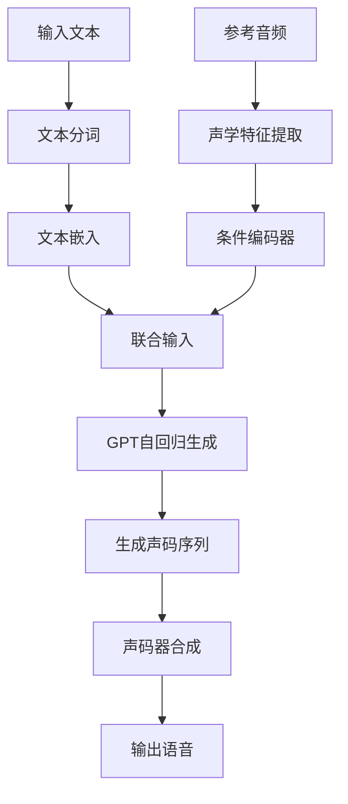
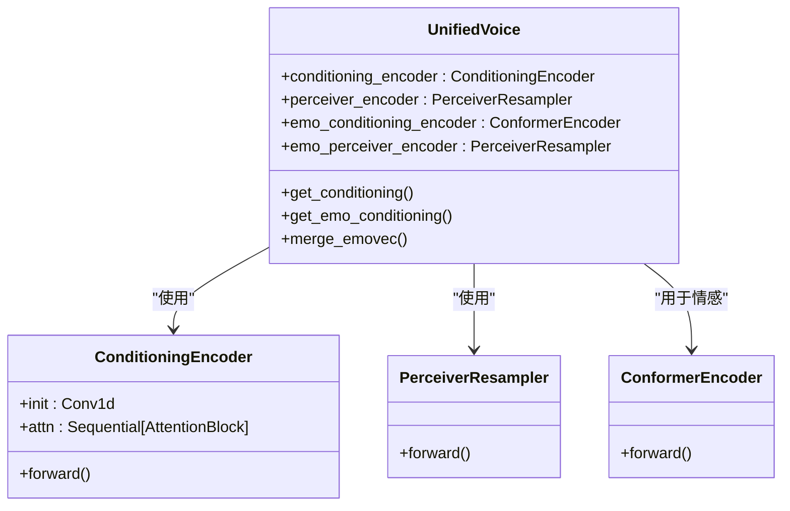
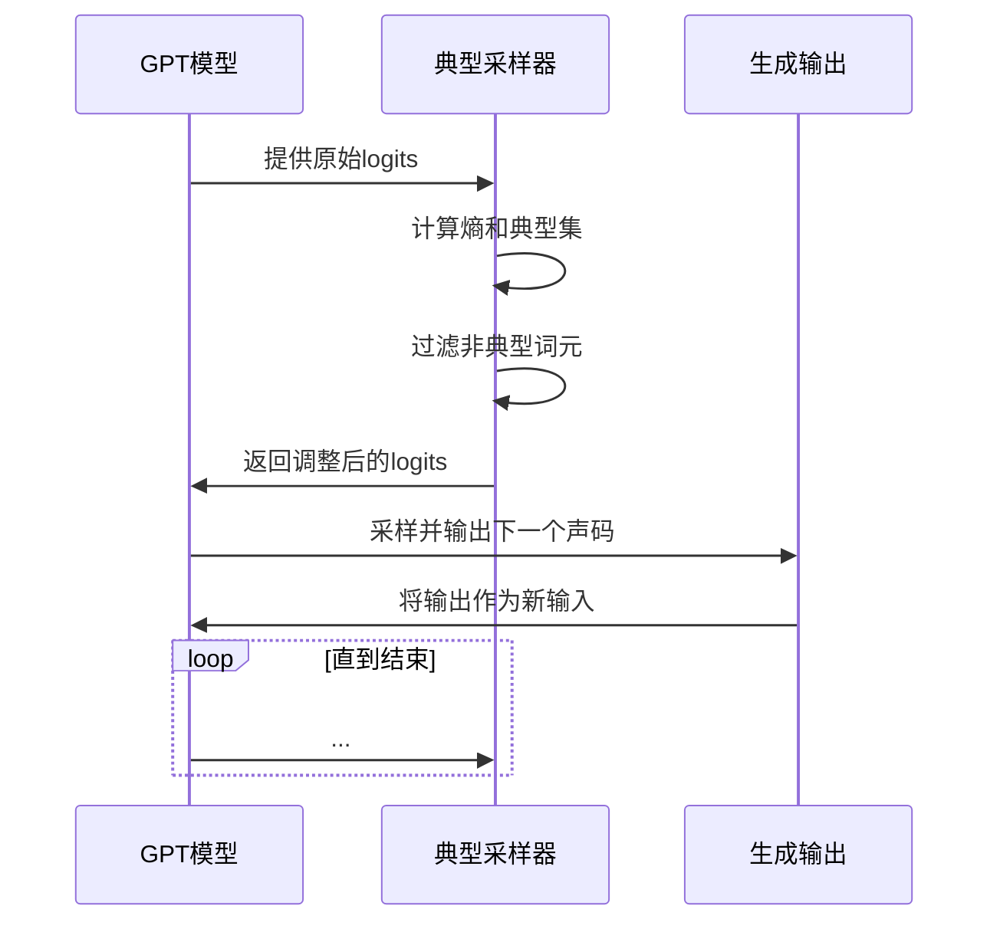
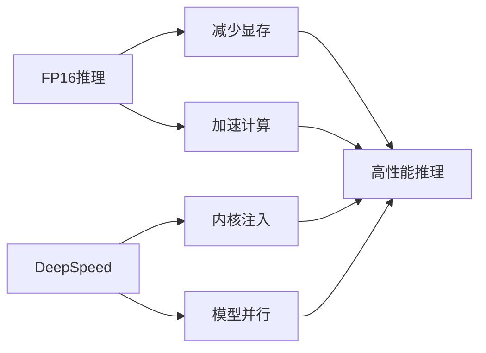

# GPT推理

<cite>
**本文档中引用的文件**   
- [model.py](file://indextts/gpt/model.py)
- [model_v2.py](file://indextts/gpt/model_v2.py)
- [transformers_generation_utils.py](file://indextts/gpt/transformers_generation_utils.py)
- [typical_sampling.py](file://indextts/utils/typical_sampling.py)
- [infer.py](file://indextts/infer.py)
- [infer_v2.py](file://indextts/infer_v2.py)
</cite>

## 目录
1. [引言](#引言)
2. [GPT模型架构与推理流程](#gpt模型架构与推理流程)
3. [语义特征与情感向量处理](#语义特征与情感向量处理)
4. [自回归生成与采样策略](#自回归生成与采样策略)
5. [长度调节机制](#长度调节机制)
6. [性能优化技术](#性能优化技术)
7. [生成质量与速度权衡](#生成质量与速度权衡)
8. [代码示例与配置](#代码示例与配置)
9. [结论](#结论)

## 引言
本文档详细阐述了Index-TTS项目中GPT语音生成模型的推理过程。该模型采用统一语音（UnifiedVoice）架构，能够将文本和参考音频作为输入，生成高质量的语音。推理过程涉及复杂的模型架构，包括对语义特征和情感向量的处理、自回归的声学特征序列生成、以及多种性能优化技术。本文将深入解析这些核心机制，并提供实际的代码调用示例。

## GPT模型架构与推理流程
Index-TTS中的GPT模型基于Hugging Face的GPT-2架构进行改造，其核心是一个`UnifiedVoice`类。该模型通过一个自回归解码器，将文本语义和参考音频的声学特征联合编码，逐步生成目标语音的离散声码（mel codes）。

推理流程主要分为两个阶段：首先，使用`inference_speech`方法生成声码序列；然后，将生成的声码序列输入到声码器（如BigVGAN）中，合成最终的波形音频。整个流程由`IndexTTS`或`IndexTTS2`等高级接口类进行封装和管理。



**图源**
- [model.py](file://indextts/gpt/model.py#L1)
- [infer.py](file://indextts/infer.py#L1)

## 语义特征与情感向量处理
模型通过多阶段处理来融合语义和情感信息。首先，参考音频通过一个`ConditioningEncoder`（在`model_v2.py`中为`ConformerEncoder`）被编码为一个高维的潜变量表示。这个过程捕捉了说话人的音色、语调和情感等声学特征。

在`model_v2.py`中，情感处理更为精细。它引入了独立的情感编码器（`emo_conditioning_encoder`）和情感向采样器（`emo_perceiver_encoder`），专门用于提取情感向量。此外，还支持通过文本提示（`use_emo_text`）来引导情感生成，利用一个名为`QwenEmotion`的外部模型分析文本情感，并将其转换为可混合的情感向量。



**图源**
- [model_v2.py](file://indextts/gpt/model_v2.py#L1)
- [infer_v2.py](file://indextts/infer_v2.py#L1)

## 自回归生成与采样策略
声学特征序列的生成是一个自回归过程。模型在每一步预测下一个声码，然后将这个预测结果作为下一步的输入，循环往复，直到生成完整的序列或遇到结束标记。

为了控制生成的多样性和质量，模型支持多种采样策略。默认情况下使用“典型采样”（typical sampling），该策略通过计算预测分布的典型集来过滤掉概率过低或过高的异常词元，从而在保持多样性的同时提高生成文本的连贯性。在`typical_sampling.py`中，`TypicalLogitsWarper`类实现了这一逻辑，它根据预测的对数概率和熵值来调整logits。



**图源**
- [model.py](file://indextts/gpt/model.py#L1)
- [typical_sampling.py](file://indextts/utils/typical_sampling.py#L1)

## 长度调节机制
模型通过`length_regulator`模块来处理输入文本和输出声码序列之间的长度不匹配问题。由于文本序列和声码序列的长度通常不同，该模块负责将文本的语义表示扩展或压缩，以对齐到目标声码序列的长度。

在`infer_v2.py`中，`s2mel.models['length_regulator']`被用于此目的。它接收由GPT生成的潜变量和声码序列，并根据目标长度进行调节，确保后续的声码器能够正确地将语义信息映射到声学信号上。

## 性能优化技术
为了提升推理速度和效率，系统应用了多项性能优化技术。

**FP16推理**：通过将模型权重和计算转换为半精度浮点数（FP16），可以显著减少显存占用并加速计算。在`infer.py`和`infer_v2.py`的初始化过程中，通过`torch.amp.autocast`上下文管理器来启用FP16推理。

**DeepSpeed加速**：对于支持的环境，系统集成了DeepSpeed的推理优化。在`model.py`的`post_init_gpt2_config`方法中，当`use_deepspeed=True`时，会调用`deepspeed.init_inference`来初始化一个经过内核注入优化的推理引擎，这可以进一步提升GPT模型的生成速度。



**图源**
- [model.py](file://indextts/gpt/model.py#L1)
- [infer.py](file://indextts/infer.py#L1)

## 生成质量与速度权衡
在实际应用中，需要在生成质量和推理速度之间进行权衡。调整生成参数是实现这一平衡的关键。

- **`max_text_tokens_per_segment`**：此参数控制每次生成的文本段长度。较小的值会将长文本分割成更多段落，增加批处理的并行度，从而加快整体推理速度，但可能影响段落间的连贯性。
- **`max_mel_tokens`**：限制了单次生成的最大声码数量。如果生成的语音过长，达到此上限，生成会提前停止。增加此值可以生成更长的语音，但会增加单次生成的耗时和内存消耗。
- **采样参数**：如`temperature`、`top_p`和`top_k`直接影响生成的随机性和多样性。较高的`temperature`会增加随机性，可能产生更富表现力但不稳定的语音；而较低的值则会使输出更确定和稳定。

## 代码示例与配置
以下代码展示了如何使用`IndexTTS`类进行语音合成，包括关键的生成配置。

```python
# [infer.py](file://indextts/infer.py#L1)
tts = IndexTTS(use_fp16=True, use_cuda_kernel=True) # 启用FP16和CUDA内核
output_path = tts.infer(
    audio_prompt="reference.wav",
    text="这是一个测试。",
    output_path="output.wav",
    do_sample=True,          # 启用采样
    top_p=0.8,               # 核采样概率
    temperature=1.0,         # 温度参数
    max_text_tokens_per_segment=100, # 分段长度
    max_mel_tokens=600       # 最大声码数
)
```

## 结论
Index-TTS的GPT语音生成模型通过一个复杂的多阶段推理流程，成功地将文本和参考音频融合，生成了高质量的语音。其核心在于对语义和情感特征的联合编码，以及通过自回归和典型采样策略生成连贯的声学序列。通过FP16和DeepSpeed等性能优化技术，系统能够在保证生成质量的同时，实现高效的推理。用户可以通过调整一系列生成参数，根据具体需求在生成速度和语音质量之间找到最佳平衡点。