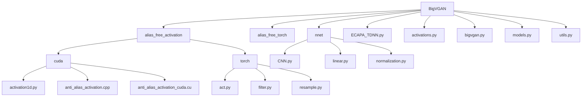
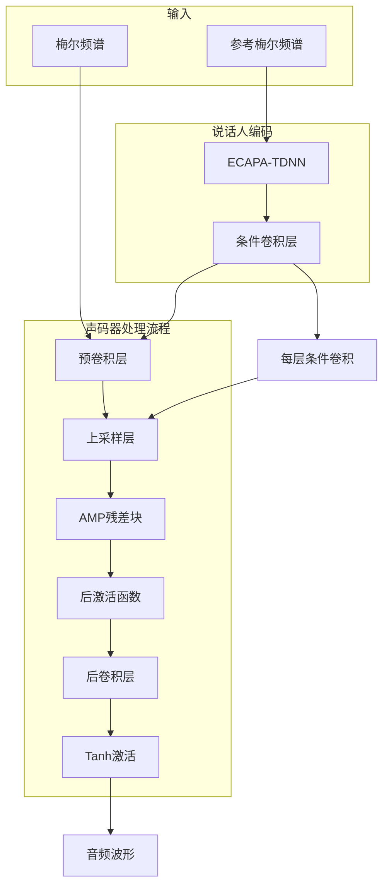
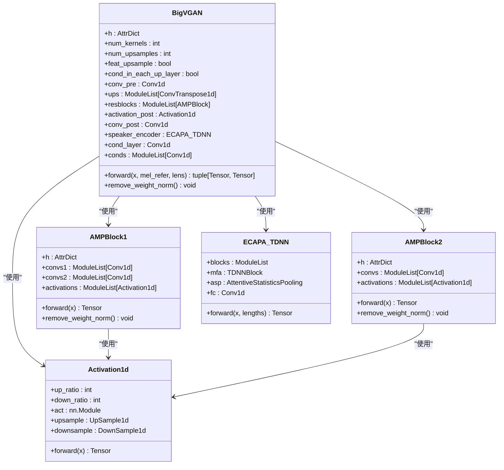
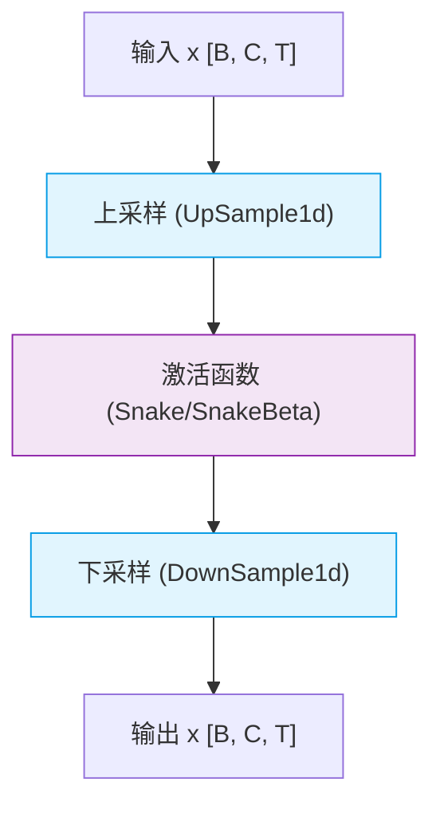
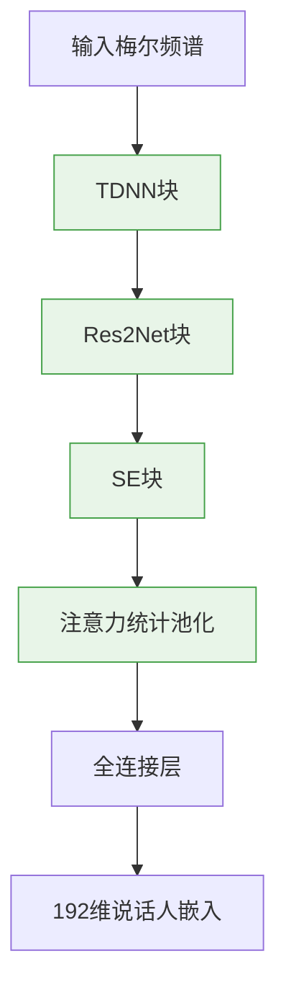
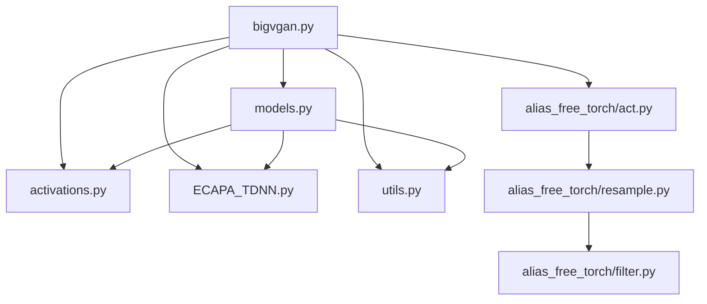

# 声码器合成

<cite>
**本文档中引用的文件**  
- [bigvgan.py](file://indextts/BigVGAN/bigvgan.py)
- [models.py](file://indextts/BigVGAN/models.py)
- [activations.py](file://indextts/BigVGAN/activations.py)
- [act.py](file://indextts/BigVGAN/alias_free_torch/act.py)
- [resample.py](file://indextts/BigVGAN/alias_free_torch/resample.py)
- [filter.py](file://indextts/BigVGAN/alias_free_torch/filter.py)
- [ECAPA_TDNN.py](file://indextts/BigVGAN/ECAPA_TDNN.py)
- [utils.py](file://indextts/BigVGAN/utils.py)
</cite>

## 目录
1. [简介](#简介)
2. [项目结构](#项目结构)
3. [核心组件](#核心组件)
4. [架构概述](#架构概述)
5. [详细组件分析](#详细组件分析)
6. [依赖分析](#依赖分析)
7. [性能考虑](#性能考虑)
8. [故障排除指南](#故障排除指南)
9. [结论](#结论)

## 简介
本文档详细介绍了BigVGAN声码器在Index-TTS系统中的合成阶段。BigVGAN是一种先进的神经声码器，能够将GPT模型生成的梅尔频谱图高效地转换为高质量的音频波形。文档深入解析了其模型架构、反混叠激活函数、多周期生成机制以及性能优化策略。通过代码调用示例和配置说明，展示了如何在实际应用中平衡合成速度与音频质量，以实现自然、清晰的语音合成。

## 项目结构
BigVGAN声码器模块位于`indextts/BigVGAN/`目录下，其结构清晰，模块化设计便于维护和扩展。

**图示来源**  
- [bigvgan.py](file://indextts/BigVGAN/bigvgan.py)
- [models.py](file://indextts/BigVGAN/models.py)

**本节来源**  
- [bigvgan.py](file://indextts/BigVGAN/bigvgan.py)
- [models.py](file://indextts/BigVGAN/models.py)

## 核心组件
BigVGAN的核心组件包括声码器主模型、反混叠激活函数、说话人编码器和多周期残差块。这些组件协同工作，将低维的梅尔频谱特征逐步上采样并转换为高保真的音频波形。

**本节来源**  
- [bigvgan.py](file://indextts/BigVGAN/bigvgan.py#L1-L534)
- [activations.py](file://indextts/BigVGAN/activations.py#L1-L122)
- [ECAPA_TDNN.py](file://indextts/BigVGAN/ECAPA_TDNN.py#L1-L656)

## 架构概述
BigVGAN采用编码器-解码器风格的架构，但其解码过程是通过一系列上采样层和残差块完成的。该架构的关键在于使用了反混叠激活函数，有效解决了传统声码器在上采样过程中产生的混叠失真问题。

**图示来源**  
- [bigvgan.py](file://indextts/BigVGAN/bigvgan.py#L1-L534)
- [ECAPA_TDNN.py](file://indextts/BigVGAN/ECAPA_TDNN.py#L1-L656)

## 详细组件分析
### BigVGAN 模型分析
`BigVGAN`类是声码器的主干，负责协调整个波形生成过程。

#### 模型架构图

**图示来源**  
- [bigvgan.py](file://indextts/BigVGAN/bigvgan.py#L1-L534)
- [models.py](file://indextts/BigVGAN/models.py#L1-L451)
- [act.py](file://indextts/BigVGAN/alias_free_torch/act.py#L1-L28)
- [ECAPA_TDNN.py](file://indextts/BigVGAN/ECAPA_TDNN.py#L1-L656)

**本节来源**  
- [bigvgan.py](file://indextts/BigVGAN/bigvgan.py#L1-L534)

### 反混叠激活函数分析
反混叠激活函数是BigVGAN的核心创新，它通过在激活前上采样、激活后下采样来消除高频混叠。

#### 激活函数处理流程

**图示来源**  
- [act.py](file://indextts/BigVGAN/alias_free_torch/act.py#L1-L28)
- [resample.py](file://indextts/BigVGAN/alias_free_torch/resample.py#L1-L48)
- [filter.py](file://indextts/BigVGAN/alias_free_torch/filter.py#L1-L95)

**本节来源**  
- [act.py](file://indextts/BigVGAN/alias_free_torch/act.py#L1-L28)

### 说话人编码器分析
ECAPA-TDNN说话人编码器为声码器提供说话人身份信息，确保合成语音的个性化。

#### 说话人编码器架构

**图示来源**  
- [ECAPA_TDNN.py](file://indextts/BigVGAN/ECAPA_TDNN.py#L1-L656)

**本节来源**  
- [ECAPA_TDNN.py](file://indextts/BigVGAN/ECAPA_TDNN.py#L1-L656)

## 依赖分析
BigVGAN模块的依赖关系清晰，各组件职责分明。

**图示来源**  
- [bigvgan.py](file://indextts/BigVGAN/bigvgan.py)
- [models.py](file://indextts/BigVGAN/models.py)

**本节来源**  
- [bigvgan.py](file://indextts/BigVGAN/bigvgan.py)
- [models.py](file://indextts/BigVGAN/models.py)

## 性能考虑
BigVGAN提供了多种性能优化选项。通过设置`use_cuda_kernel=True`，可以启用优化的CUDA内核进行推理，显著提升合成速度，但此模式仅支持推理，不支持训练。此外，模型的`feat_upsample`和`cond_in_each_up_layer`等配置选项允许在质量和速度之间进行权衡。

## 故障排除指南
常见问题及解决方案：
- **合成音频有爆音或失真**：检查输入梅尔频谱的范围是否正确，确保其经过了适当的归一化处理。
- **加载模型失败**：确认`config.json`和`bigvgan_generator.pt`文件存在于指定路径，并且文件完整无损。
- **CUDA内核编译失败**：确保系统中安装了与PyTorch版本匹配的`nvcc`和`ninja`工具。
- **显存不足**：尝试减小批处理大小（batch size）或使用更小的模型配置。

**本节来源**  
- [bigvgan.py](file://indextts/BigVGAN/bigvgan.py#L1-L534)
- [utils.py](file://indextts/BigVGAN/utils.py#L1-L101)

## 结论
BigVGAN声码器通过其创新的反混叠激活函数和精心设计的多周期残差块，在语音自然度和清晰度方面表现出色。其模块化的设计和灵活的配置选项使其能够适应不同的应用场景，在合成质量和速度之间取得最佳平衡。通过深入理解其架构和组件，开发者可以有效地集成和优化该声码器，以满足各种语音合成需求。