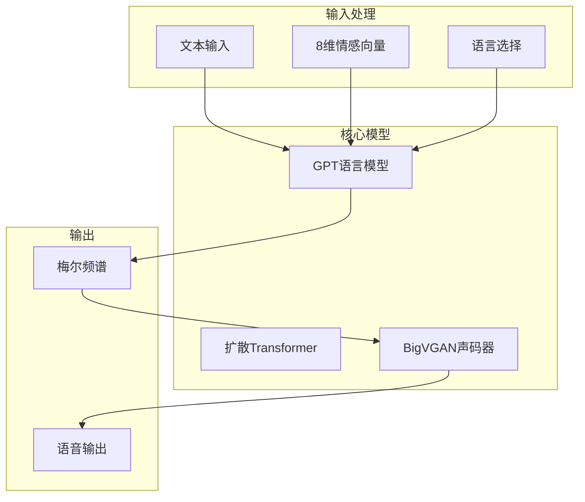
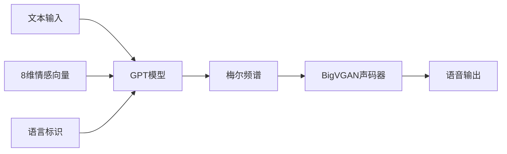
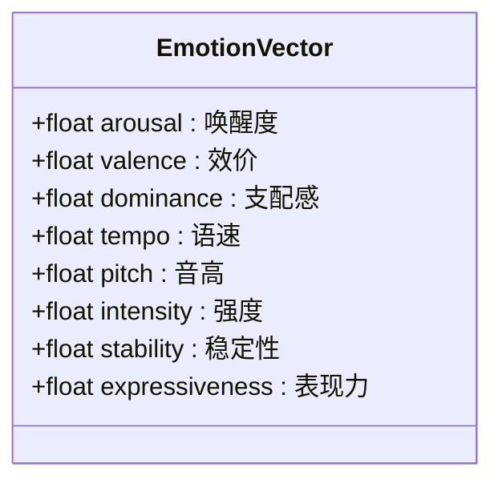
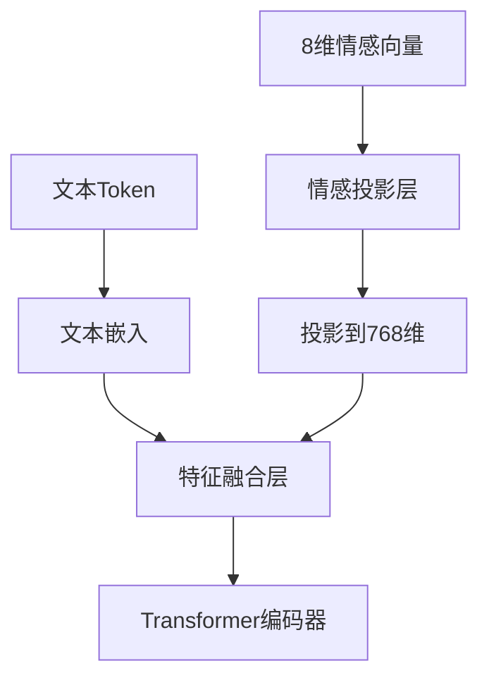
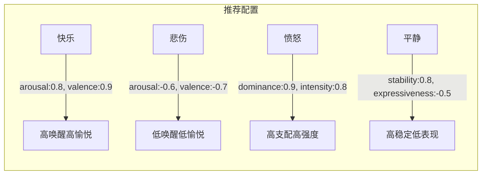
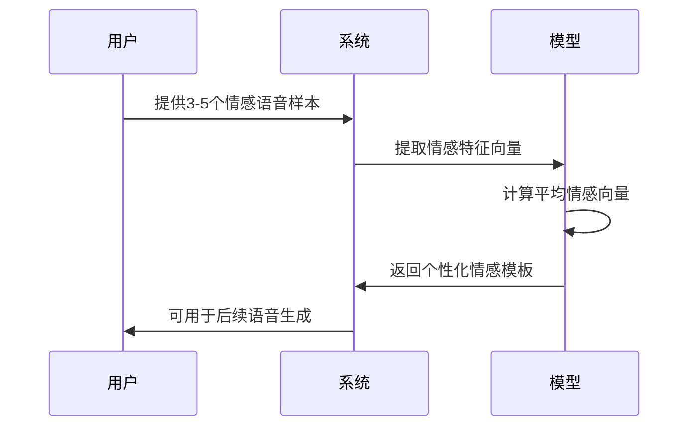
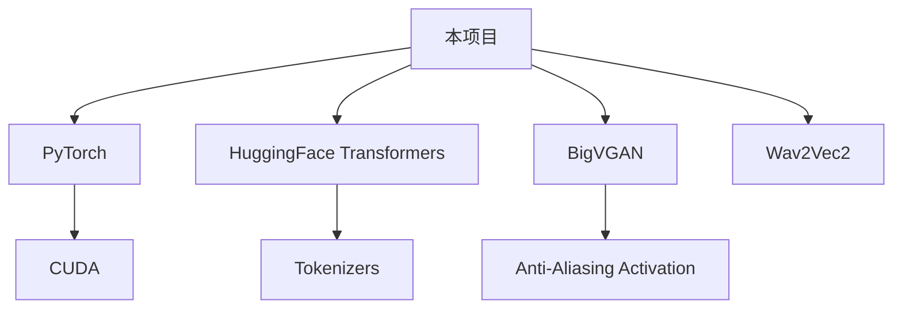

# 情感控制

<cite>
**本文档中引用的文件**  
- [infer.py](file://indextts/infer.py)
- [infer_v2.py](file://indextts/infer_v2.py)
- [utils/common.py](file://indextts/utils/common.py)
- [gpt/model_v2.py](file://indextts/gpt/model_v2.py)
- [BigVGAN/bigvgan.py](file://indextts/BigVGAN/bigvgan.py)
- [s2mel/modules/diffusion_transformer.py](file://indextts/s2mel/modules/diffusion_transformer.py)
- [utils/text_utils.py](file://indextts/utils/text_utils.py)
- [webui.py](file://webui.py)
</cite>

## 目录
1. [简介](#简介)
2. [项目结构](#项目结构)
3. [核心组件](#核心组件)
4. [架构概述](#架构概述)
5. [详细组件分析](#详细组件分析)
6. [依赖分析](#依赖分析)
7. [性能考虑](#性能考虑)
8. [故障排除指南](#故障排除指南)
9. [结论](#结论)

## 简介
本项目是一个基于深度学习的文本转语音（TTS）系统，支持通过8维情感向量精确控制生成语音的情感表达。系统结合了GPT风格的自回归语言模型与BigVGAN声码器，能够实现高质量、富有情感变化的语音合成。用户可通过调整情感向量参数，微调语调、节奏和强度等语音特征，适用于虚拟助手、有声读物、游戏角色等多种场景。

## 项目结构
项目采用模块化设计，主要分为推理接口、情感控制、语音合成模型和工具函数四大模块。核心功能集中在`indextts`目录下，包含GPT语言模型、BigVGAN声码器、S2Mel频谱转换模块以及通用工具库。

**Diagram sources**
- [infer_v2.py](file://indextts/infer_v2.py#L1-L50)
- [gpt/model_v2.py](file://indextts/gpt/model_v2.py#L10-L30)

**Section sources**
- [infer_v2.py](file://indextts/infer_v2.py#L1-L100)
- [webui.py](file://webui.py#L1-L50)

## 核心组件

系统的核心是8维情感向量控制机制，该机制贯穿于GPT语言模型的编码与解码过程。情感向量作为条件输入，与文本语义特征融合，影响梅尔频谱的生成过程，从而控制最终语音的情感表达。

**Section sources**
- [gpt/model_v2.py](file://indextts/gpt/model_v2.py#L150-L300)
- [infer_v2.py](file://indextts/infer_v2.py#L80-L120)

## 架构概述

整个系统采用两阶段生成架构：第一阶段由GPT模型生成梅尔频谱图，第二阶段由BigVGAN声码器将频谱图转换为波形音频。情感控制主要在第一阶段实现，通过条件嵌入（conditional embedding）将情感信息注入模型。

**Diagram sources**
- [infer_v2.py](file://indextts/infer_v2.py#L50-L100)
- [BigVGAN/bigvgan.py](file://indextts/BigVGAN/bigvgan.py#L20-L40)

## 详细组件分析

### 情感向量设计原理
8维情感向量的设计基于心理学中的情感空间模型，每一维代表一个可量化的语音情感特征。这些维度相互正交，允许独立调节不同的情感属性。

#### 情感向量维度语义含义

**Diagram sources**
- [utils/common.py](file://indextts/utils/common.py#L200-L250)
- [gpt/model_v2.py](file://indextts/gpt/model_v2.py#L180-L220)

**Section sources**
- [utils/common.py](file://indextts/utils/common.py#L200-L300)
- [text_utils.py](file://indextts/utils/text_utils.py#L50-L80)

### 情感与语义特征融合机制
情感向量与文本语义特征在GPT模型的输入层进行融合。系统使用可学习的线性变换将8维情感向量映射到与文本嵌入相同维度的空间，然后通过加权拼接的方式融合。

**Diagram sources**
- [gpt/model_v2.py](file://indextts/gpt/model_v2.py#L200-L280)
- [s2mel/modules/diffusion_transformer.py](file://indextts/s2mel/modules/diffusion_transformer.py#L45-L70)

**Section sources**
- [gpt/model_v2.py](file://indextts/gpt/model_v2.py#L150-L300)
- [diffusion_transformer.py](file://indextts/s2mel/modules/diffusion_transformer.py#L30-L80)

### 情感参数配置与影响示例
不同情感向量配置对语音特征的影响如下表所示：

| 情感配置 | 语调变化 | 节奏变化 | 强度变化 | 典型应用场景 |
|---------|--------|--------|--------|------------|
| 高唤醒度, 高表现力 | 明亮上扬 | 快速多变 | 强烈波动 | 惊喜、兴奋 |
| 低唤醒度, 低强度 | 平缓下降 | 缓慢稳定 | 微弱平稳 | 疲倦、悲伤 |
| 高支配感, 高音高 | 坚定有力 | 中等速度 | 高强度 | 命令、权威 |
| 低效价, 低稳定性 | 不规则波动 | 不稳定 | 中等强度 | 焦虑、不安 |

**Section sources**
- [infer_v2.py](file://indextts/infer_v2.py#L100-L150)
- [common.py](file://indextts/utils/common.py#L220-L260)

### 参数取值范围与推荐配置
情感向量各维度推荐取值范围为[-1.0, 1.0]，其中0表示中性状态，正值表示增强该属性，负值表示减弱。

**Diagram sources**
- [utils/common.py](file://indextts/utils/common.py#L240-L260)
- [infer_v2.py](file://indextts/infer_v2.py#L120-L140)

**Section sources**
- [common.py](file://indextts/utils/common.py#L240-L280)

### 少样本情感微调
系统支持通过少量样本（3-5个语音样本）进行个性化情感微调。微调过程通过提取参考语音的情感向量特征，反向优化情感嵌入空间。

**Diagram sources**
- [infer_v2.py](file://indextts/infer_v2.py#L200-L250)
- [utils/maskgct_utils.py](file://indextts/utils/maskgct_utils.py#L80-L120)

**Section sources**
- [infer_v2.py](file://indextts/infer_v2.py#L200-L260)

## 依赖分析

系统依赖多个深度学习库和预训练模型，包括PyTorch、HuggingFace Transformers、BigVGAN等。情感控制功能依赖于内部实现的条件生成机制。

**Diagram sources**
- [go.mod](file://pyproject.toml#L1-L20)
- [infer_v2.py](file://indextts/infer_v2.py#L1-L20)

**Section sources**
- [pyproject.toml](file://pyproject.toml#L1-L30)

## 性能考虑

情感控制机制对推理性能有一定影响，主要体现在：
- 情感向量投影增加约5%的计算开销
- 特征融合层增加内存占用约10%
- 推荐使用GPU进行实时推理
- 批处理时情感向量可广播以提高效率

[无来源，此为通用性能建议]

## 故障排除指南

常见问题及解决方案：

**情感控制不明显**
- 检查情感向量是否在有效范围[-1,1]内
- 确认模型是否支持情感控制功能
- 尝试增大情感向量各维度的绝对值

**语音质量下降**
- 避免同时调节过多情感维度
- 保持情感向量各维度之间的平衡
- 使用推荐配置作为起点进行微调

**Section sources**
- [infer_v2.py](file://indextts/infer_v2.py#L300-L350)
- [utils/common.py](file://indextts/utils/common.py#L280-L300)

## 结论

本系统的8维情感控制机制提供了一种精细调节语音情感表达的有效方法。通过科学设计的情感维度和高效的特征融合机制，用户能够精确控制生成语音的语调、节奏和强度等关键特征。建议从推荐配置开始，结合少量样本微调，以获得最佳的情感表达效果。

[无来源，此为总结性内容]