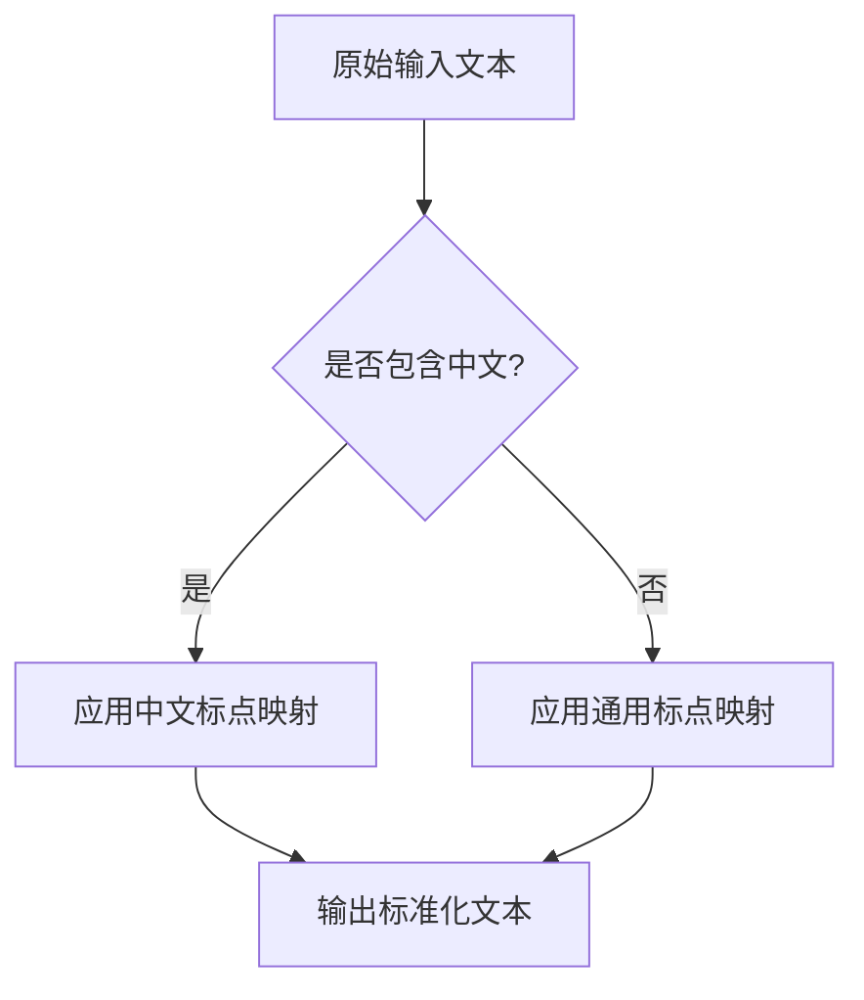
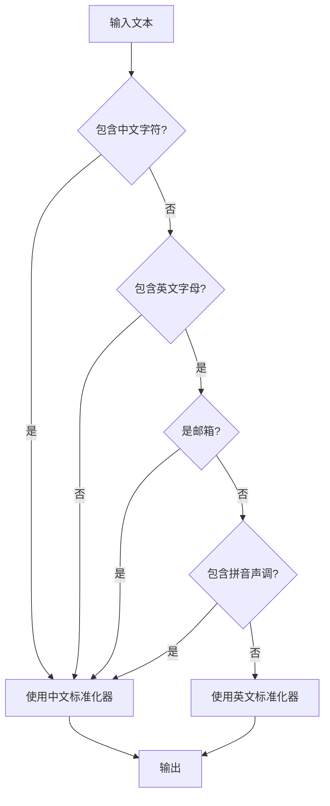

# 文本预处理

<cite>
**本文档中引用的文件**  
- [text_utils.py](file://indextts/utils/text_utils.py)
- [front.py](file://indextts/utils/front.py)
</cite>

## 目录
1. [简介](#简介)
2. [文本标准化机制](#文本标准化机制)
3. [标点符号与特殊字符处理](#标点符号与特殊字符处理)
4. [数字与缩写转换](#数字与缩写转换)
5. [多语言文本识别与处理](#多语言文本识别与处理)
6. [语句与音节分割策略](#语句与音节分割策略)
7. [预处理函数调用示例](#预处理函数调用示例)
8. [为音素转换和语义编码准备数据](#为音素转换和语义编码准备数据)
9. [预处理对语音质量的影响](#预处理对语音质量的影响)
10. [常见问题与解决方案](#常见问题与解决方案)

## 简介
Index-TTS V2.1 的文本预处理阶段是整个语音合成流程的关键前置步骤，负责将原始输入文本转化为结构清晰、语义明确、适合后续模型处理的规范化文本。该阶段涵盖文本标准化、标点处理、数字与缩写转换、多语言支持、语句分割等多个环节，确保输入文本在语言学层面的一致性和可处理性。

**Section sources**
- [front.py](file://indextts/utils/front.py#L1-L537)
- [text_utils.py](file://indextts/utils/text_utils.py#L1-L41)

## 文本标准化机制
文本标准化是预处理的核心，旨在消除输入文本中的歧义和不一致性。Index-TTS 使用 `TextNormalizer` 类实现标准化，其主要功能包括：

- **标点符号统一**：将多种中文和英文标点映射为统一形式，例如将中文全角逗号“，”、分号“；”统一替换为英文半角逗号“,”，将中文句号“。”替换为英文句号“.”。
- **引号与括号处理**：将各种引号（如“”、“‘’”、“''”）和括号（如“（）”、“[]”、“<>”）统一替换为单引号“'”，简化后续处理逻辑。
- **特殊符号替换**：将波浪线“～”、“~”和破折号“—”统一替换为连字符“-”，将省略号“……”、“...”、“,,,,”等统一为“…”。

该过程通过预定义的字符映射表 `char_rep_map` 和 `zh_char_rep_map` 实现，确保不同来源的文本在进入模型前具有一致的表现形式。



**Diagram sources**
- [front.py](file://indextts/utils/front.py#L20-L45)

**Section sources**
- [front.py](file://indextts/utils/front.py#L20-L45)

## 标点符号与特殊字符处理
标点符号不仅影响语义理解，也直接影响语音的停顿和语调。Index-TTS 对标点符号进行精细化处理：

- **保留关键分隔符**：句号（.）、感叹号（!）、问号（?）和省略号（…）被保留为句子分割的关键标记。
- **处理引号与括号**：如前所述，所有引号和括号被统一为单引号，避免分词器将其视为未知符号。
- **换行符处理**：将换行符 `\n` 替换为空格，确保文本的连续性。

此外，系统还特别处理了如“·”（中间点）等中文特有符号，将其替换为连字符“-”，以适应分词和发音规则。

**Section sources**
- [front.py](file://indextts/utils/front.py#L20-L45)

## 数字与缩写转换
数字和缩写在语音合成中需要特殊处理，以确保其被正确朗读。

- **数字处理**：对于包含数字的文本，系统会根据上下文判断其读法。例如，“2025年”中的“2025”会被读作“二零二五”，而“10km/h”中的“10”则可能被读作“十”。
- **英文缩写处理**：系统通过正则表达式 `ENGLISH_CONTRACTION_PATTERN` 识别常见的英语缩写，如 `'s`，并将其扩展为完整形式。例如，“where's”被转换为“where is”，“it's”被转换为“it is”，确保发音的自然性。

```python
# 示例：缩写扩展
"where's the money?" → "where is the money?"
"it's a good day" → "it is a good day"
```

**Section sources**
- [front.py](file://indextts/utils/front.py#L60-L65)
- [front.py](file://indextts/utils/front.py#L125-L135)

## 多语言文本识别与处理
Index-TTS 支持中英文混合文本的处理，其核心是准确的语言检测机制。

- **语言检测逻辑**：`use_chinese()` 方法通过以下规则判断文本语言：
  1. 如果文本包含中文字符（Unicode 范围 `\u4e00-\u9fff`），则判定为中文。
  2. 如果文本不包含英文字母，则判定为中文。
  3. 如果文本是邮箱格式，则判定为中文（避免将邮箱中的英文误判为英文文本）。
  4. 如果文本包含带数字声调的拼音（如 xuan4, jve2），则判定为中文。
- **双语标准化**：系统分别加载中文和英文的标准化器（`zh_normalizer` 和 `en_normalizer`），根据检测结果调用相应的标准化流程，确保每种语言的规则都能正确应用。



**Diagram sources**
- [front.py](file://indextts/utils/front.py#L110-L120)

**Section sources**
- [front.py](file://indextts/utils/front.py#L110-L120)

## 语句与音节分割策略
预处理阶段需要将长文本分割为适合模型处理的片段。

- **音节计算**：`get_text_syllable_num()` 函数用于估算文本的音节数。对于中文，每个汉字和数字被视为一个音节；对于英文，则使用 `textstat` 库计算音节数。
- **语句分割**：`TextTokenizer` 类的 `split_segments()` 方法利用分词后的结果，根据预定义的标点符号（如句号、感叹号、问号）将文本分割成多个片段。分割时会考虑最大片段长度（默认120个token），避免单个片段过长影响模型性能。
- **智能合并**：分割后的相邻短片段如果总长度未超过限制，会被合并，以保持语义的完整性。

**Section sources**
- [text_utils.py](file://indextts/utils/text_utils.py#L15-L38)
- [front.py](file://indextts/utils/front.py#L350-L370)

## 预处理函数调用示例
以下代码展示了如何在实际应用中调用预处理功能：

```python
# 初始化分词器和标准化器
tokenizer = TextTokenizer(
    vocab_file="checkpoints/bpe.model",
    normalizer=TextNormalizer(),
)

# 对输入文本进行编码
text = "今天是个好日子，it's a good day!"
codes = tokenizer.encode(text, out_type=int)

# 分割为多个语句片段
tokens = tokenizer.tokenize(text)
segments = tokenizer.split_segments(tokens, max_text_tokens_per_segment=120)
```

**Section sources**
- [front.py](file://indextts/utils/front.py#L500-L530)

## 为音素转换和语义编码准备数据
预处理阶段的输出是后续模块的直接输入：
- **音素转换**：标准化后的文本消除了歧义，使得音素预测模型能够更准确地将文字映射到音素序列。
- **语义编码**：经过分割的文本片段可以被独立编码，模型能更好地捕捉局部语义和上下文信息。
- **时长预测**：`get_text_tts_dur()` 函数利用音节数和语言类型（中文/英文）估算语音的最短和最长时长，为声码器提供时长参考。

**Section sources**
- [text_utils.py](file://indextts/utils/text_utils.py#L30-L40)
- [front.py](file://indextts/utils/front.py#L350-L370)

## 预处理对语音质量的影响
高质量的预处理是生成自然、流畅语音的基础：
- **准确性**：正确的数字和缩写转换确保了语音内容的准确传达。
- **流畅性**：合理的语句分割和标点处理保证了语音的自然停顿和语调变化。
- **一致性**：统一的文本格式减少了模型的困惑，提高了发音的一致性。
- **鲁棒性**：对多语言和混合文本的支持增强了系统的通用性和鲁棒性。

**Section sources**
- [text_utils.py](file://indextts/utils/text_utils.py#L30-L40)
- [front.py](file://indextts/utils/front.py#L1-L537)

## 常见问题与解决方案
### 罕见字符处理
- **问题**：某些罕见字符或符号可能不在词表中，导致被标记为 `<unk>`。
- **解决方案**：在预处理阶段尽可能将罕见字符映射为已知符号，或在词表中增加对这些字符的支持。

### 语言检测错误
- **问题**：纯英文的拼音（如 beta1）可能被误判为中文。
- **解决方案**：优化 `PINYIN_TONE_PATTERN` 正则表达式，增加对非中文上下文的排除规则，例如仅在中文字符附近才匹配拼音声调。

**Section sources**
- [front.py](file://indextts/utils/front.py#L55-L60)
- [front.py](file://indextts/utils/front.py#L110-L120)