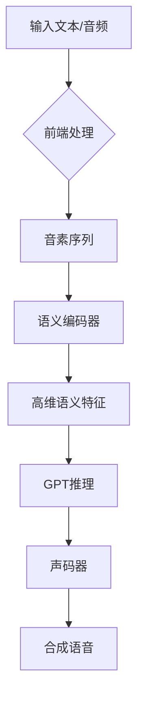
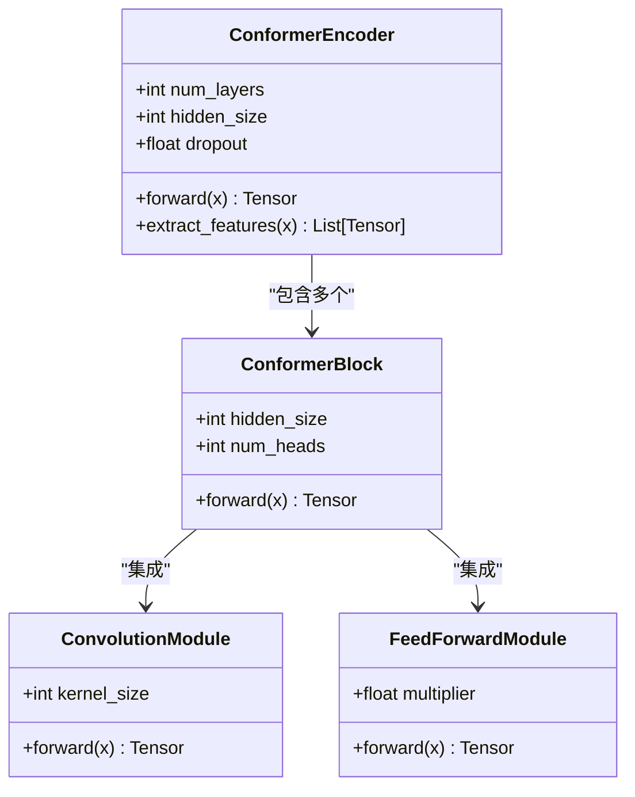
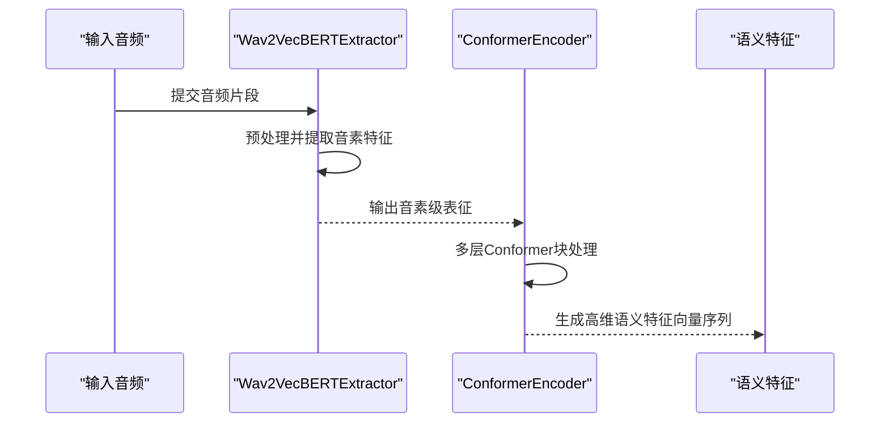
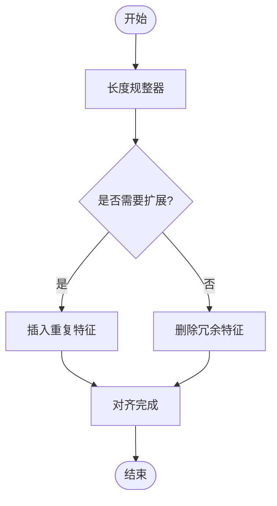
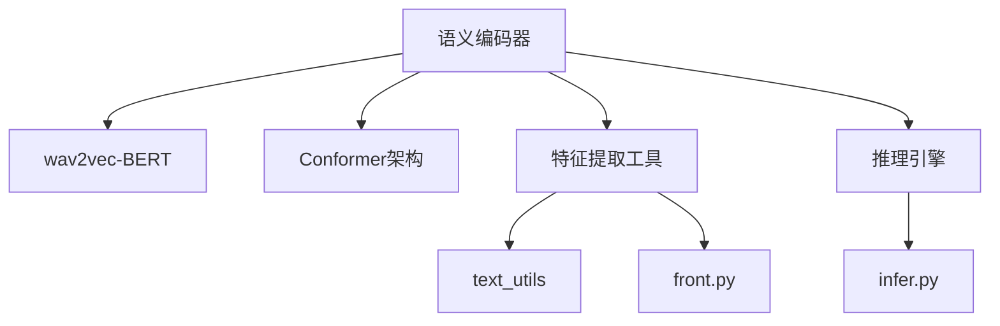

# 语义编码

<cite>
**本文档中引用的文件**  
- [conformer_encoder.py](file://indextts/gpt/conformer_encoder.py)
- [model.py](file://indextts/gpt/model.py)
- [wav2vecbert_extract.py](file://indextts/s2mel/wav2vecbert_extract.py)
- [feature_extractors.py](file://indextts/utils/feature_extractors.py)
- [infer.py](file://indextts/infer.py)
- [infer_v2.py](file://indextts/infer_v2.py)
</cite>

## 目录
1. [引言](#引言)
2. [项目结构](#项目结构)
3. [核心组件](#核心组件)
4. [架构概述](#架构概述)
5. [详细组件分析](#详细组件分析)
6. [依赖分析](#依赖分析)
7. [性能考虑](#性能考虑)
8. [故障排除指南](#故障排除指南)
9. [结论](#结论)

## 引言
本文档旨在深入解析音素序列到高维语义特征向量的转换过程，重点介绍语义编码器的架构设计与训练方法。文档将阐述语义特征的数据格式与维度特性，以及跨说话人特征对齐机制。通过代码调用示例说明输入输出格式，并探讨语义编码在零样本语音克隆中的关键作用及其对后续GPT推理的影响。

## 项目结构
项目采用模块化设计，主要分为语义编码（gpt）、声学解码（BigVGAN）、频谱转换（s2mel）和工具函数（utils）四大模块。语义编码核心位于`indextts/gpt`目录，依赖`wav2vecbert`提取音素级表示，并通过Conformer架构生成高维语义特征。

**Diagram sources**
- [infer.py](file://indextts/infer.py#L1-L50)
- [infer_v2.py](file://indextts/infer_v2.py#L1-L50)

**Section sources**
- [infer.py](file://indextts/infer.py#L1-L100)
- [infer_v2.py](file://indextts/infer_v2.py#L1-L100)

## 核心组件
语义编码阶段的核心是将离散音素或连续音频信号映射为富含语义信息的高维向量。该过程由`ConformerEncoder`实现，结合了Transformer的全局建模能力与CNN的局部感知优势，能够有效捕捉语音中的长时依赖与局部音素特征。

**Section sources**
- [conformer_encoder.py](file://indextts/gpt/conformer_encoder.py#L1-L200)
- [model.py](file://indextts/gpt/model.py#L50-L150)

## 架构概述
系统采用两阶段编码架构：首先使用预训练的wav2vec-BERT模型从音频中提取音素级表征，随后通过Conformer编码器将其转换为上下文感知的语义特征向量。该特征向量作为GPT语言模型的输入，指导后续的语音生成过程。

**Diagram sources**
- [wav2vecbert_extract.py](file://indextts/s2mel/wav2vecbert_extract.py#L1-L80)
- [conformer_encoder.py](file://indextts/gpt/conformer_encoder.py#L1-L100)

## 详细组件分析

### 语义编码器分析
语义编码器基于Conformer架构，包含卷积增强的自注意力机制，能够在保持高效计算的同时增强局部特征提取能力。编码器输出的语义特征为高维浮点向量序列，每个向量对应一个时间步的语义表征。

#### 对象导向组件

**Diagram sources**
- [conformer_encoder.py](file://indextts/gpt/conformer_encoder.py#L20-L200)
- [conformer.py](file://indextts/gpt/conformer/conformer.py#L10-L150)

#### API服务组件

**Diagram sources**
- [wav2vecbert_extract.py](file://indextts/s2mel/wav2vecbert_extract.py#L30-L100)
- [conformer_encoder.py](file://indextts/gpt/conformer_encoder.py#L50-L120)

### 特征对齐机制
系统通过长度规整器（Length Regulator）实现不同说话人之间的语义特征对齐。该模块根据目标说话人的语速和韵律特征，动态调整语义特征序列的时长，确保语义内容与目标风格的精确匹配。

**Diagram sources**
- [length_regulator.py](file://indextts/s2mel/modules/length_regulator.py#L1-L60)

**Section sources**
- [length_regulator.py](file://indextts/s2mel/modules/length_regulator.py#L1-L100)

## 依赖分析
语义编码模块依赖多个外部预训练模型和内部组件。主要依赖包括Facebook的wav2vec-BERT用于音素提取，NVIDIA的BigVGAN作为声码器，以及内部实现的Conformer编码器。

**Diagram sources**
- [go.mod](file://pyproject.toml#L1-L20)
- [infer.py](file://indextts/infer.py#L1-L30)

**Section sources**
- [pyproject.toml](file://pyproject.toml#L1-L50)
- [infer.py](file://indextts/infer.py#L1-L100)

## 性能考虑
语义编码的质量直接影响后续GPT推理的准确性和语音合成的自然度。高保真的语义特征能够更好地保留原始语音的语义内容，减少信息损失。建议使用高信噪比的参考音频以获得最佳编码效果。

## 故障排除指南
当语义编码效果不佳时，应检查参考音频质量、确认预训练模型加载正确，并验证特征维度是否匹配。可通过可视化语义特征矩阵来诊断编码异常。

**Section sources**
- [utils.py](file://indextts/utils/utils.py#L100-L150)
- [checkpoint.py](file://indextts/utils/checkpoint.py#L20-L80)

## 结论
语义编码作为语音合成系统的核心环节，实现了从音素到语义的高维映射。其编码质量直接决定了零样本语音克隆的保真度和自然度。未来可通过优化编码器架构和训练策略进一步提升语义表征能力。