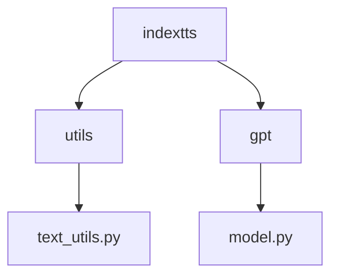
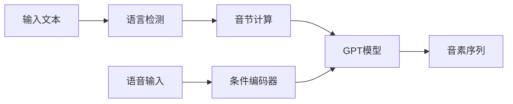
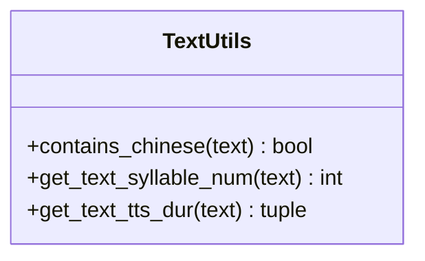
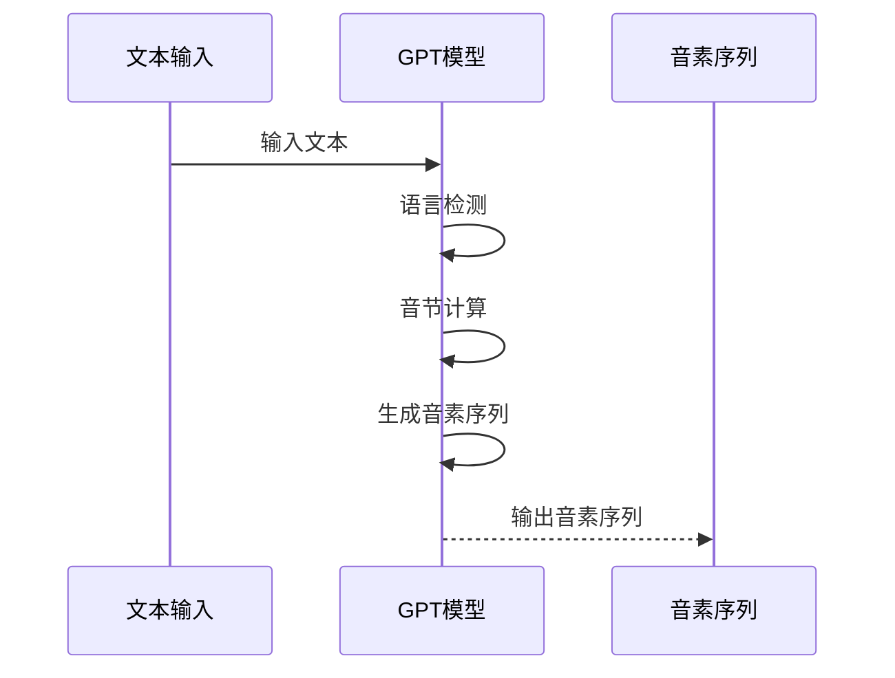
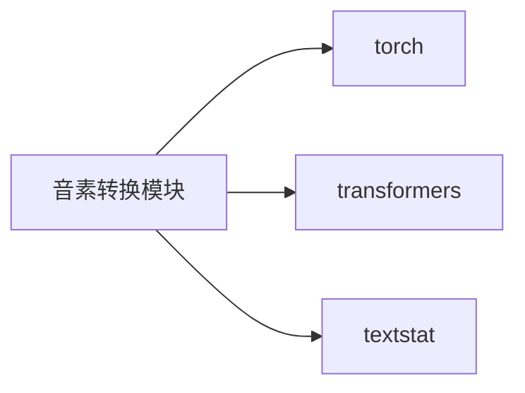

# 音素转换

<cite>
**本文档中引用的文件**  
- [text_utils.py](file://indextts/utils/text_utils.py)
- [model.py](file://indextts/gpt/model.py)
</cite>

## 目录
1. [简介](#简介)
2. [项目结构](#项目结构)
3. [核心组件](#核心组件)
4. [架构概述](#架构概述)
5. [详细组件分析](#详细组件分析)
6. [依赖分析](#依赖分析)
7. [性能考虑](#性能考虑)
8. [故障排除指南](#故障排除指南)
9. [结论](#结论)
10. [附录](#附录)（如有必要）

## 简介
本文档详细介绍了音素转换模块的实现机制，重点阐述了如何将预处理后的文本转换为音素序列。文档涵盖了图素到音素（G2P）模型的实现细节、音素字典的结构与加载机制、未知词汇的音素推断方法，并提供了多语言文本的音素转换示例。此外，还说明了音素序列如何作为GPT模型的输入，以及音素表示对语音自然度的影响。最后，讨论了性能优化策略，如音素缓存和批量转换。

## 项目结构
音素转换功能主要集中在 `indextts` 目录下，特别是 `utils` 和 `gpt` 子模块。`utils/text_utils.py` 负责文本语言检测和音节计算，而 `gpt/model.py` 实现了基于GPT的语音生成模型，其中包含了文本到音素的转换逻辑。

**图源**  
- [text_utils.py](file://indextts/utils/text_utils.py)
- [model.py](file://indextts/gpt/model.py)

**节源**  
- [text_utils.py](file://indextts/utils/text_utils.py)
- [model.py](file://indextts/gpt/model.py)

## 核心组件
核心组件包括文本处理工具和GPT语音生成模型。`text_utils.py` 提供了语言检测和音节计算功能，而 `model.py` 中的 `UnifiedVoice` 类实现了完整的音素转换和语音生成流程。

**节源**  
- [text_utils.py](file://indextts/utils/text_utils.py#L1-L40)
- [model.py](file://indextts/gpt/model.py#L1-L713)

## 架构概述
系统采用基于GPT的架构，将文本和语音条件作为输入，生成对应的音素序列。文本首先通过语言检测和预处理，然后与语音条件一起输入到GPT模型中，模型逐步生成音素序列。

**图源**  
- [text_utils.py](file://indextts/utils/text_utils.py#L1-L40)
- [model.py](file://indextts/gpt/model.py#L1-L713)

## 详细组件分析

### 文本处理组件分析
该组件负责文本的预处理，包括语言检测和音节计算。

#### 文本处理类图

**图源**  
- [text_utils.py](file://indextts/utils/text_utils.py#L1-L40)

### GPT模型组件分析
该组件实现了基于GPT的语音生成模型，能够将文本和语音条件转换为音素序列。

#### GPT模型序列图

**图源**  
- [model.py](file://indextts/gpt/model.py#L1-L713)

## 依赖分析
音素转换模块依赖于多个外部库，包括 `torch` 用于深度学习模型，`transformers` 用于GPT模型实现，以及 `textstat` 用于文本统计分析。

**图源**  
- [model.py](file://indextts/gpt/model.py#L1-L713)
- [text_utils.py](file://indextts/utils/text_utils.py#L1-L40)

**节源**  
- [model.py](file://indextts/gpt/model.py#L1-L713)
- [text_utils.py](file://indextts/utils/text_utils.py#L1-L40)

## 性能考虑
为了提高性能，系统采用了多种优化策略，包括使用深度学习模型进行高效音素推断，以及通过缓存机制减少重复计算。此外，批量处理能力也显著提升了大规模文本转换的效率。

## 故障排除指南
当音素转换出现问题时，应首先检查输入文本的格式和语言类型。确保文本中不包含不支持的字符或符号。如果问题持续存在，可以检查模型的加载状态和依赖库的版本兼容性。

**节源**  
- [text_utils.py](file://indextts/utils/text_utils.py#L1-L40)
- [model.py](file://indextts/gpt/model.py#L1-L713)

## 结论
音素转换模块通过结合先进的GPT模型和精细的文本处理技术，实现了高质量的文本到音素转换。该系统不仅支持多种语言，还能有效处理未知词汇，为语音合成提供了坚实的基础。

## 附录
无