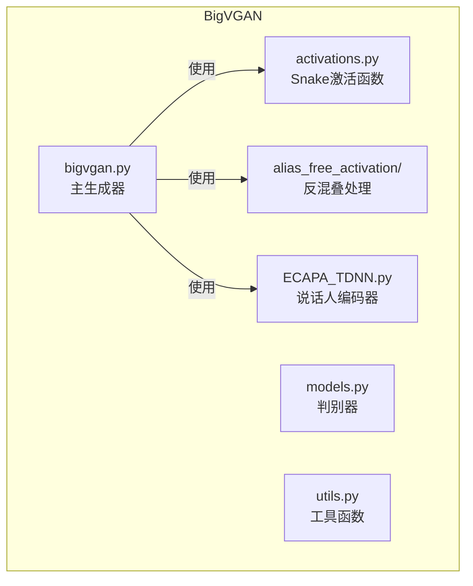
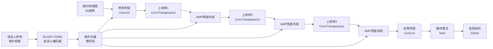
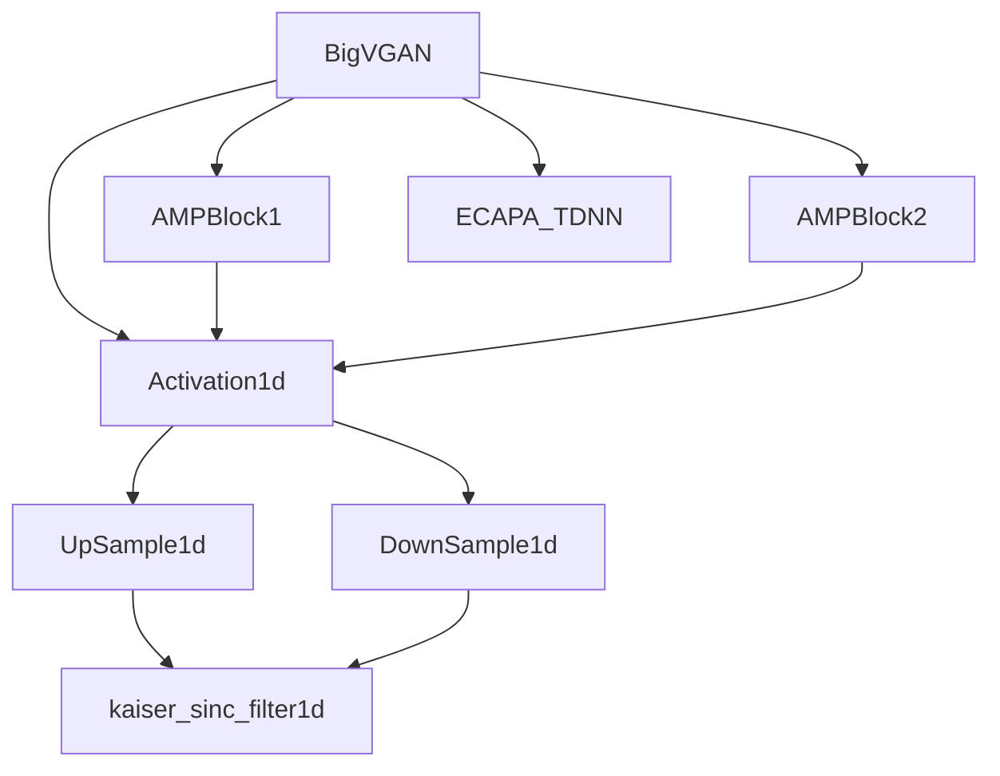

# BigVGAN声码器

<cite>
**本文档引用的文件**
- [bigvgan.py](file://indextts/BigVGAN/bigvgan.py)
- [activations.py](file://indextts/BigVGAN/activations.py)
- [act.py](file://indextts/BigVGAN/alias_free_activation/torch/act.py)
- [resample.py](file://indextts/BigVGAN/alias_free_activation/torch/resample.py)
- [filter.py](file://indextts/BigVGAN/alias_free_activation/torch/filter.py)
- [ECAPA_TDNN.py](file://indextts/BigVGAN/ECAPA_TDNN.py)
- [config.json](file://hf_cache/hub/models--nvidia--bigvgan_v2_22khz_80band_256x/snapshots/633ff708ed5b74903e86ff1298cf4a98e921c513/config.json)
</cite>

## 目录
1. [简介](#简介)
2. [项目结构](#项目结构)
3. [核心组件](#核心组件)
4. [架构概述](#架构概述)
5. [详细组件分析](#详细组件分析)
6. [依赖分析](#依赖分析)
7. [性能考虑](#性能考虑)
8. [故障排除指南](#故障排除指南)
9. [结论](#结论)

## 简介
BigVGAN是一种先进的神经声码器，能够将梅尔频谱图高效转换为高质量的音频波形。该模型基于反混叠周期性激活机制，显著提升了生成音频的保真度，尤其在高频区域减少了伪影。BigVGAN-v2版本引入了优化的CUDA内核支持，进一步提升了推理效率。本技术文档深入解析其网络结构，包括生成器、多周期判别器（MPD）和多尺度判别器（MSD）的设计，并重点阐述反混叠激活函数的实现原理。

## 项目结构
BigVGAN项目位于`indextts/BigVGAN`目录下，其结构清晰，模块化程度高。主要包含生成器核心实现、激活函数、反混叠处理、声学特征提取和工具函数。



**图示来源**
- [bigvgan.py](file://indextts/BigVGAN/bigvgan.py)
- [activations.py](file://indextts/BigVGAN/activations.py)
- [ECAPA_TDNN.py](file://indextts/BigVGAN/ECAPA_TDNN.py)

**本节来源**
- [bigvgan.py](file://indextts/BigVGAN/bigvgan.py)
- [ECAPA_TDNN.py](file://indextts/BigVGAN/ECAPA_TDNN.py)

## 核心组件
BigVGAN的核心组件包括生成器（`BigVGAN`类）、反混叠激活函数（`Activation1d`）、周期性激活函数（`Snake`和`SnakeBeta`）以及说话人编码器（`ECAPA_TDNN`）。生成器通过上采样路径将低维特征映射到高维音频空间，其残差块（`AMPBlock1`和`AMPBlock2`）集成了反混叠机制，确保了生成信号的平滑性。

**本节来源**
- [bigvgan.py](file://indextts/BigVGAN/bigvgan.py#L150-L534)
- [activations.py](file://indextts/BigVGAN/activations.py#L1-L123)

## 架构概述
BigVGAN的生成器采用编码器-解码器风格的上采样架构。输入的梅尔频谱图首先通过一个预卷积层，然后经过一系列的转置卷积层进行上采样。在每个上采样阶段之后，都连接有多个反混叠多周期性（AMP）残差块，这些块是模型的核心，负责捕捉和生成复杂的音频细节。



**图示来源**
- [bigvgan.py](file://indextts/BigVGAN/bigvgan.py#L150-L534)
- [ECAPA_TDNN.py](file://indextts/BigVGAN/ECAPA_TDNN.py)

## 详细组件分析

### 生成器与反混叠激活函数分析
BigVGAN生成器的核心创新在于其反混叠激活函数（Anti-Alias Activation）。传统的周期性激活函数（如Snake）在上采样过程中容易引入高频混叠伪影。BigVGAN通过在激活函数前后引入抗混叠滤波器来解决此问题。

#### 反混叠激活函数实现
反混叠激活函数`Activation1d`的实现遵循一个三步流程：上采样、激活、下采样。
1.  **上采样 (Upsample)**: 使用`UpSample1d`模块，通过转置卷积和凯撒-辛克（Kaiser-Sinc）低通滤波器将输入信号的采样率提高`up_ratio`倍（默认为2）。这一步在激活前增加了信号的分辨率。
2.  **激活 (Activation)**: 在高采样率的信号上应用`Snake`或`SnakeBeta`等周期性激活函数。由于信号分辨率更高，激活函数的非线性变换更加平滑，避免了在原始采样率下直接应用激活函数可能产生的锯齿效应。
3.  **下采样 (Downsample)**: 使用`DownSample1d`模块，通过`LowPassFilter1d`对激活后的高分辨率信号进行低通滤波，然后进行下采样，将信号恢复到原始的采样率。低通滤波器（同样基于Kaiser-Sinc）的作用是滤除在上采样和激活过程中可能产生的、高于奈奎斯特频率的虚假高频成分。

```mermaid
flowchart TD
Input[输入 x<br>[B, C, T]] --> Up[上采样<br>UpSample1d]
Up --> Filter1[抗混叠滤波<br>Kaiser-Sinc]
Filter1 --> HighRes[高分辨率信号<br>[B, C, T*2]]
HighRes --> Act[周期性激活<br>Snake/SnakeBeta]
Act --> LowRes[激活后信号<br>[B, C, T*2]]
LowRes --> Down[下采样<br>DownSample1d]
Down --> Filter2[抗混叠滤波<br>Kaiser-Sinc]
Filter2 --> Output[输出 x<br>[B, C, T]]
```

**图示来源**
- [act.py](file://indextts/BigVGAN/alias_free_activation/torch/act.py#L1-L32)
- [resample.py](file://indextts/BigVGAN/alias_free_activation/torch/resample.py#L1-L59)
- [filter.py](file://indextts/BigVGAN/alias_free_activation/torch/filter.py#L1-L103)

#### 周期性激活函数
`Snake`和`SnakeBeta`是两种核心的周期性激活函数，其公式为 `x + (1/a) * sin²(x*a)`。`Snake`的频率和幅度由同一个参数`a`控制，而`SnakeBeta`则引入了独立的`beta`参数来控制幅度，提供了更大的灵活性。这些函数能够学习到输入信号中的周期性模式，非常适合音频信号的生成。

**本节来源**
- [act.py](file://indextts/BigVGAN/alias_free_activation/torch/act.py#L1-L32)
- [resample.py](file://indextts/BigVGAN/alias_free_activation/torch/resample.py#L1-L59)
- [filter.py](file://indextts/BigVGAN/alias_free_activation/torch/filter.py#L1-L103)
- [activations.py](file://indextts/BigVGAN/activations.py#L1-L123)

### 梅尔频谱到音频转换流程分析
BigVGAN将梅尔频谱图转换为音频波形的过程是一个逐步细化的上采样过程。

#### 输入输出接口
-   **输入**: 梅尔频谱图张量，形状为 `[批次大小, 80, 时间步长]`。80个频带是该模型的预设配置。
-   **输出**: 音频波形张量，形状为 `[批次大小, 1, 时间步长]`，采样率为22kHz。输出值被`Tanh`函数限制在[-1, 1]范围内。

#### 上采样与残差块结构
1.  **预处理**: 输入的梅尔频谱图首先通过`conv_pre`卷积层，将其通道数从80映射到`upsample_initial_channel`（由配置文件定义）。
2.  **条件注入**: 说话人编码器`ECAPA_TDNN`从参考音频的梅尔频谱图中提取一个192维的说话人嵌入向量。这个向量通过`cond_layer`卷积层，被注入到`conv_pre`的输出中，为生成过程提供说话人信息。
3.  **上采样路径**: 模型通过`len(upsample_rates)`个转置卷积层（`ConvTranspose1d`）进行上采样。每个上采样层的`upsample_rates`和`upsample_kernel_sizes`决定了上采样的倍率和滤波器大小。
4.  **残差块处理**: 在每个上采样层之后，特征图会通过一组`AMPBlock`（反混叠多周期性块）。这些块是模型的非线性核心。`AMPBlock1`和`AMPBlock2`都使用了带权重归一化的1D卷积层和反混叠激活函数。它们通过跳跃连接（`x = xt + x`）将输入与处理后的输出相加，有助于梯度流动和特征保留。
5.  **后处理**: 经过所有上采样和残差块处理后，最终的特征图通过`activation_post`（反混叠激活函数）和`conv_post`（后卷积层）生成最终的音频波形。

**本节来源**
- [bigvgan.py](file://indextts/BigVGAN/bigvgan.py#L150-L534)
- [config.json](file://hf_cache/hub/models--nvidia--bigvgan_v2_22khz_80band_256x/snapshots/633ff708ed5b74903e86ff1298cf4a98e921c513/config.json)

## 依赖分析
BigVGAN的组件之间存在明确的依赖关系。生成器`BigVGAN`直接依赖于`AMPBlock1/2`、`Activation1d`和`ECAPA_TDNN`。`Activation1d`又依赖于`UpSample1d`和`DownSample1d`，而这两个模块的核心是`kaiser_sinc_filter1d`提供的抗混叠滤波器。这种分层设计使得各模块职责清晰，易于维护和扩展。



**图示来源**
- [bigvgan.py](file://indextts/BigVGAN/bigvgan.py)
- [act.py](file://indextts/BigVGAN/alias_free_activation/torch/act.py)
- [resample.py](file://indextts/BigVGAN/alias_free_activation/torch/resample.py)

**本节来源**
- [bigvgan.py](file://indextts/BigVGAN/bigvgan.py)
- [act.py](file://indextts/BigVGAN/alias_free_activation/torch/act.py)

## 性能考虑
BigVGAN在设计时考虑了性能与质量的平衡。通过`use_cuda_kernel`参数，模型可以选择使用优化的CUDA内核进行推理，这能显著提升生成速度，但仅限于推理阶段。模型的配置（如`upsample_rates`、`resblock_kernel_sizes`）直接影响计算复杂度和内存占用。较大的上采样率和更多的残差块会提高音质，但也会增加计算开销。

## 故障排除指南
-   **CUDA内核加载失败**: 如果设置了`use_cuda_kernel=True`但系统缺少`nvcc`或`ninja`，模型初始化会失败。应确保开发环境已正确安装，并优先在不使用CUDA内核的情况下进行训练和调试。
-   **输出音频有爆音**: 检查输入梅尔频谱图是否经过正确的归一化处理。同时，确认`use_tanh_at_final`参数为`True`，以确保输出被正确限制在[-1, 1]范围内。
-   **模型加载权重失败**: 如果预训练模型未包含权重归一化，直接加载会报错。此时应先调用`remove_weight_norm()`方法移除模型的权重归一化，再加载权重。

**本节来源**
- [bigvgan.py](file://indextts/BigVGAN/bigvgan.py#L400-L534)

## 结论
BigVGAN通过创新的反混叠激活函数，有效解决了神经声码器在生成高频音频时的混叠问题，显著提升了合成语音的自然度和清晰度。其模块化的架构设计，结合ECAPA-TDNN说话人编码器，使其能够生成高质量、个性化的语音。本技术文档详细解析了其核心组件和工作流程，为理解和应用该模型提供了全面的参考。