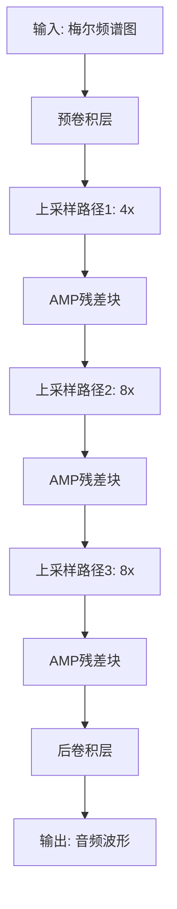
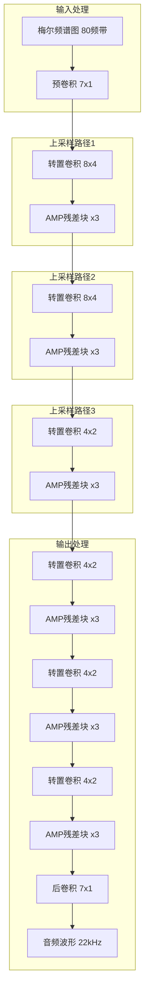
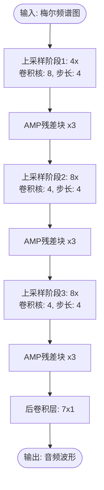
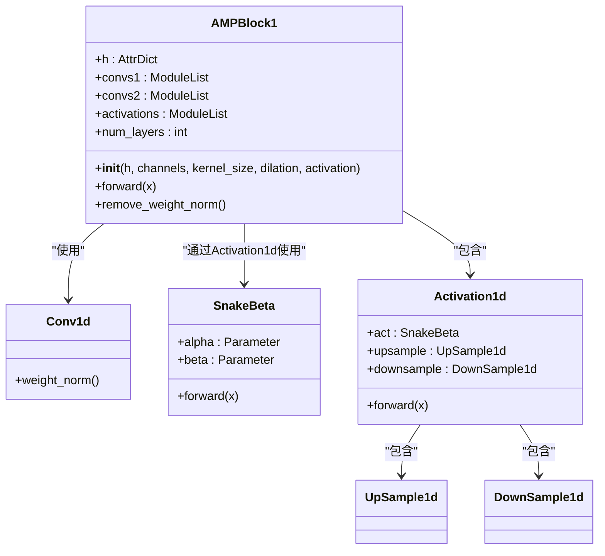
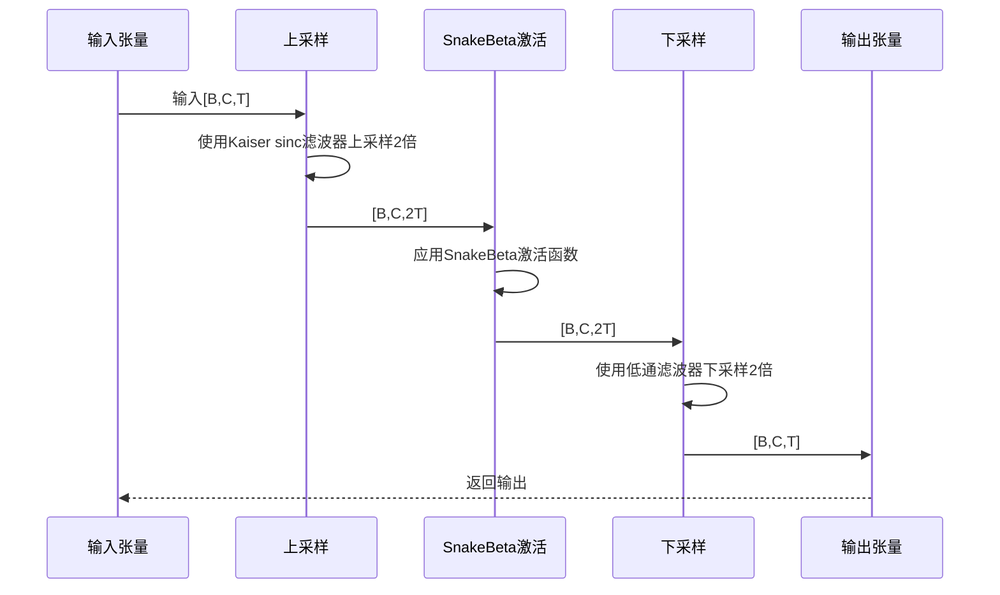
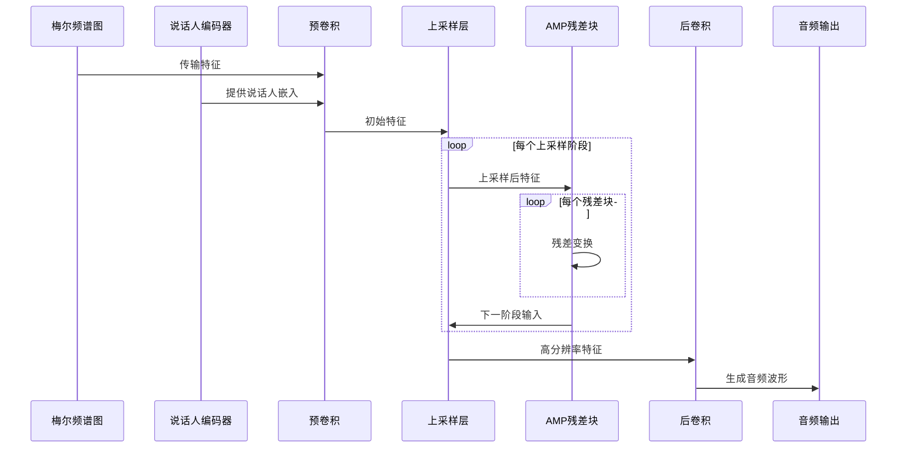
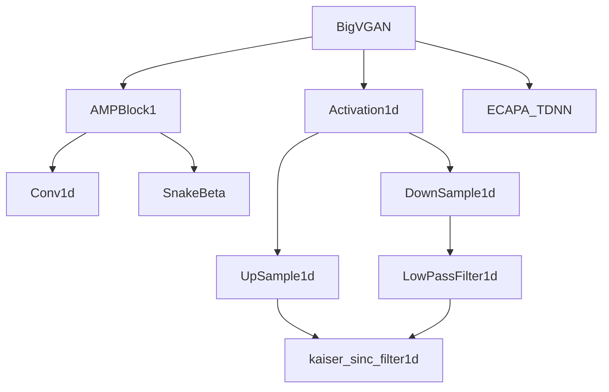

# BigVGAN生成器

<cite>
**本文档中引用的文件**  
- [bigvgan.py](file://indextts/BigVGAN/bigvgan.py)
- [activations.py](file://indextts/BigVGAN/activations.py)
- [act.py](file://indextts/BigVGAN/alias_free_activation/torch/act.py)
- [resample.py](file://indextts/BigVGAN/alias_free_activation/torch/resample.py)
- [filter.py](file://indextts/BigVGAN/alias_free_activation/torch/filter.py)
- [utils.py](file://indextts/BigVGAN/utils.py)
- [env.py](file://indextts/s2mel/modules/bigvgan/env.py)
- [config.json](file://hf_cache/hub/models--nvidia--bigvgan_v2_22khz_80band_256x/snapshots/633ff708ed5b74903e86ff1298cf4a98e921c513/config.json)
</cite>

## 目录
1. [简介](#简介)
2. [项目结构](#项目结构)
3. [核心组件](#核心组件)
4. [架构概述](#架构概述)
5. [详细组件分析](#详细组件分析)
6. [依赖分析](#依赖分析)
7. [性能考虑](#性能考虑)
8. [故障排除指南](#故障排除指南)
9. [结论](#结论)

## 简介
BigVGAN是一种先进的神经声码器模型，专为高质量音频波形生成而设计。该模型采用抗混叠周期性激活函数，通过多周期性残差块（AMP Block）实现高保真语音合成。本技术文档深入分析BigVGAN生成器的实现细节，重点介绍其分层上采样结构、残差块设计、抗混叠机制以及从梅尔频谱图到音频波形的完整生成流程。模型接收80频带的梅尔频谱图作为输入，通过三级上采样路径（4倍、8倍、8倍）逐步提升时间分辨率，最终生成22kHz采样率的高质量音频。

## 项目结构
BigVGAN的实现位于`indextts/BigVGAN/`目录下，包含核心生成器、激活函数、抗混叠模块和辅助工具。主要文件包括`bigvgan.py`（生成器主类）、`activations.py`（Snake和SnakeBeta激活函数）、`alias_free_activation/`（抗混叠处理模块）和`utils.py`（工具函数）。模型配置通过`config.json`文件定义，包含上采样率、卷积核大小、激活函数类型等关键超参数。整个架构设计模块化，便于扩展和维护。

**图源**  
- [bigvgan.py](file://indextts/BigVGAN/bigvgan.py#L150-L300)

**本节来源**  
- [bigvgan.py](file://indextts/BigVGAN/bigvgan.py#L1-L50)
- [config.json](file://hf_cache/hub/models--nvidia--bigvgan_v2_22khz_80band_256x/snapshots/633ff708ed5b74903e86ff1298cf4a98e921c513/config.json#L1-L64)

## 核心组件
BigVGAN生成器的核心由分层上采样结构、抗混叠多周期性（AMP）残差块和条件说话人嵌入组成。生成器首先通过预卷积层将80维梅尔频谱图映射到高维特征空间，然后通过三个上采样阶段逐步提升时间分辨率。每个上采样阶段后接多个AMP残差块，这些块采用SnakeBeta激活函数并结合抗混叠机制，有效减少上采样过程中的混叠伪影。说话人编码器（ECAPA-TDNN）提取的说话人嵌入作为条件信息，通过卷积层注入到生成器的各个上采样层级，实现多说话人语音合成。

**本节来源**  
- [bigvgan.py](file://indextts/BigVGAN/bigvgan.py#L150-L300)
- [activations.py](file://indextts/BigVGAN/activations.py#L1-L122)
- [ECAPA_TDNN.py](file://indextts/BigVGAN/ECAPA_TDNN.py#L1-L200)

## 架构概述
BigVGAN生成器采用编码器-解码器风格的分层上采样架构。输入的梅尔频谱图首先通过7x1卷积的预卷积层，将特征维度从80扩展到1536。随后，模型通过六个连续的转置卷积上采样层，总上采样率为256倍（4×4×2×2×2×2），将时间分辨率从梅尔频谱的256步长提升到音频波形的1步长。每个上采样阶段后接多个AMP残差块，这些块采用多周期性卷积和可学习的SnakeBeta激活函数。最终，通过7x1卷积的后卷积层和可选的tanh激活函数生成[-1,1]范围内的音频波形。

**图源**  
- [bigvgan.py](file://indextts/BigVGAN/bigvgan.py#L200-L250)
- [config.json](file://hf_cache/hub/models--nvidia--bigvgan_v2_22khz_80band_256x/snapshots/633ff708ed5b74903e86ff1298cf4a98e921c513/config.json#L10-L20)

## 详细组件分析

### 分层上采样结构分析
BigVGAN生成器采用三级分层上采样结构，通过转置卷积逐步将梅尔频谱图的时间分辨率提升到音频波形级别。第一级上采样率为4倍，使用8x8卷积核；第二级上采样率为8倍，由两个4x4转置卷积层组成；第三级上采样率为8倍，同样由两个4x4转置卷积层实现。这种分阶段上采样策略避免了单次大倍率上采样带来的严重混叠问题，同时保持了生成音频的细节质量。

#### 上采样流程图

**图源**  
- [bigvgan.py](file://indextts/BigVGAN/bigvgan.py#L200-L230)
- [config.json](file://hf_cache/hub/models--nvidia--bigvgan_v2_22khz_80band_256x/snapshots/633ff708ed5b74903e86ff1298cf4a98e921c513/config.json#L10-L15)

### AMP残差块分析
AMP（抗混叠多周期性）残差块是BigVGAN的核心构建单元，采用AMPBlock1实现。每个残差块包含两组一维卷积层：第一组使用可变膨胀率（1,3,5），第二组使用固定膨胀率1。卷积层之间插入SnakeBeta激活函数，该函数具有可学习的频率和幅度参数，能生成复杂的周期性模式。残差连接确保梯度有效传播，提高训练稳定性。

#### AMP残差块类图

**图源**  
- [bigvgan.py](file://indextts/BigVGAN/bigvgan.py#L50-L140)
- [activations.py](file://indextts/BigVGAN/activations.py#L50-L122)

### 抗混叠激活函数分析
抗混叠激活函数（AntiAliasActivation）通过在激活前上采样、激活后下采样来减少混叠伪影。具体实现为Activation1d类，它包装SnakeBeta激活函数，并在其前后添加UpSample1d和DownSample1d层。上采样使用Kaiser sinc滤波器进行插值，下采样使用低通滤波器防止频率混叠。这种设计确保激活函数的非线性变换在更高采样率下进行，有效抑制了高频伪影。

#### 抗混叠激活流程

**图源**  
- [act.py](file://indextts/BigVGAN/alias_free_activation/torch/act.py#L1-L30)
- [resample.py](file://indextts/BigVGAN/alias_free_activation/torch/resample.py#L1-L58)
- [filter.py](file://indextts/BigVGAN/alias_free_activation/torch/filter.py#L1-L102)

### 前向传播流程分析
生成器的前向传播从梅尔频谱图和参考音频开始。首先，说话人编码器提取参考音频的说话人嵌入。然后，梅尔频谱图通过预卷积层并融合说话人条件。接着，数据通过六个上采样阶段，每个阶段包含转置卷积和多个AMP残差块。在每个上采样阶段后，可选地注入说话人条件。最后，经过后卷积层和可选的tanh激活生成音频波形。

#### 前向传播序列图

**图源**  
- [bigvgan.py](file://indextts/BigVGAN/bigvgan.py#L250-L300)

**本节来源**  
- [bigvgan.py](file://indextts/BigVGAN/bigvgan.py#L150-L350)
- [activations.py](file://indextts/BigVGAN/activations.py#L1-L122)
- [act.py](file://indextts/BigVGAN/alias_free_activation/torch/act.py#L1-L30)

## 依赖分析
BigVGAN生成器的组件间存在清晰的依赖关系。主生成器类依赖于AMPBlock1、Activation1d和ECAPA-TDNN等核心组件。AMPBlock1依赖于PyTorch的卷积层和SnakeBeta激活函数。Activation1d依赖于UpSample1d和DownSample1d进行抗混叠处理。UpSample1d和DownSample1d依赖于Kaiser sinc滤波器实现高质量的重采样。这种模块化设计降低了组件间的耦合度，提高了代码的可维护性和可扩展性。

**图源**  
- [bigvgan.py](file://indextts/BigVGAN/bigvgan.py#L1-L50)
- [act.py](file://indextts/BigVGAN/alias_free_activation/torch/act.py#L1-L30)

**本节来源**  
- [bigvgan.py](file://indextts/BigVGAN/bigvgan.py#L1-L534)
- [activations.py](file://indextts/BigVGAN/activations.py#L1-L122)
- [resample.py](file://indextts/BigVGAN/alias_free_activation/torch/resample.py#L1-L58)

## 性能考虑
BigVGAN在设计时充分考虑了性能与质量的平衡。通过使用weight_norm对所有卷积层进行归一化，提高了训练稳定性。AMPBlock1中的多膨胀率卷积捕获了不同时间尺度的特征。SnakeBeta激活函数的可学习参数增强了模型的表达能力。抗混叠机制虽然增加了计算量，但显著提升了音频质量。模型支持CUDA内核优化，在推理时可启用use_cuda_kernel以提高生成速度，但训练时应保持默认设置。

## 故障排除指南
常见问题包括生成音频中的混叠伪影、训练不稳定和推理速度慢。对于混叠问题，确保抗混叠模块正确工作，检查UpSample1d和DownSample1d的滤波器参数。训练不稳定时，验证weight_norm是否正确应用，检查学习率和梯度裁剪设置。推理速度慢时，考虑启用CUDA内核优化，但需确保系统环境支持。模型加载时若出现权重不匹配，使用remove_weight_norm()方法处理预训练模型。

**本节来源**  
- [bigvgan.py](file://indextts/BigVGAN/bigvgan.py#L400-L500)
- [utils.py](file://indextts/BigVGAN/utils.py#L1-L102)

## 结论
BigVGAN生成器通过创新的分层上采样结构和抗混叠机制，实现了高质量的语音合成。其核心AMP残差块结合可学习的SnakeBeta激活函数，有效捕捉了语音信号的复杂周期性。三级上采样路径（4倍、8倍、8倍）逐步提升时间分辨率，避免了单次大倍率上采样带来的问题。抗混叠激活函数通过上采样-激活-下采样的流程，显著减少了生成音频中的混叠伪影。整体架构设计精巧，组件间依赖清晰，为高质量神经声码器提供了优秀的实现范例。