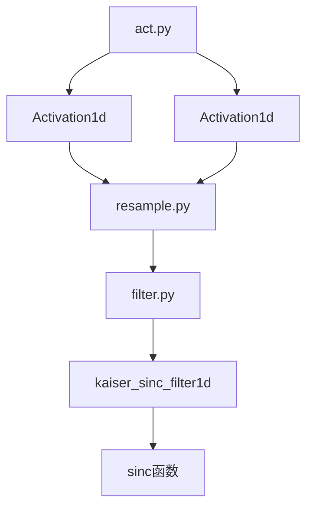
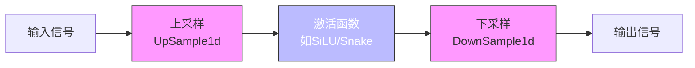
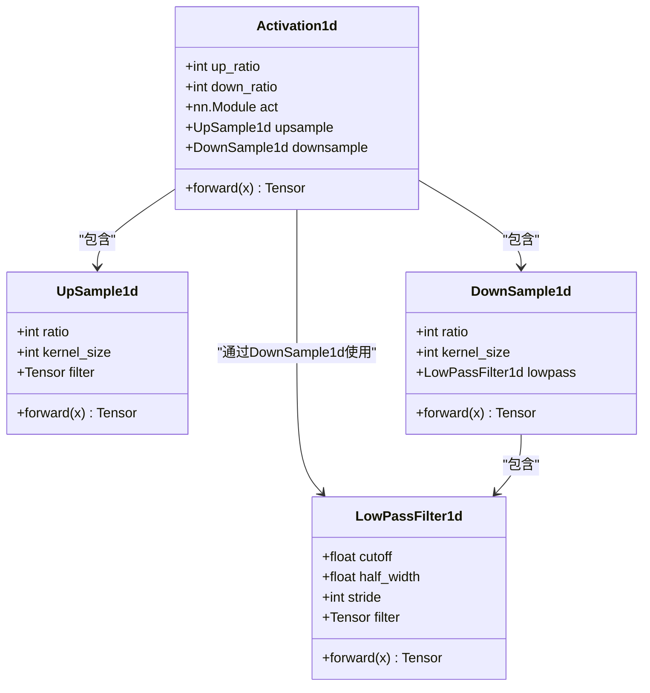
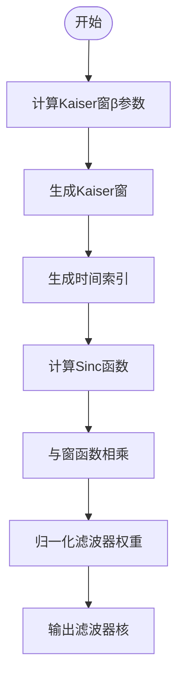
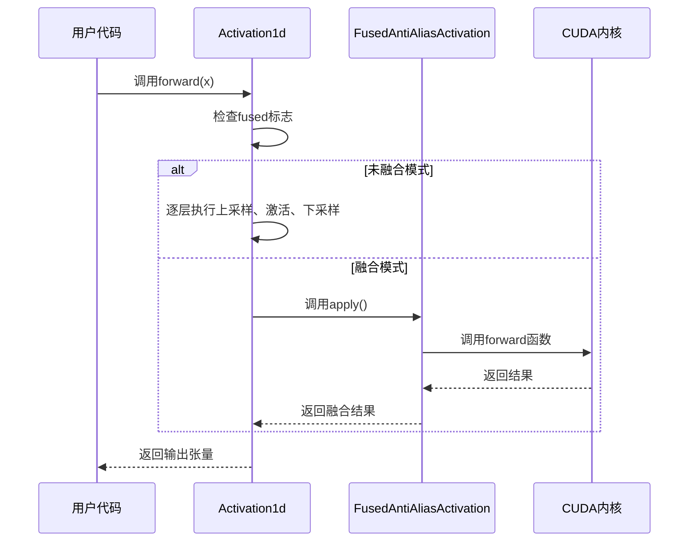
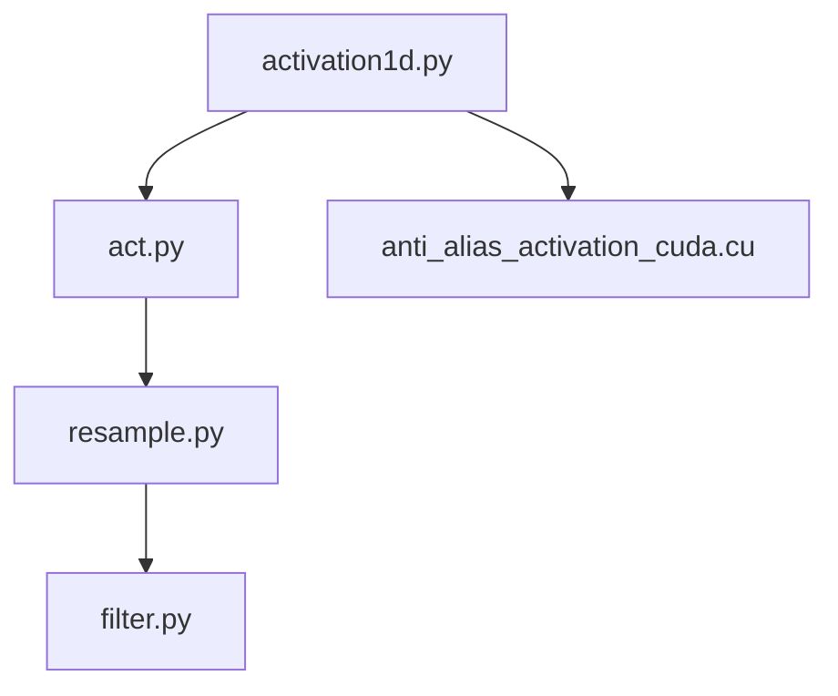

# 反混叠激活函数

<cite>
**本文档中引用的文件**  
- [act.py](file://indextts/BigVGAN/alias_free_torch/act.py)
- [resample.py](file://indextts/BigVGAN/alias_free_torch/resample.py)
- [filter.py](file://indextts/BigVGAN/alias_free_torch/filter.py)
- [activation1d.py](file://indextts/BigVGAN/alias_free_activation/cuda/activation1d.py)
- [anti_alias_activation_cuda.cu](file://indextts/BigVGAN/alias_free_activation/cuda/anti_alias_activation_cuda.cu)
</cite>

## 目录
1. [简介](#简介)
2. [项目结构](#项目结构)
3. [核心组件](#核心组件)
4. [架构概述](#架构概述)
5. [详细组件分析](#详细组件分析)
6. [依赖分析](#依赖分析)
7. [性能考量](#性能考量)
8. [故障排除指南](#故障排除指南)
9. [结论](#结论)

## 简介
本文档深入解析反混叠激活函数（Anti-Alias Activation）的技术实现，重点围绕 `alias_free_torch/act.py` 中的 `Activation1d` 类展开。该技术通过将传统激活函数（如SiLU、Snake等）与抗混叠滤波器相结合，有效抑制生成模型在上采样过程中产生的高频伪影，从而显著提升音频生成质量。文档详细阐述低通滤波器的设计原理、卷积核生成机制（基于Kaiser窗与Sinc函数），并结合CUDA内核代码分析其在GPU上的高效实现策略。

## 项目结构
反混叠激活模块位于 `indextts/BigVGAN/alias_free_torch/` 目录下，包含三个核心文件：`act.py`、`resample.py` 和 `filter.py`。该模块通过上采样、激活、下采样三阶段流水线实现抗混叠功能。CUDA加速版本位于 `alias_free_activation/cuda/` 目录，提供融合内核以提升计算效率。

**图示来源**  
- [act.py](file://indextts/BigVGAN/alias_free_torch/act.py#L8-L28)
- [resample.py](file://indextts/BigVGAN/alias_free_torch/resample.py#L10-L48)
- [filter.py](file://indextts/BigVGAN/alias_free_torch/filter.py#L40-L95)

**本节来源**  
- [act.py](file://indextts/BigVGAN/alias_free_torch/act.py#L1-L28)
- [resample.py](file://indextts/BigVGAN/alias_free_torch/resample.py#L1-L48)
- [filter.py](file://indextts/BigVGAN/alias_free_torch/filter.py#L1-L95)

## 核心组件
`Activation1d` 类是反混叠激活的核心实现，其设计思想是在激活函数执行前后分别进行上采样和下采样操作，以扩展信号带宽并滤除高频混叠成分。该类封装了 `UpSample1d` 和 `DownSample1d` 模块，并接受任意可调用的激活函数作为参数，具有高度的灵活性和通用性。

**本节来源**  
- [act.py](file://indextts/BigVGAN/alias_free_torch/act.py#L8-L28)

## 架构概述
反混叠激活的整体架构遵循“上采样-激活-下采样”（Upsample-Activate-Downsample）的三步流程。该设计确保激活函数在更高采样率下运行，从而避免因非线性变换引入的高频成分超出原始信号带宽而导致混叠。低通滤波器在上下采样阶段均被应用，以保证频带限制的严格性。

**图示来源**  
- [act.py](file://indextts/BigVGAN/alias_free_torch/act.py#L20-L26)
- [resample.py](file://indextts/BigVGAN/alias_free_torch/resample.py#L10-L48)

## 详细组件分析

### Activation1d 类分析
`Activation1d` 类通过组合上采样、激活和下采样操作，实现抗混叠激活功能。其前向传播过程严格按照信号处理的最佳实践进行：首先通过转置卷积进行上采样并应用抗混叠滤波器，随后在高采样率下执行非线性激活，最后通过卷积进行下采样并再次滤波，确保输出信号的频谱完整性。

#### 类图

**图示来源**  
- [act.py](file://indextts/BigVGAN/alias_free_torch/act.py#L8-L28)
- [resample.py](file://indextts/BigVGAN/alias_free_torch/resample.py#L10-L48)
- [filter.py](file://indextts/BigVGAN/alias_free_torch/filter.py#L60-L95)

### 上下采样与滤波器设计
上下采样模块的核心是基于Kaiser窗的Sinc函数低通滤波器。`kaiser_sinc_filter1d` 函数生成具有理想频域特性的卷积核，其截止频率和过渡带宽度可根据上采样比率动态调整。Kaiser窗的β参数根据滤波器要求自动计算，以在主瓣宽度和旁瓣衰减之间取得最佳平衡。

#### 滤波器生成流程图

**图示来源**  
- [filter.py](file://indextts/BigVGAN/alias_free_torch/filter.py#L40-L95)

**本节来源**  
- [filter.py](file://indextts/BigVGAN/alias_free_torch/filter.py#L40-L95)

### CUDA融合内核实现
在 `alias_free_activation/cuda/` 目录中，提供了名为 `FusedAntiAliasActivation` 的CUDA融合内核实现。该实现将上采样、激活和下采样操作融合为单一CUDA内核，极大减少了GPU内存访问开销和内核启动延迟。融合内核假设滤波器大小为12，使用复制填充，并接受对数尺度的α/β参数，这些超参数被硬编码以最大化执行速度。

#### CUDA内核调用序列图

**图示来源**  
- [activation1d.py](file://indextts/BigVGAN/alias_free_activation/cuda/activation1d.py#L33-L75)
- [anti_alias_activation_cuda.cu](file://indextts/BigVGAN/alias_free_activation/cuda/anti_alias_activation_cuda.cu#L1-L200)

**本节来源**  
- [activation1d.py](file://indextts/BigVGAN/alias_free_activation/cuda/activation1d.py#L33-L75)
- [anti_alias_activation_cuda.cu](file://indextts/BigVGAN/alias_free_activation/cuda/anti_alias_activation_cuda.cu#L1-L200)

## 依赖分析
反混叠激活模块内部依赖关系清晰，`act.py` 依赖于 `resample.py`，而 `resample.py` 又依赖于 `filter.py` 中的低通滤波器实现。CUDA版本依赖于PyTorch的C++/CUDA扩展机制，并通过 `torch.autograd.Function` 提供自定义梯度支持。目前未发现循环依赖或外部第三方库的强依赖。

**图示来源**  
- [act.py](file://indextts/BigVGAN/alias_free_torch/act.py#L4-L5)
- [resample.py](file://indextts/BigVGAN/alias_free_torch/resample.py#L4-L5)
- [activation1d.py](file://indextts/BigVGAN/alias_free_activation/cuda/activation1d.py#L1-L10)

**本节来源**  
- [act.py](file://indextts/BigVGAN/alias_free_torch/act.py#L1-L28)
- [resample.py](file://indextts/BigVGAN/alias_free_torch/resample.py#L1-L48)
- [activation1d.py](file://indextts/BigVGAN/alias_free_activation/cuda/activation1d.py#L1-L75)

## 性能考量
反混叠激活函数在提升音频质量的同时引入了额外的计算开销。标准实现由于多次内存访问和内核启动，性能较低。CUDA融合内核通过减少内存传输和合并计算步骤，显著提升了执行效率。然而，融合内核的超参数被硬编码，限制了其灵活性。在实际应用中，应根据性能与灵活性的需求权衡选择实现方式。

## 故障排除指南
当反混叠激活函数出现异常时，应首先检查滤波器参数是否合理（截止频率应在(0, 0.5]范围内）。若使用CUDA融合内核失败，需确认PyTorch版本与CUDA扩展的兼容性，并检查是否正确编译了CUDA内核。此外，确保激活函数提供了必要的α/β参数，否则融合内核将无法正确提取参数。

**本节来源**  
- [filter.py](file://indextts/BigVGAN/alias_free_torch/filter.py#L65-L67)
- [activation1d.py](file://indextts/BigVGAN/alias_free_activation/cuda/activation1d.py#L45-L60)

## 结论
反混叠激活函数通过巧妙结合信号处理技术与深度学习架构，有效解决了生成模型中的高频混叠问题。其模块化设计允许灵活集成各种激活函数，而CUDA融合内核则为高性能推理提供了可能。该技术在BigVGAN等高质量音频生成模型中发挥了关键作用，是提升生成音频保真度的重要手段。