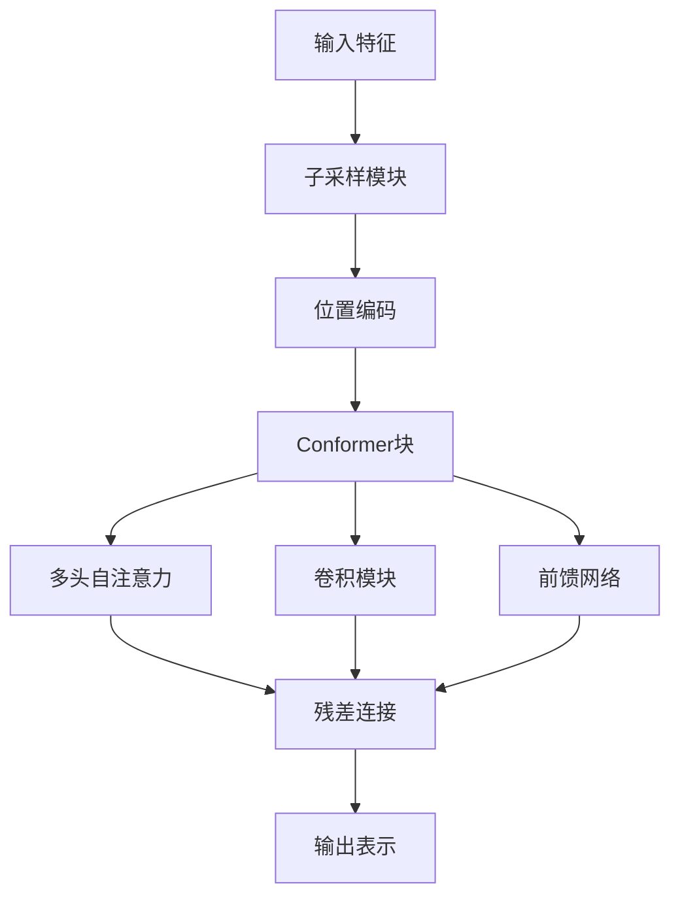
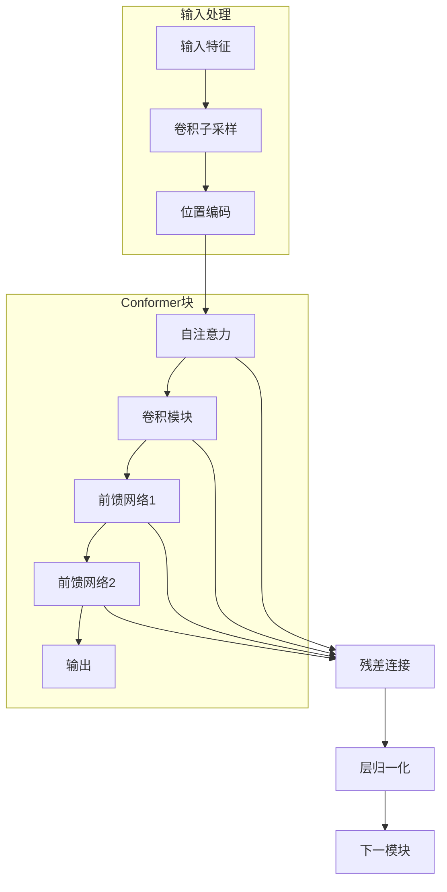
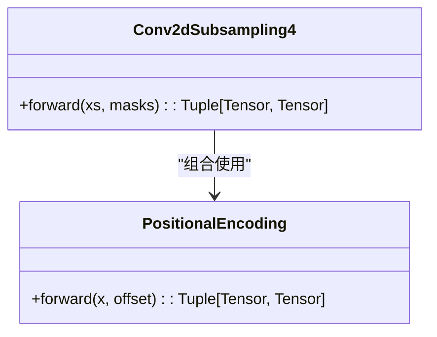
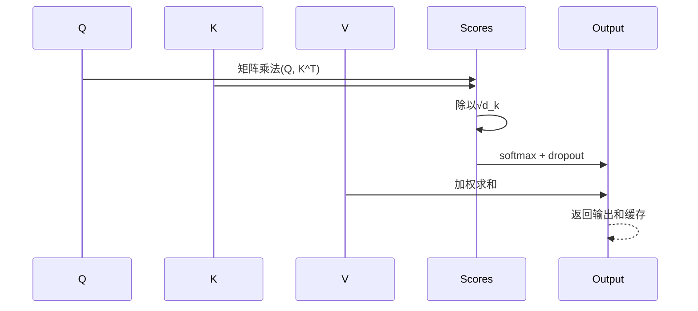
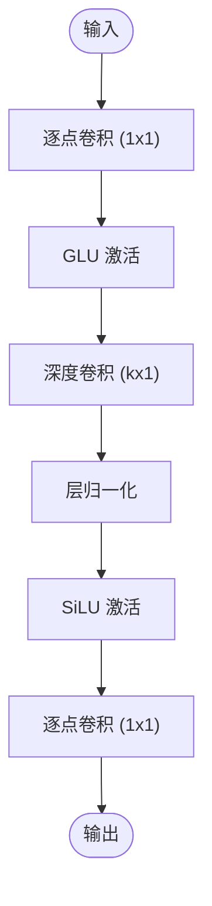
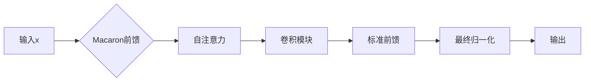
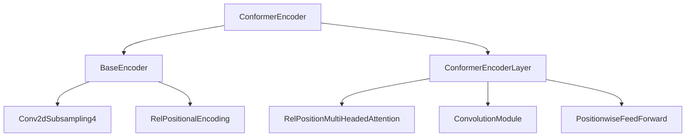

# Conformer编码器

<cite>
**本文档中引用的文件**  
- [conformer_encoder.py](file://indextts/gpt/conformer_encoder.py)
- [attention.py](file://indextts/gpt/conformer/attention.py)
- [embedding.py](file://indextts/gpt/conformer/embedding.py)
</cite>

## 目录
1. [简介](#简介)
2. [项目结构](#项目结构)
3. [核心组件](#核心组件)
4. [架构概述](#架构概述)
5. [详细组件分析](#详细组件分析)
6. [依赖分析](#依赖分析)
7. [性能考虑](#性能考虑)
8. [故障排除指南](#故障排除指南)
9. [结论](#结论)

## 简介
Conformer是一种结合卷积神经网络（CNN）和自注意力机制的混合架构，专为语音识别和文本到语音任务设计。该模型通过融合局部特征提取与全局依赖建模能力，在保持高效性的同时提升了序列建模性能。本文档深入分析`conformer_encoder.py`中的实现细节，涵盖子采样模块、嵌入层、多头自注意力、卷积模块及前馈网络等关键组件。

## 项目结构
Conformer编码器位于`indextts/gpt/conformer/`目录下，主要由以下文件构成：
- `conformer_encoder.py`：定义主编码器结构和各层模块
- `attention.py`：实现多头自注意力与相对位置编码注意力机制
- `embedding.py`：提供位置编码与相对位置编码功能
- `subsampling.py`：包含二维卷积子采样模块

该结构采用模块化设计，便于扩展和维护。

**图源**  
- [conformer_encoder.py](file://indextts/gpt/conformer_encoder.py#L1-L520)

**节源**  
- [conformer_encoder.py](file://indextts/gpt/conformer_encoder.py#L1-L520)

## 核心组件
Conformer编码器的核心包括子采样层、位置编码、多头自注意力、卷积模块和前馈网络。这些组件协同工作，将原始输入特征转换为高级语义表示。每个Conformer块包含四个子模块：自注意力模块、卷积模块、两个前馈模块（可选Macaron结构），并通过残差连接和层归一化确保训练稳定性。

**节源**  
- [conformer_encoder.py](file://indextts/gpt/conformer_encoder.py#L1-L520)

## 架构概述
Conformer编码器采用堆叠式模块设计，每层包含多头自注意力、卷积模块和双前馈网络。输入首先经过子采样以降低序列长度，随后添加位置编码信息。每个编码层通过自注意力捕捉长距离依赖，卷积模块提取局部模式，前馈网络进行非线性变换。所有子模块均使用残差连接和层归一化。

**图源**  
- [conformer_encoder.py](file://indextts/gpt/conformer_encoder.py#L1-L520)

## 详细组件分析

### 子采样与嵌入层分析
子采样模块通过二维卷积减少序列长度，降低计算复杂度。支持多种配置如`Conv2dSubsampling4`，可将时间维度压缩四倍。嵌入层结合子采样输出与位置编码，生成高维表示供后续处理。

**图源**  
- [conformer_encoder.py](file://indextts/gpt/conformer_encoder.py#L1-L520)
- [embedding.py](file://indextts/gpt/conformer/embedding.py#L1-L163)

**节源**  
- [conformer_encoder.py](file://indextts/gpt/conformer_encoder.py#L1-L520)
- [embedding.py](file://indextts/gpt/conformer/embedding.py#L1-L163)

### 多头自注意力机制分析
多头自注意力模块允许模型在不同表示子空间中并行关注输入序列的不同位置。相对位置编码版本（RelPositionMultiHeadedAttention）引入可学习的相对位置偏差，增强对序列顺序的感知能力。

**图源**  
- [attention.py](file://indextts/gpt/conformer/attention.py#L25-L185)
- [attention.py](file://indextts/gpt/conformer/attention.py#L188-L311)

**节源**  
- [attention.py](file://indextts/gpt/conformer/attention.py#L25-L311)

### 卷积模块分析
卷积模块采用深度可分离卷积结构，包含逐点卷积、GLU激活和一维深度卷积。该设计有效提取局部特征，并通过门控机制控制信息流动。模块支持因果卷积模式，适用于流式处理场景。

**图源**  
- [conformer_encoder.py](file://indextts/gpt/conformer_encoder.py#L1-L520)

**节源**  
- [conformer_encoder.py](file://indextts/gpt/conformer_encoder.py#L1-L520)

### 前向传播流程分析
Conformer块的前向传播依次执行自注意力、卷积和前馈操作，每个步骤后应用残差连接和归一化。Macaron结构引入额外前馈层，提升模型表达能力。最终输出经过层归一化得到高级表示。

**图源**  
- [conformer_encoder.py](file://indextts/gpt/conformer_encoder.py#L1-L520)

**节源**  
- [conformer_encoder.py](file://indextts/gpt/conformer_encoder.py#L1-L520)

## 依赖分析
Conformer编码器依赖多个子模块协同工作。主类`ConformerEncoder`继承自`BaseEncoder`，使用`Conv2dSubsampling4`进行子采样，`RelPositionalEncoding`提供位置信息，`RelPositionMultiHeadedAttention`实现注意力机制，`ConvolutionModule`负责局部特征提取。

**图源**  
- [conformer_encoder.py](file://indextts/gpt/conformer_encoder.py#L1-L520)

**节源**  
- [conformer_encoder.py](file://indextts/gpt/conformer_encoder.py#L1-L520)

## 性能考虑
模型使用SiLU激活函数替代ReLU，提升梯度流动；采用层归一化而非批归一化，适应变长序列；通过dropout正则化防止过拟合。子采样显著降低序列长度，减少自注意力计算量。缓存机制支持流式推理，提高实时性。

## 故障排除指南
常见问题包括维度不匹配、掩码错误和训练不稳定。建议检查输入张量形状是否符合(B,T,D)格式，确认掩码正确应用，调整学习率和dropout率。对于流式处理，需验证缓存机制正确实现。

**节源**  
- [conformer_encoder.py](file://indextts/gpt/conformer_encoder.py#L1-L520)
- [attention.py](file://indextts/gpt/conformer/attention.py#L1-L311)

## 结论
Conformer编码器通过巧妙融合卷积与自注意力机制，在语音处理任务中展现出卓越性能。其模块化设计、相对位置编码和Macaron结构共同提升了模型的表达能力和训练稳定性。未来可探索更高效的子采样策略和轻量化版本以适应移动端部署。