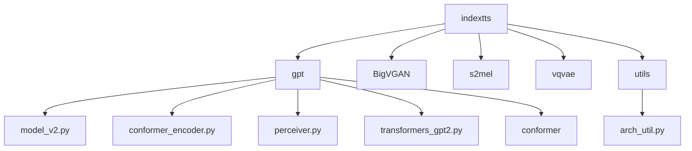
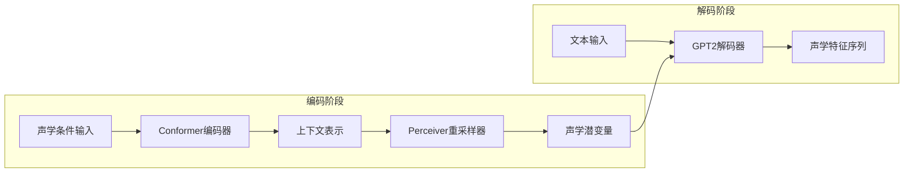
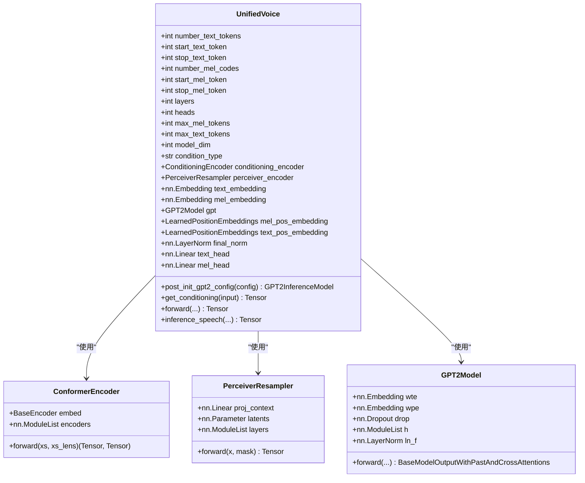
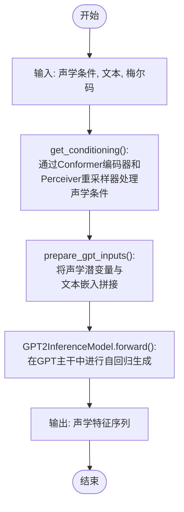
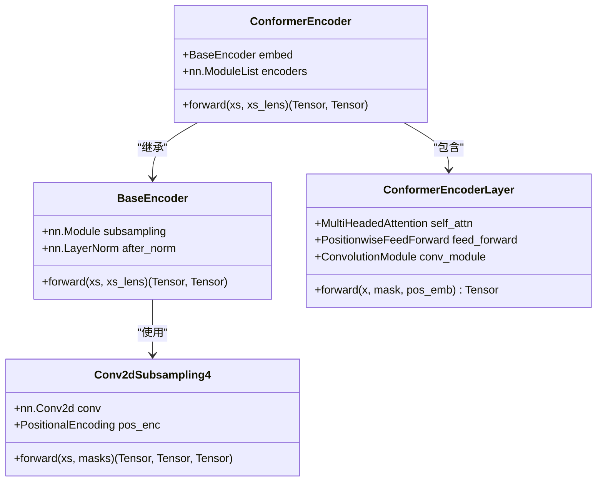
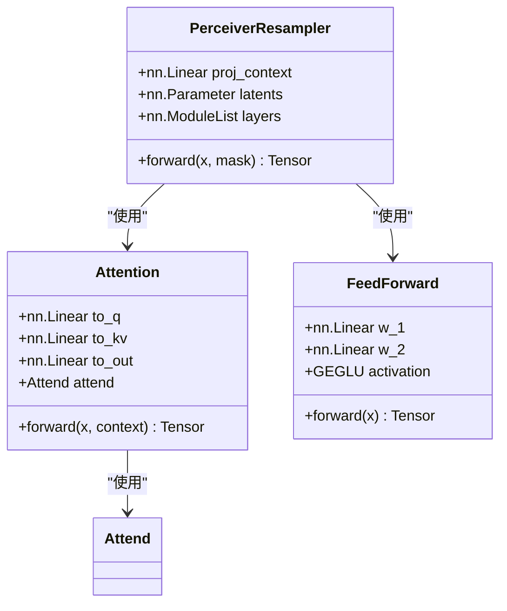
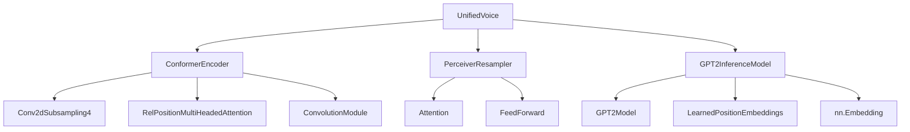

# GPT模型架构

<cite>
**本文档中引用的文件**   
- [model_v2.py](file://indextts/gpt/model_v2.py)
- [conformer_encoder.py](file://indextts/gpt/conformer_encoder.py)
- [perceiver.py](file://indextts/gpt/perceiver.py)
- [transformers_gpt2.py](file://indextts/gpt/transformers_gpt2.py)
- [arch_util.py](file://indextts/utils/arch_util.py)
</cite>

## 目录
1. [简介](#简介)
2. [项目结构](#项目结构)
3. [核心组件](#核心组件)
4. [架构概述](#架构概述)
5. [详细组件分析](#详细组件分析)
6. [依赖分析](#依赖分析)
7. [性能考虑](#性能考虑)
8. [故障排除指南](#故障排除指南)
9. [结论](#结论)

## 简介
本文档详细描述了Index-TTS V2.1项目中GPT语音生成模型的整体架构。该模型基于`model_v2.py`文件实现，采用统一语音（UnifiedVoice）框架，结合了Conformer编码器和Perceiver重采样器，构建了一个先进的文本到语音（TTS）系统。文档深入分析了模型的网络结构、初始化参数、层配置和组件集成方式，详细说明了从输入特征到声学特征序列生成的完整前向传播流程。

## 项目结构
Index-TTS V2.1项目是一个完整的文本到语音系统，其核心位于`indextts`目录下。`gpt`子目录包含了GPT模型的核心实现，包括`model_v2.py`主模型文件、`conformer_encoder.py`用于声学特征编码的Conformer编码器、`perceiver.py`用于上下文压缩的Perceiver模块，以及基于Hugging Face Transformers的GPT2模型组件。

**图源**
- [model_v2.py](file://indextts/gpt/model_v2.py)
- [conformer_encoder.py](file://indextts/gpt/conformer_encoder.py)
- [perceiver.py](file://indextts/gpt/perceiver.py)
- [transformers_gpt2.py](file://indextts/gpt/transformers_gpt2.py)
- [arch_util.py](file://indextts/utils/arch_util.py)

**节源**
- [model_v2.py](file://indextts/gpt/model_v2.py)
- [conformer_encoder.py](file://indextts/gpt/conformer_encoder.py)
- [perceiver.py](file://indextts/gpt/perceiver.py)

## 核心组件
`model_v2.py`文件定义了`UnifiedVoice`类，这是整个GPT语音生成模型的核心。该类集成了多个关键组件：`ConformerEncoder`用于处理声学条件输入，`PerceiverResampler`用于压缩和提炼上下文信息，以及一个基于Hugging Face `GPT2Model`的主干Transformer解码器。模型通过`build_hf_gpt_transformer`函数构建GPT2主干，并通过`GPT2InferenceModel`类进行推理优化。

**节源**
- [model_v2.py](file://indextts/gpt/model_v2.py#L1-L747)
- [transformers_gpt2.py](file://indextts/gpt/transformers_gpt2.py#L1-L1879)

## 架构概述
GPT语音生成模型采用了一种分层的编码-解码架构。首先，声学条件输入（如参考语音的梅尔频谱图）通过一个`ConformerEncoder`进行编码，生成一个高维的上下文表示。然后，`PerceiverResampler`模块将这个长序列的上下文表示压缩为一个固定长度的潜变量序列（latent sequence），这极大地提高了后续Transformer解码器的效率。最后，一个GPT2风格的Transformer解码器将文本输入和压缩后的声学潜变量结合起来，自回归地生成声学特征序列（如梅尔码）。

**图源**
- [model_v2.py](file://indextts/gpt/model_v2.py#L1-L747)
- [conformer_encoder.py](file://indextts/gpt/conformer_encoder.py#L1-L521)
- [perceiver.py](file://indextts/gpt/perceiver.py#L1-L318)

## 详细组件分析

### UnifiedVoice 模型分析
`UnifiedVoice`类是整个系统的中心，它协调了所有组件的交互。其初始化参数定义了模型的超参数，如层数（`layers`）、模型维度（`model_dim`）、注意力头数（`heads`）等。

#### 类图

**图源**
- [model_v2.py](file://indextts/gpt/model_v2.py#L1-L747)
- [conformer_encoder.py](file://indextts/gpt/conformer_encoder.py#L1-L521)
- [perceiver.py](file://indextts/gpt/perceiver.py#L1-L318)
- [transformers_gpt2.py](file://indextts/gpt/transformers_gpt2.py#L1-L1879)

#### 前向传播流程
模型的前向传播流程是一个复杂的数据处理管道，从原始输入到最终的声学特征生成。

**图源**
- [model_v2.py](file://indextts/gpt/model_v2.py#L1-L747)

**节源**
- [model_v2.py](file://indextts/gpt/model_v2.py#L1-L747)

### Conformer编码器分析
`ConformerEncoder`是模型中用于处理声学条件输入的关键组件。它基于Conformer架构，结合了卷积神经网络（CNN）和自注意力机制（Self-Attention），能够有效地捕捉声学信号中的局部和全局依赖关系。

#### 类图

**图源**
- [conformer_encoder.py](file://indextts/gpt/conformer_encoder.py#L1-L521)

### Perceiver重采样器分析
`PerceiverResampler`模块是模型高效性的关键。它解决了长序列上下文输入与Transformer解码器计算复杂度之间的矛盾。该模块使用交叉注意力机制，将一个长的上下文序列（来自Conformer编码器）映射到一个固定长度的潜变量序列。

#### 类图

**图源**
- [perceiver.py](file://indextts/gpt/perceiver.py#L1-L318)

## 依赖分析
`UnifiedVoice`模型的组件之间存在明确的依赖关系。`GPT2InferenceModel`依赖于`GPT2Model`、`LearnedPositionEmbeddings`和`nn.Embedding`等组件。`ConformerEncoder`依赖于`Conv2dSubsampling4`、`RelPositionMultiHeadedAttention`和`ConvolutionModule`等子模块。`PerceiverResampler`则依赖于`Attention`和`FeedForward`模块。这些依赖关系确保了模型各部分能够协同工作，形成一个完整的语音生成管道。

**图源**
- [model_v2.py](file://indextts/gpt/model_v2.py#L1-L747)
- [conformer_encoder.py](file://indextts/gpt/conformer_encoder.py#L1-L521)
- [perceiver.py](file://indextts/gpt/perceiver.py#L1-L318)
- [transformers_gpt2.py](file://indextts/gpt/transformers_gpt2.py#L1-L1879)

**节源**
- [model_v2.py](file://indextts/gpt/model_v2.py#L1-L747)
- [conformer_encoder.py](file://indextts/gpt/conformer_encoder.py#L1-L521)
- [perceiver.py](file://indextts/gpt/perceiver.py#L1-L318)

## 性能考虑
该模型在设计时考虑了多种性能优化技术。`post_init_gpt2_config`方法支持使用DeepSpeed进行推理加速，并可选择启用混合精度计算（half=True）。`GPT2InferenceModel`类实现了`parallelize`和`deparallelize`方法，支持模型并行化，可以将模型分布在多个GPU上运行。此外，模型在训练时可以启用梯度检查点（gradient_checkpointing），以用时间换空间，显著减少显存占用。

## 故障排除指南
在使用该模型时，常见的问题可能包括显存不足和推理速度慢。对于显存不足的问题，可以尝试减小`max_mel_tokens`和`max_text_tokens`的值，或启用梯度检查点。对于推理速度慢的问题，应确保已正确配置并启用了DeepSpeed和混合精度计算。此外，检查`condition_type`参数是否正确设置，以及输入的声学条件和文本长度是否在模型支持的范围内。

**节源**
- [model_v2.py](file://indextts/gpt/model_v2.py#L1-L747)

## 结论
本文档详细分析了Index-TTS V2.1项目中GPT语音生成模型的架构。该模型通过巧妙地结合Conformer编码器、Perceiver重采样器和GPT2解码器，实现了高质量的语音合成。其模块化的设计使得各个组件可以独立优化和替换，为未来的改进提供了良好的基础。对模型超参数和实现细节的深入理解，对于成功部署和优化该系统至关重要。