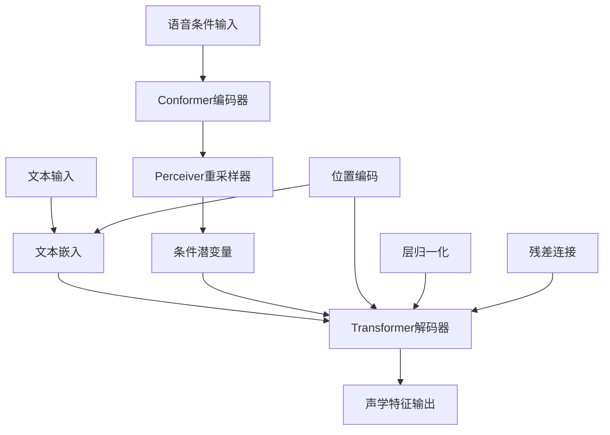
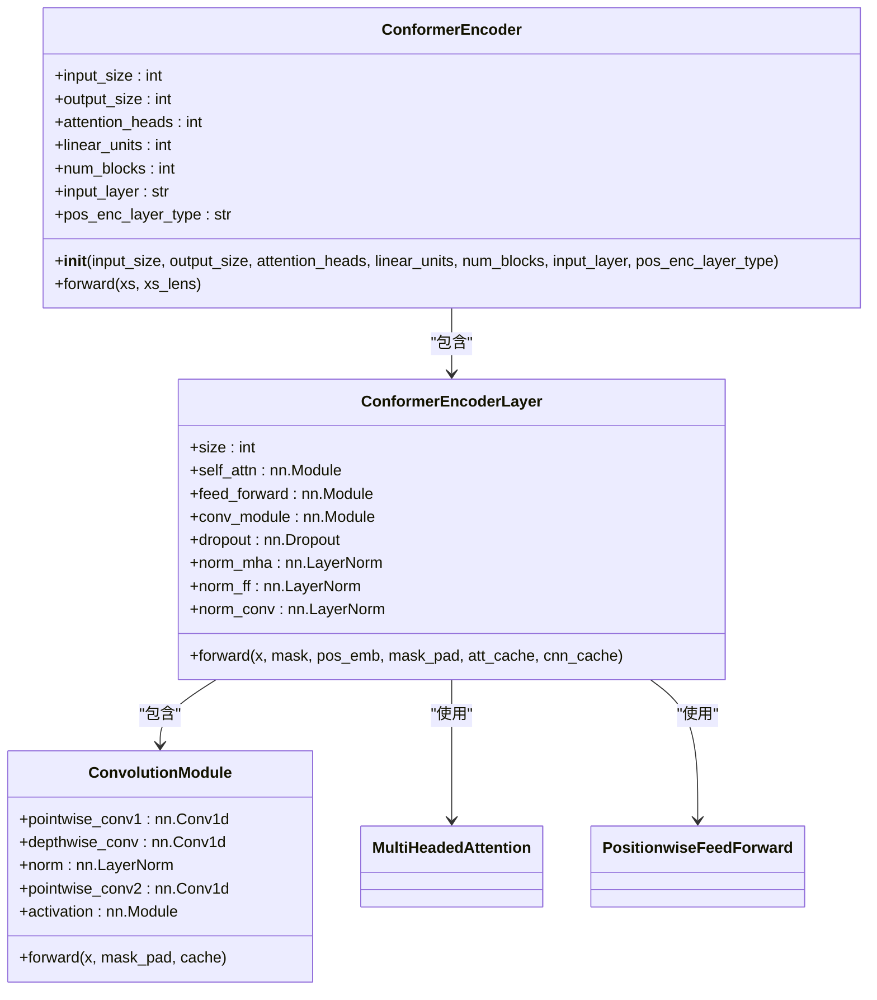
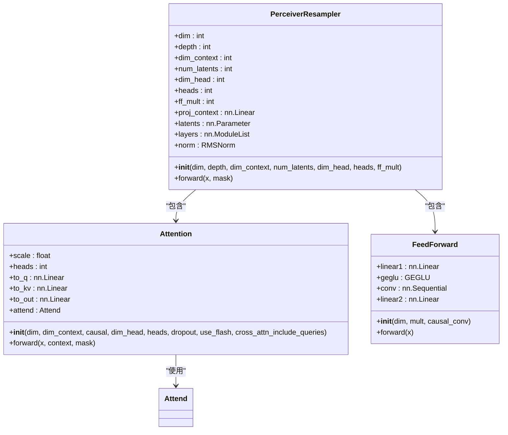
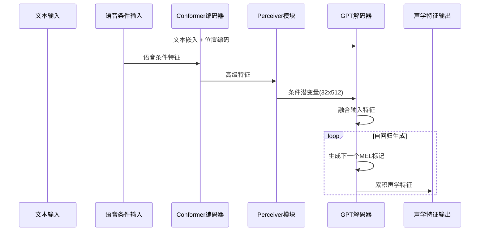
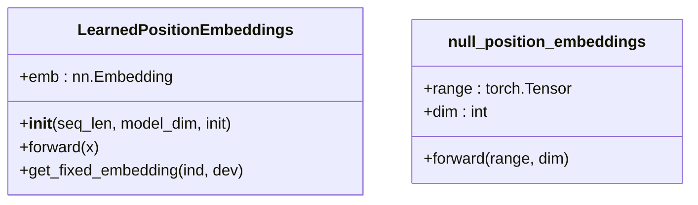

# GPT语音生成模型

<cite>
**本文档中引用的文件**   
- [model_v2.py](file://indextts/gpt/model_v2.py)
- [conformer_encoder.py](file://indextts/gpt/conformer_encoder.py)
- [perceiver.py](file://indextts/gpt/perceiver.py)
- [arch_util.py](file://indextts/utils/arch_util.py)
- [typical_sampling.py](file://indextts/utils/typical_sampling.py)
</cite>

## 目录
1. [简介](#简介)
2. [模型架构概述](#模型架构概述)
3. [核心组件分析](#核心组件分析)
4. [前向传播流程](#前向传播流程)
5. [输入输出张量规格](#输入输出张量规格)
6. [训练与推理模式差异](#训练与推理模式差异)
7. [关键实现细节](#关键实现细节)
8. [结论](#结论)

## 简介
本文档详细描述了基于Transformer架构的GPT语音生成模型，该模型能够将文本语义特征转换为声学特征序列。模型采用统一语音（UnifiedVoice）架构，结合了GPT-2的解码器结构、Conformer编码器和Perceiver模块，实现了高质量的文本到语音转换。文档深入分析了`model_v2.py`中的网络架构，包括Transformer层堆叠、注意力机制、位置编码等关键组件。

## 模型架构概述

**图示来源**  
- [model_v2.py](file://indextts/gpt/model_v2.py#L1-L747)
- [conformer_encoder.py](file://indextts/gpt/conformer_encoder.py#L1-L520)

## 核心组件分析

### GPT-2解码器架构
模型的核心是基于HuggingFace实现的GPT-2解码器，具有以下关键超参数：
- **层数**：8层Transformer解码器堆叠
- **隐藏层维度**：512维
- **注意力头数**：8头注意力机制
- **前馈网络大小**：4倍于隐藏层维度
- **最大文本标记数**：120个
- **最大MEL标记数**：250个

Transformer层采用标准的解码器结构，包含多头自注意力机制、前馈神经网络和残差连接。每层都包含层归一化操作，确保训练稳定性。

**组件来源**  
- [model_v2.py](file://indextts/gpt/model_v2.py#L300-L747)

### Conformer编码器
Conformer编码器负责从语音条件输入中提取高级特征，其主要特点包括：
- **输入大小**：1024维
- **输出大小**：256维
- **注意力头数**：4头
- **线性单元**：2048个
- **块数**：6个

编码器采用卷积-注意力混合结构，结合了卷积神经网络的局部特征提取能力和自注意力机制的全局上下文建模能力。位置编码采用相对位置编码（rel_pos），增强了模型对序列位置关系的理解。

**图示来源**  
- [conformer_encoder.py](file://indextts/gpt/conformer_encoder.py#L1-L520)

### Perceiver模块
Perceiver模块作为跨模态信息处理器，将高维的语音条件特征压缩为固定长度的潜变量序列。其主要参数包括：
- **维度**：512
- **深度**：2
- **潜变量数**：32
- **注意力头数**：8
- **头维度**：64
- **前馈网络倍数**：4

该模块采用交叉注意力机制，允许少量的查询向量（latents）从上下文特征中提取相关信息，实现了高效的特征压缩和信息整合。

**图示来源**  
- [perceiver.py](file://indextts/gpt/perceiver.py#L1-L317)

## 前向传播流程
模型的前向传播流程从文本编码到声学特征生成的完整过程如下：

1. **语音条件处理**：输入的语音条件特征首先通过Conformer编码器提取高级特征，然后由Perceiver模块压缩为32个潜变量。
2. **文本编码**：文本输入通过嵌入层转换为向量表示，并与学习到的位置编码相加。
3. **特征融合**：条件潜变量、文本嵌入和速度嵌入被拼接在一起，形成GPT解码器的输入。
4. **自回归生成**：GPT解码器以自回归方式生成MEL频谱标记，每一步的输出作为下一步的输入。
5. **声学特征输出**：生成的MEL标记通过线性层转换为最终的声学特征。

**图示来源**  
- [model_v2.py](file://indextts/gpt/model_v2.py#L500-L747)

## 输入输出张量规格
### 输入张量
- **文本输入**：形状为`(batch_size, text_length)`的长整型张量，数据类型为`torch.long`
- **语音条件输入**：形状为`(batch_size, 1024, frames)`的浮点型张量，数据类型为`torch.float32`
- **文本长度**：形状为`(batch_size,)`的长整型张量，表示每个样本的实际文本长度
- **MEL代码长度**：形状为`(batch_size,)`的长整型张量，表示每个样本的实际MEL序列长度

### 输出张量
- **声学特征**：形状为`(batch_size, mel_length, 8194)`的浮点型张量，数据类型为`torch.float32`，表示MEL频谱标记的概率分布
- **条件潜变量**：形状为`(batch_size, 32, 512)`的浮点型张量，用于后续生成过程

**规格来源**  
- [model_v2.py](file://indextts/gpt/model_v2.py#L500-L747)

## 训练与推理模式差异
### 训练模式
在训练模式下，模型采用教师强制（teacher forcing）策略，将真实的目标序列作为输入，同时计算文本和声学特征的交叉熵损失。模型可以并行处理整个序列，加速训练过程。

### 推理模式
在推理模式下，模型采用自回归生成策略：
- **KV缓存**：启用KV缓存以提高生成效率，避免重复计算已处理的token的键值对
- **束搜索**：支持束搜索（beam search）等高级解码策略
- **典型采样**：实现典型采样（typical sampling）以提高生成质量
- **速度控制**：通过速度嵌入实现生成速度的控制

推理模式下的`GPT2InferenceModel`封装了标准的HuggingFace生成接口，支持各种生成参数的配置。

**模式差异来源**  
- [model_v2.py](file://indextts/gpt/model_v2.py#L100-L211)
- [typical_sampling.py](file://indextts/utils/typical_sampling.py#L1-L30)

## 关键实现细节

### 位置编码
模型实现了两种位置编码机制：
- **学习的位置编码**：通过`LearnedPositionEmbeddings`类实现，使用可学习的嵌入表
- **零位置编码**：通过`null_position_embeddings`函数实现，返回全零张量，由外部提供位置信息

**实现来源**  
- [model_v2.py](file://indextts/gpt/model_v2.py#L250-L265)

### 层归一化与残差连接
模型在多个位置应用了层归一化和残差连接：
- **层归一化**：在每个Transformer层前后都应用层归一化，确保激活值的稳定性
- **残差连接**：在注意力模块和前馈网络后都添加残差连接，缓解梯度消失问题
- **RMS归一化**：在Perceiver模块中使用RMS归一化，具有更好的数值稳定性

这些技术的组合使用显著提高了模型的训练稳定性和收敛速度。

**实现来源**  
- [model_v2.py](file://indextts/gpt/model_v2.py#L300-L747)
- [perceiver.py](file://indextts/gpt/perceiver.py#L1-L317)

## 结论
本文档详细分析了GPT语音生成模型的架构和实现细节。该模型通过结合Conformer编码器、Perceiver模块和GPT-2解码器，实现了高质量的文本到语音转换。模型的关键创新在于使用Perceiver模块有效地处理跨模态信息，并通过精心设计的训练和推理流程确保生成质量。未来的工作可以探索更高效的注意力机制和更复杂的条件控制策略，进一步提升模型性能。