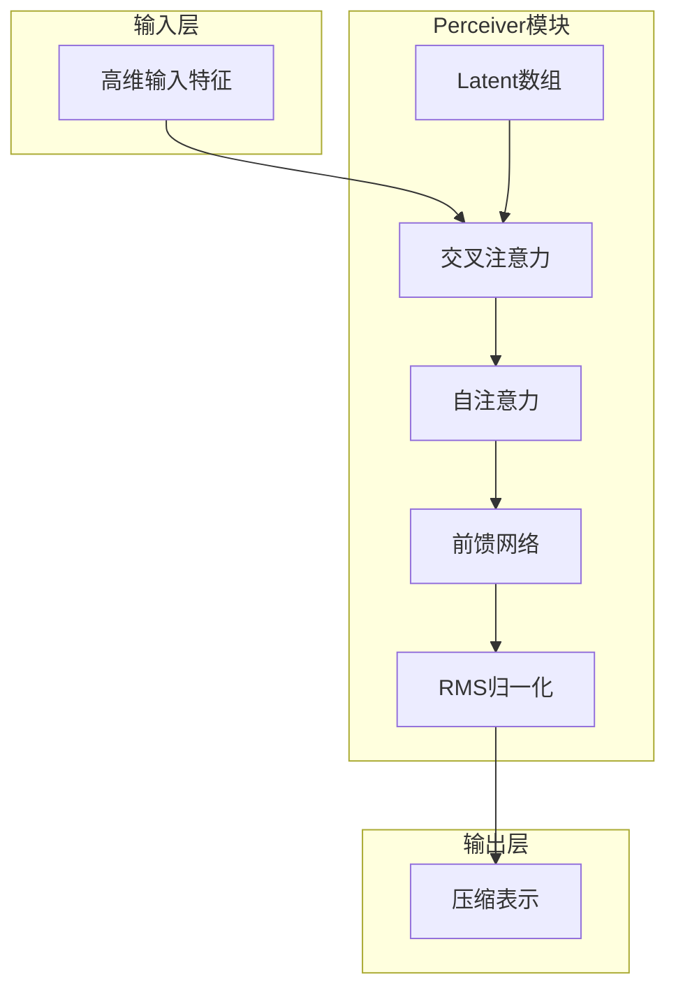
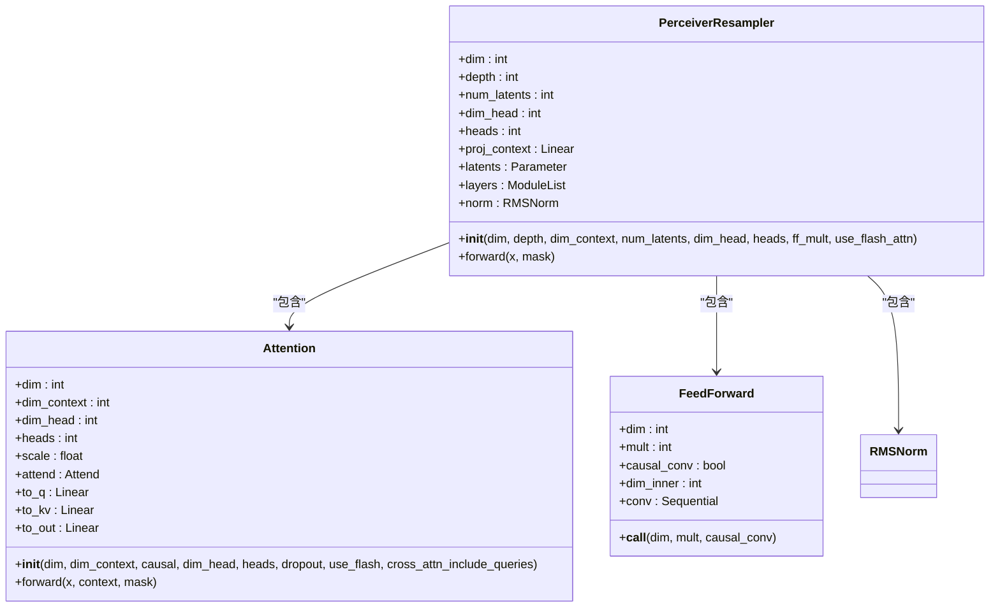
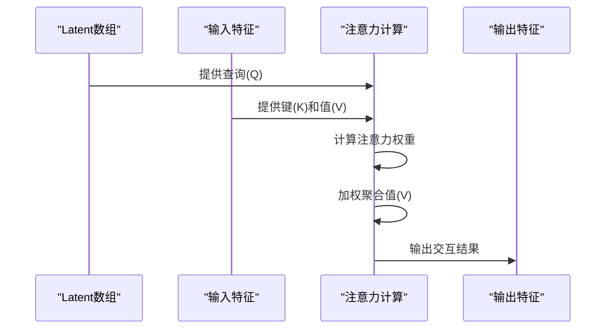
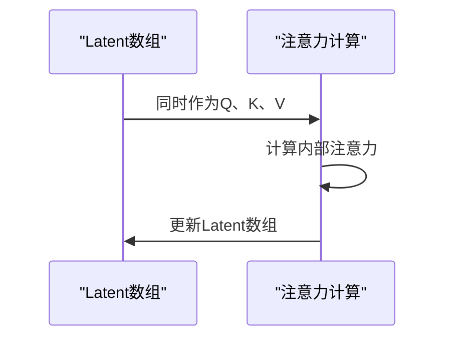
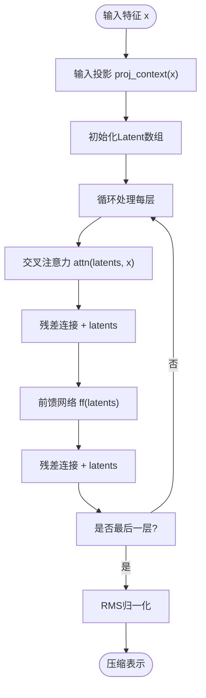
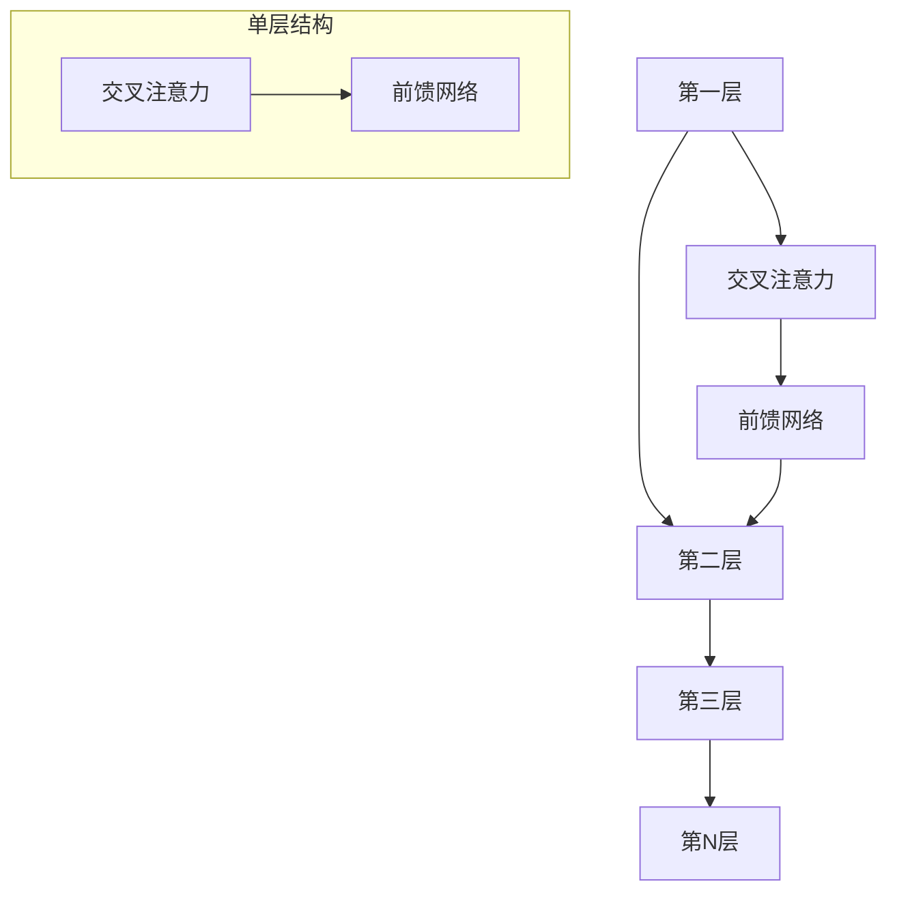
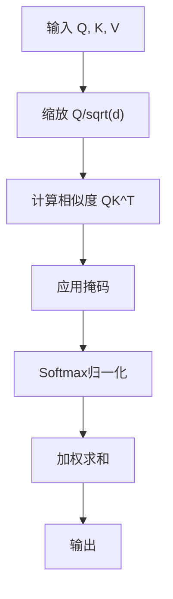
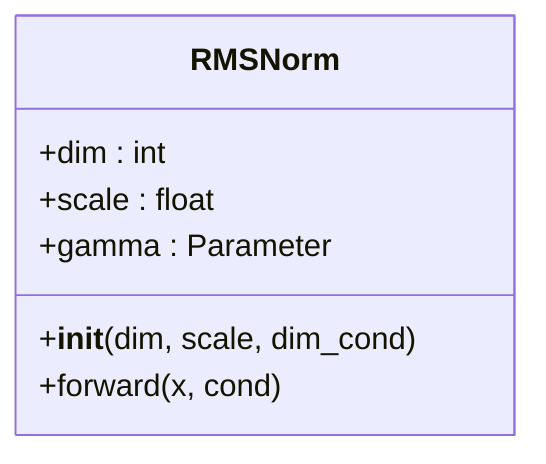

# Perceiver模块

<cite>
**本文档中引用的文件**   
- [perceiver.py](file://indextts/gpt/perceiver.py)
</cite>

## 目录
1. [简介](#简介)
2. [核心组件](#核心组件)
3. [架构概述](#架构概述)
4. [详细组件分析](#详细组件分析)
5. [前向传播流程](#前向传播流程)
6. [输入输出张量规格](#输入输出张量规格)
7. [多层堆叠策略](#多层堆叠策略)
8. [关键实现细节](#关键实现细节)

## 简介
Perceiver模块是一种高效的神经网络架构，专门设计用于处理高维输入并提取关键信息。该模块通过引入latent数组和注意力机制，实现了对复杂输入数据的有效压缩和特征提取。在跨模态信息处理任务中，Perceiver模块展现出卓越的性能，能够有效地整合来自不同模态的信息。

## 核心组件
Perceiver模块的核心组件包括PerceiverResampler类、Attention类、Attend类、RMSNorm类、CausalConv1d类和GEGLU类。这些组件共同构成了Perceiver模块的基础架构，实现了从输入特征到压缩表示的转换过程。其中，PerceiverResampler类负责整体的特征压缩和信息提取，Attention类实现了交叉注意力和自注意力机制，Attend类处理注意力计算的核心逻辑。

**Section sources**
- [perceiver.py](file://indextts/gpt/perceiver.py#L0-L317)

## 架构概述
Perceiver模块的架构基于Transformer的注意力机制，但进行了重要改进以适应高维输入处理。该架构的核心是latent数组，它作为信息交互的中介，通过交叉注意力机制与输入特征进行交互，并通过自注意力机制在内部进行信息整合。这种设计使得模型能够在保持计算效率的同时处理高维输入。

**Diagram sources**
- [perceiver.py](file://indextts/gpt/perceiver.py#L223-L273)

## 详细组件分析
### PerceiverResampler分析
PerceiverResampler是Perceiver模块的核心类，负责实现从输入特征到压缩表示的转换。该类通过多层堆叠的注意力块和前馈网络，逐步提取和压缩输入特征中的关键信息。

#### 架构设计

**Diagram sources**
- [perceiver.py](file://indextts/gpt/perceiver.py#L223-L273)

### Attention机制分析
Attention类实现了Perceiver模块中的注意力机制，包括交叉注意力和自注意力两种模式。该类通过查询（Query）、键（Key）和值（Value）的计算，实现了特征之间的信息交互。

#### 交叉注意力机制

**Diagram sources**
- [perceiver.py](file://indextts/gpt/perceiver.py#L276-L316)

#### 自注意力机制

**Diagram sources**
- [perceiver.py](file://indextts/gpt/perceiver.py#L276-L316)

## 前向传播流程
Perceiver模块的前向传播流程从输入特征开始，经过多个处理阶段最终生成压缩表示。这个过程包括输入投影、Latent数组初始化、交叉注意力、前馈网络和归一化等步骤。

**Diagram sources**
- [perceiver.py](file://indextts/gpt/perceiver.py#L255-L273)

**Section sources**
- [perceiver.py](file://indextts/gpt/perceiver.py#L223-L273)

## 输入输出张量规格
Perceiver模块的输入输出张量具有特定的形状和数据类型要求，这些规格确保了模块能够正确处理各种输入并生成预期的输出。

### 输入张量规格
- **形状**: (batch_size, sequence_length, feature_dim)
- **数据类型**: torch.float32
- **维度说明**:
  - batch_size: 批次大小
  - sequence_length: 序列长度
  - feature_dim: 特征维度

### 输出张量规格
- **形状**: (batch_size, num_latents, feature_dim)
- **数据类型**: torch.float32
- **维度说明**:
  - batch_size: 批次大小
  - num_latents: Latent数组数量
  - feature_dim: 特征维度

**Section sources**
- [perceiver.py](file://indextts/gpt/perceiver.py#L255-L273)

## 多层堆叠策略
Perceiver模块采用多层堆叠策略，通过重复应用注意力块和前馈网络来逐步提取和压缩信息。每一层都包含交叉注意力和前馈网络，形成一个处理单元。

**Diagram sources**
- [perceiver.py](file://indextts/gpt/perceiver.py#L245-L253)

**Section sources**
- [perceiver.py](file://indextts/gpt/perceiver.py#L223-L273)

## 关键实现细节
### 注意力计算
注意力计算是Perceiver模块的核心，通过Attend类实现。该类支持标准注意力计算和Flash注意力计算两种模式，根据设备和PyTorch版本自动选择最优实现。

**Diagram sources**
- [perceiver.py](file://indextts/gpt/perceiver.py#L106-L149)

### 特征投影
特征投影通过proj_context实现，将输入特征投影到与Latent数组相同的维度空间，确保两者可以在相同的特征空间中进行交互。

### 层归一化
层归一化采用RMSNorm实现，这是一种高效的归一化方法，通过均方根归一化来稳定训练过程。

**Diagram sources**
- [perceiver.py](file://indextts/gpt/perceiver.py#L151-L185)

**Section sources**
- [perceiver.py](file://indextts/gpt/perceiver.py#L151-L185)