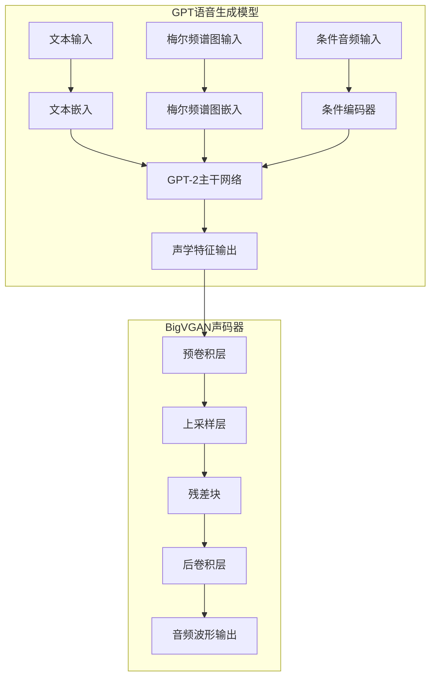

# 模型架构

<cite>
**本文档中引用的文件**  
- [model_v2.py](file://indextts/gpt/model_v2.py)
- [bigvgan.py](file://indextts/BigVGAN/bigvgan.py)
- [activations.py](file://indextts/BigVGAN/activations.py)
- [ECAPA_TDNN.py](file://indextts/BigVGAN/ECAPA_TDNN.py)
- [normalization.py](file://indextts/BigVGAN/nnet/normalization.py)
</cite>

## 目录
1. [引言](#引言)
2. [GPT语音生成模型架构](#gpt语音生成模型架构)
3. [BigVGAN声码器架构](#bigvgan声码器架构)
4. [特殊技术详解](#特殊技术详解)
5. [输入输出接口定义](#输入输出接口定义)
6. [架构图与数据流](#架构图与数据流)
7. [组件连接与维度变化](#组件连接与维度变化)

## 引言

Index-TTS V2.1 是一个先进的文本到语音（TTS）系统，其核心由两个主要组件构成：GPT语音生成模型和BigVGAN声码器。该系统能够将语义特征高效地转换为高质量的声学特征，并通过声码器生成自然流畅的音频波形。本文档将深入探讨这两个模型的网络结构、关键参数、特殊技术以及它们之间的连接方式和数据维度变化。

## GPT语音生成模型架构

GPT语音生成模型基于HuggingFace的GPT-2架构，经过定制化修改以适应语音生成任务。该模型由多个Transformer层堆叠而成，每层包含多头自注意力机制和前馈神经网络。模型的输入包括文本嵌入和梅尔频谱图嵌入，通过位置编码和条件编码器处理后，输入到GPT-2主干网络中。模型的输出为声学特征，用于后续的声码器生成音频。

**Section sources**
- [model_v2.py](file://indextts/gpt/model_v2.py#L1-L747)

## BigVGAN声码器架构

BigVGAN声码器是一个基于反混叠周期性激活函数的神经声码器，能够将梅尔频谱图转换为高质量的音频波形。该模型由预卷积层、多个上采样层和残差块组成。每个残差块包含卷积层和反混叠多周期性（AMP）模块，使用Snake或SnakeBeta激活函数。模型的输入为梅尔频谱图，输出为音频波形。

**Section sources**
- [bigvgan.py](file://indextts/BigVGAN/bigvgan.py#L1-L534)

## 特殊技术详解

### 反混叠激活函数

反混叠激活函数（anti-alias activation）是BigVGAN声码器中的关键技术，用于减少上采样过程中的混叠效应。该技术通过在卷积层后引入周期性激活函数，如Snake或SnakeBeta，来平滑信号的频谱，从而生成更高质量的音频波形。

### 归一化层

模型中使用了多种归一化层，包括批归一化（BatchNorm）、层归一化（LayerNorm）和实例归一化（InstanceNorm）。这些归一化层有助于稳定训练过程，提高模型的收敛速度和生成质量。

**Section sources**
- [activations.py](file://indextts/BigVGAN/activations.py#L1-L122)
- [normalization.py](file://indextts/BigVGAN/nnet/normalization.py#L1-L670)

## 输入输出接口定义

### GPT模型

- **输入**:
  - 文本嵌入: 张量形状 `(batch_size, text_seq_len, model_dim)`，数据类型 `float32`
  - 梅尔频谱图嵌入: 张量形状 `(batch_size, mel_seq_len, model_dim)`，数据类型 `float32`
  - 条件编码: 张量形状 `(batch_size, cond_seq_len, model_dim)`，数据类型 `float32`
- **输出**:
  - 声学特征: 张量形状 `(batch_size, mel_seq_len, model_dim)`，数据类型 `float32`

### BigVGAN声码器

- **输入**:
  - 梅尔频谱图: 张量形状 `(batch_size, num_mels, time_steps)`，数据类型 `float32`
  - 参考音频: 张量形状 `(batch_size, num_mels, time_steps)`，数据类型 `float32`
- **输出**:
  - 音频波形: 张量形状 `(batch_size, 1, audio_length)`，数据类型 `float32`

**Section sources**
- [model_v2.py](file://indextts/gpt/model_v2.py#L1-L747)
- [bigvgan.py](file://indextts/BigVGAN/bigvgan.py#L1-L534)

## 架构图与数据流

**Diagram sources**
- [model_v2.py](file://indextts/gpt/model_v2.py#L1-L747)
- [bigvgan.py](file://indextts/BigVGAN/bigvgan.py#L1-L534)

## 组件连接与维度变化

GPT语音生成模型和BigVGAN声码器通过声学特征进行连接。GPT模型的输出声学特征作为BigVGAN声码器的输入，经过一系列上采样和卷积操作，最终生成高质量的音频波形。在整个过程中，数据的维度从低维的语义特征逐步扩展到高维的音频波形，确保了生成音频的自然性和流畅性。

**Section sources**
- [model_v2.py](file://indextts/gpt/model_v2.py#L1-L747)
- [bigvgan.py](file://indextts/BigVGAN/bigvgan.py#L1-L534)