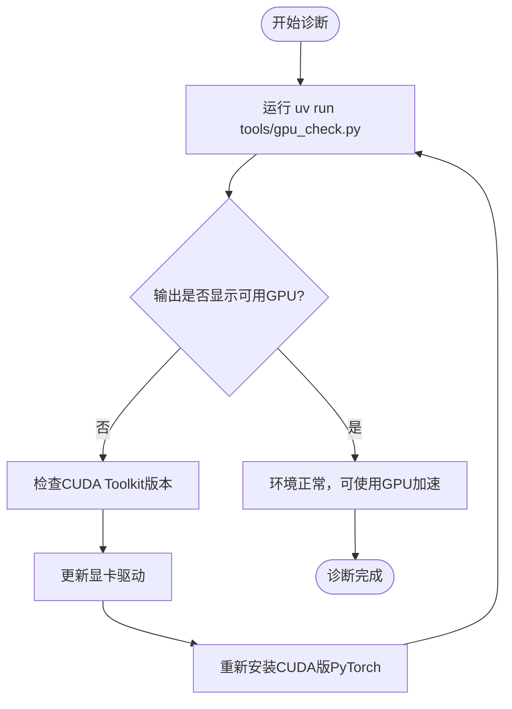

# 故障排除

<cite>
**本文档中引用的文件**  
- [README.md](file://README.md)
- [tools/gpu_check.py](file://tools/gpu_check.py)
- [pyproject.toml](file://pyproject.toml)
</cite>

## 目录
1. [简介](#简介)
2. [常见问题及解决方案](#常见问题及解决方案)
3. [GPU与CUDA环境检查](#gpu与cuda环境检查)
4. [已知问题与限制](#已知问题与限制)
5. [问题上报渠道与格式建议](#问题上报渠道与格式建议)

## 简介
本文档旨在为用户提供一份实用的故障排除指南，帮助解决在安装和使用IndexTTS-V21过程中可能遇到的常见问题。涵盖CUDA显存不足、模型加载失败、依赖库版本冲突、Web界面无法启动等问题，并结合`tools/gpu_check.py`脚本指导用户诊断GPU和CUDA环境。同时引用README.md中提到的已知问题和限制，提供清晰的问题上报建议，以降低用户的使用门槛。

## 常见问题及解决方案

### CUDA显存不足（CUDA out of memory）
**问题现象**  
在运行推理或启动WebUI时，程序崩溃并报错：`CUDA out of memory` 或 `RuntimeError: CUDA error: out of memory`。

**可能原因**  
- GPU显存容量不足，无法加载模型权重。
- 同时运行了其他占用显存的程序（如游戏、浏览器、其他AI模型）。
- 使用了高精度计算模式（如FP32），导致显存占用过高。

**解决步骤**  
1. 关闭其他占用GPU资源的应用程序。
2. 启动WebUI时启用半精度（FP16）模式以减少显存占用：
   ```bash
   uv run webui.py --use_fp16
   ```
3. 在Python脚本中初始化模型时设置`use_fp16=True`：
   ```python
   tts = IndexTTS2(..., use_fp16=True)
   ```
4. 若仍失败，尝试使用更小的模型或升级显卡。

**Section sources**
- [README.md](file://README.md#L200-L210)

### 模型加载失败
**问题现象**  
程序提示无法找到模型文件，或加载时出现`FileNotFoundError`、`OSError`等错误。

**可能原因**  
- 未正确下载模型权重文件。
- `checkpoints`目录结构不完整或路径错误。
- 网络问题导致部分文件下载不全。

**解决步骤**  
1. 确保已执行模型下载命令：
   ```bash
   hf download IndexTeam/IndexTTS-2 --local-dir=checkpoints
   ```
2. 检查`checkpoints/`目录下是否存在`config.yaml`及模型权重文件。
3. 若使用ModelScope，确认命令为：
   ```bash
   modelscope download --model IndexTeam/IndexTTS-2 --local_dir checkpoints
   ```
4. 清理缓存后重试下载：
   ```bash
   rm -rf checkpoints/*
   ```

**Section sources**
- [README.md](file://README.md#L165-L180)

### 依赖库版本冲突
**问题现象**  
安装依赖后运行程序报错，提示模块缺失、版本不兼容或CUDA相关错误。

**可能原因**  
- 未使用推荐的`uv`工具进行环境管理。
- 使用`pip`或`conda`安装导致依赖解析错误。
- CUDA Toolkit版本不符合要求（需12.8或更高）。

**解决步骤**  
1. **必须使用`uv`工具安装依赖**：
   ```bash
   uv sync --all-extras
   ```
2. 若国内下载慢，可使用镜像源：
   ```bash
   uv sync --all-extras --default-index "https://mirrors.aliyun.com/pypi/simple"
   ```
3. 安装NVIDIA CUDA Toolkit 12.8或以上版本。
4. 避免混用`pip`、`conda`等其他包管理器。

**Section sources**
- [README.md](file://README.md#L115-L150)
- [pyproject.toml](file://pyproject.toml#L1-L114)

### Web界面无法启动
**问题现象**  
运行`uv run webui.py`后无响应，或浏览器无法访问`http://127.0.0.1:7860`。

**可能原因**  
- 端口被占用。
- 依赖未正确安装，特别是`gradio`。
- Python环境未激活或路径错误。

**解决步骤**  
1. 检查7860端口是否被占用：
   ```bash
   netstat -ano | findstr :7860
   ```
   若被占用，更换端口启动：
   ```bash
   uv run webui.py --port 7861
   ```
2. 确保已安装WebUI依赖：
   ```bash
   uv sync --extra webui
   ```
3. 确认当前目录为项目根目录，且`.venv`环境已正确配置。

**Section sources**
- [README.md](file://README.md#L200-L210)

## GPU与CUDA环境检查

使用项目提供的`tools/gpu_check.py`脚本可快速诊断PyTorch是否能正确识别GPU设备。

**使用方法**  
```bash
uv run tools/gpu_check.py
```

**预期输出示例**  
```
Scanning for PyTorch hardware acceleration devices...

PyTorch: NVIDIA CUDA / AMD ROCm is available!
  * Number of CUDA devices found: 1
  * Device 0: "NVIDIA GeForce RTX 3090"

Hardware acceleration detected. Your system is ready!
```

**异常情况处理**  
- 若提示“PyTorch: No devices found for NVIDIA CUDA / AMD ROCm backend.”，请检查：
  - 是否安装了支持CUDA的PyTorch版本。
  - CUDA Toolkit版本是否为12.8或更高。
  - 显卡驱动是否最新。
- 脚本会自动检测NVIDIA、AMD ROCm、Intel XPU和Apple MPS设备，适用于多平台诊断。



**Diagram sources**
- [tools/gpu_check.py](file://tools/gpu_check.py#L1-L85)

**Section sources**
- [tools/gpu_check.py](file://tools/gpu_check.py#L1-L85)
- [README.md](file://README.md#L190-L195)

## 已知问题与限制

根据`README.md`文档内容，当前版本存在以下已知问题与限制：

- **精确时长控制功能暂未启用**：尽管IndexTTS2支持精确语音时长控制，但该功能在当前发布版本中尚未开放。
- **DeepSpeed在Windows上安装困难**：部分Windows用户可能难以成功安装DeepSpeed库，建议跳过该依赖或手动处理安装问题。
- **仅支持`uv`安装方式**：使用`pip`或`conda`可能导致依赖冲突、缺少GPU加速等问题，官方不提供支持。
- **自动下载的小模型可能受网络限制**：首次运行时会自动从HuggingFace下载小模型，若访问缓慢，建议设置镜像：
  ```bash
  export HF_ENDPOINT="https://hf-mirror.com"
  ```

**Section sources**
- [README.md](file://README.md#L50-L100)

## 问题上报渠道与格式建议

当遇到无法解决的问题时，请通过以下渠道联系开发团队：

- **QQ群**：553460296（一号群）、663272642（四号群）
- **Discord**：https://discord.gg/uT32E7KDmy
- **邮箱**：indexspeech@bilibili.com

**问题上报格式建议**  
为加快问题定位，请按以下模板提交信息：

```
【问题类型】：例如：安装失败、CUDA错误、WebUI无法启动
【操作系统】：Windows/Linux/macOS + 版本
【显卡型号】：如NVIDIA RTX 3090
【CUDA版本】：nvcc --version 输出结果
【Python环境】：是否使用uv，Python版本
【复现步骤】：详细描述操作流程
【完整错误日志】：复制终端或日志文件中的完整报错信息
【附加说明】：已尝试的解决方案
```

**Section sources**
- [README.md](file://README.md#L70-L75)