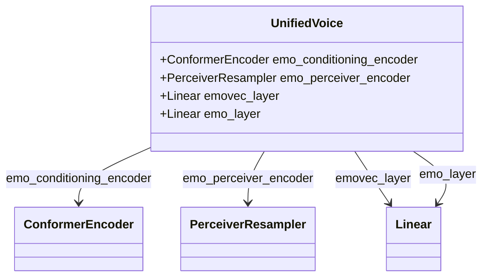

# 情感控制合成

<cite>
**本文档中引用的文件**   
- [infer_v2.py](file://indextts/infer_v2.py)
- [model_v2.py](file://indextts/gpt/model_v2.py)
- [commons.py](file://indextts/s2mel/modules/commons.py)
</cite>

## 目录
1. [简介](#简介)
2. [情感向量输入与`IndexTTS2`类](#情感向量输入与indextts2类)
3. [GPT模型架构与情感条件注入](#gpt模型架构与情感条件注入)
4. [情感向量处理工具函数](#情感向量处理工具函数)
5. [代码示例与情感维度说明](#代码示例与情感维度说明)
6. [总结](#总结)

## 简介
本文档详细阐述了IndexTTS语音合成系统中情感控制的实现机制。核心是通过一个8维浮点数列表（情感向量）来精确调控合成语音的情感表达。文档将深入分析`IndexTTS2`类的推理流程、`UnifiedVoice` GPT模型如何将情感向量作为条件信息融入自回归生成过程，以及相关工具函数的作用。

## 情感向量输入与`IndexTTS2`类

`IndexTTS2`类是情感控制合成的主要接口。其`infer`方法接收一个名为`emo_vector`的参数，该参数即为一个8维浮点数列表，用于直接指定目标情感。

在`infer`方法内部，`emo_vector`的处理流程如下：
1.  **参数接收与预处理**：`emo_vector`作为输入参数传入`infer`方法。
2.  **向量缩放**：如果同时指定了`emo_alpha`（情感混合系数），则会根据该系数对`emo_vector`中的每个元素进行缩放，以控制情感的强度。
3.  **情感向量生成**：当`emo_vector`不为`None`时，系统会进入基于向量的模式。此时，会从配置文件中加载一个预训练的`emo_matrix`和`spk_matrix`。系统会根据参考音频的声纹特征，从`emo_matrix`中选择最匹配的情感基向量，并与用户提供的`emo_vector`进行加权融合，生成最终的`emovec_mat`。
4.  **传递至GPT模型**：生成的`emovec_mat`会与说话人条件向量（`spk_cond_emb`）进行混合，形成最终的情感条件向量`emovec`，并作为`emo_vec`参数传递给GPT模型的`inference_speech`方法。

**Section sources**
- [infer_v2.py](file://indextts/infer_v2.py#L250-L280)

## GPT模型架构与情感条件注入

`indextts/gpt/model_v2.py`中的`UnifiedVoice`类是情感控制的核心。它是一个基于GPT-2的自回归模型，其架构设计允许将情感信息作为条件融入生成过程。

### 情感条件编码器
模型包含一个专门用于处理情感参考音频的编码器：


**Diagram sources**
- [model_v2.py](file://indextts/gpt/model_v2.py#L300-L310)

1.  **`emo_conditioning_encoder`**：这是一个`ConformerEncoder`，负责将情感参考音频的特征（或直接的情感向量）编码成一个高维的上下文表示。
2.  **`emo_perceiver_encoder`**：一个`PerceiverResampler`模块，它将`emo_conditioning_encoder`的输出压缩成一个固定长度的潜在向量（latent vector），这个向量代表了情感的“精髓”。
3.  **`emovec_layer` 和 `emo_layer`**：两个线性层，用于对情感向量进行维度变换和特征提取。

### 情感向量的融合与注入
情感向量的融合与注入发生在`inference_speech`和`forward`方法中。

1.  **`merge_emovec`方法**：这是情感融合的核心。它接收说话人条件向量和情感条件向量，通过线性插值的方式进行混合，混合系数由`alpha`参数控制。这使得最终的语音情感是说话人基础情感和目标情感的平滑过渡。
    ```python
    out = base_vec + alpha * (emo_vec - base_vec)
    ```

2.  **`inference_speech`方法**：在推理阶段，如果用户提供了`emo_vector`，则会跳过从音频中提取情感向量的步骤，直接使用`emo_vector`。该向量会经过`emovec_layer`和`emo_layer`的处理，生成`emo_vec`，然后与说话人条件向量通过`merge_emovec`方法融合。

3.  **`forward`方法**：在模型的前向传播中，融合后的情感向量`emo_vec`会与说话人条件向量`speech_conditioning_latent`相加，并与速度嵌入（`duration_emb`）一起，作为GPT模型的初始条件（`conds`）。这个条件向量被拼接到文本嵌入之前，共同作为GPT模型的输入，从而在生成MEL频谱图的每一步都受到情感信息的引导。

**Section sources**
- [model_v2.py](file://indextts/gpt/model_v2.py#L500-L550)
- [model_v2.py](file://indextts/gpt/model_v2.py#L600-L650)

## 情感向量处理工具函数

`indextts/s2mel/modules/commons.py`文件主要包含通用的工具函数，虽然没有直接处理情感向量的函数，但它为整个系统提供了基础支持。

该文件中的`MyModel`类定义了`forward_gpt`等方法，这些方法可能用于处理从GPT模型输出的潜在向量，但不直接参与情感向量的计算或融合。情感向量的处理主要集中在`infer_v2.py`和`model_v2.py`中。

**Section sources**
- [commons.py](file://indextts/s2mel/modules/commons.py#L500-L550)

## 代码示例与情感维度说明

### 代码示例
以下是一个使用情感向量生成不同情感语音的代码示例：

```python
# 初始化TTS模型
tts = IndexTTS2(cfg_path="checkpoints/config.yaml", model_dir="checkpoints")

# 定义参考音频和文本
prompt_wav = "examples/voice_01.wav"
text = "这是一个测试。"

# 生成喜悦的语音 [1.0, 0.0, 0.0, 0.0, 0.0, 0.0, 0.0, 0.0]
happy_vector = [1.0, 0.0, 0.0, 0.0, 0.0, 0.0, 0.0, 0.0]
tts.infer(spk_audio_prompt=prompt_wav, text=text, output_path="happy.wav", emo_vector=happy_vector)

# 生成愤怒的语音 [0.0, 1.0, 0.0, 0.0, 0.0, 0.0, 0.0, 0.0]
angry_vector = [0.0, 1.0, 0.0, 0.0, 0.0, 0.0, 0.0, 0.0]
tts.infer(spk_audio_prompt=prompt_wav, text=text, output_path="angry.wav", emo_vector=angry_vector)
```

### 情感维度说明
根据`infer_v2.py`中`QwenEmotion`类的`cn_key_to_en`和`desired_vector_order`成员变量，可以确定8维情感向量的含义（按顺序）：
1.  **高兴 (happy)**：表示喜悦、快乐的情感。
2.  **愤怒 (angry)**：表示生气、愤怒的情感。
3.  **悲伤 (sad)**：表示难过、伤心的情感。
4.  **恐惧 (afraid)**：表示害怕、恐惧的情感。
5.  **反感 (disgusted)**：表示厌恶、嫌弃的情感。
6.  **低落 (melancholic)**：表示忧郁、沮丧的情感。
7.  **惊讶 (surprised)**：表示惊奇、意外的情感。
8.  **自然 (calm)**：表示平静、中性的情感。

调整这些维度的值（通常在0.0到1.0之间）可以直接影响合成语音的情感强度。例如，将“高兴”维度的值设为1.0会使语音听起来非常欢快，而将其设为0.0则不会表达该情感。多个维度可以同时激活，以产生混合情感。

**Section sources**
- [infer_v2.py](file://indextts/infer_v2.py#L700-L720)

## 总结
IndexTTS通过一个8维情感向量实现了对合成语音情感的精确控制。`IndexTTS2`类负责接收和预处理情感向量，`UnifiedVoice` GPT模型则通过专门的情感编码器和`merge_emovec`机制，将情感向量作为条件信息深度融入到语音生成的自回归过程中。用户可以通过设置不同维度的值来生成具有特定情感（如喜悦、愤怒等）的语音，从而实现丰富多样的语音合成效果。