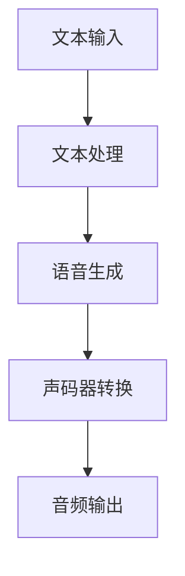
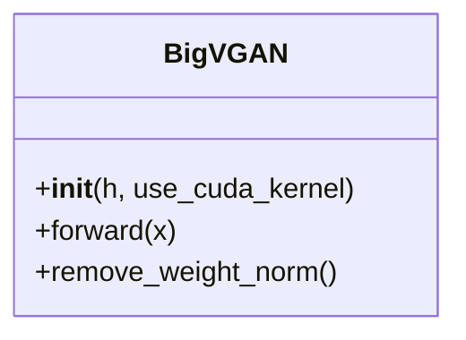
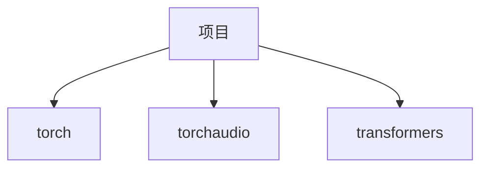

# 核心功能

<cite>
**本文档中引用的文件**  
- [infer_v2.py](file://indextts/infer_v2.py)
- [model_v2.py](file://indextts/gpt/model_v2.py)
- [bigvgan.py](file://indextts/s2mel/modules/bigvgan/bigvgan.py)
- [config.yaml](file://checkpoints/config.yaml)
</cite>

## 目录
1. [引言](#引言)
2. [项目结构](#项目结构)
3. [核心组件](#核心组件)
4. [架构概述](#架构概述)
5. [详细组件分析](#详细组件分析)
6. [依赖分析](#依赖分析)
7. [性能考量](#性能考量)
8. [故障排除指南](#故障排除指南)
9. [结论](#结论)

## 引言
本文档深入探讨了IndexTTS V21项目中的三大核心功能：零样本语音克隆、情感控制合成和持续时间精确控制。文档以`indextts/infer_v2.py`中的`IndexTTS2`类为切入点，详细阐述了这些功能的算法思想和代码实现。同时，解释了BigVGAN声码器在将声学特征转换为最终音频中的关键作用，并提供了从文本输入到音频输出的完整数据流图。

## 项目结构
项目结构清晰地分为多个模块，每个模块负责不同的功能。核心功能主要分布在`indextts`目录下，包括`BigVGAN`、`gpt`、`s2mel`、`utils`和`vqvae`等子模块。`infer_v2.py`作为主要的推理脚本，集成了这些模块，实现了完整的语音合成流程。

## 核心组件
`IndexTTS2`类是整个语音合成流程的核心，它封装了从文本输入到音频输出的所有步骤。该类初始化了多个模型，包括GPT模型、语义模型、声码器等，并通过`infer`方法实现了语音合成的主流程。

**Section sources**
- [infer_v2.py](file://indextts/infer_v2.py#L1-L739)

## 架构概述
整个语音合成流程可以分为以下几个主要阶段：文本处理、语音生成、声码器转换。每个阶段都由不同的模型和算法支持，共同完成从文本到语音的转换。

**Diagram sources**
- [infer_v2.py](file://indextts/infer_v2.py#L1-L739)

## 详细组件分析
### 零样本语音克隆
零样本语音克隆功能通过`IndexTTS2`类的`infer`方法实现。该方法首先加载参考音频，然后通过`get_emb`方法提取音频的嵌入表示。这些嵌入表示随后被用于生成与参考音频相似的语音。

**Section sources**
- [infer_v2.py](file://indextts/infer_v2.py#L1-L739)

### 情感控制合成
情感控制合成功能通过`QwenEmotion`类实现。该类使用预训练的情感分析模型，将文本输入转换为情感向量。这些情感向量随后被用于调整生成语音的情感。

**Section sources**
- [infer_v2.py](file://indextts/infer_v2.py#L1-L739)

### 持续时间精确控制
持续时间精确控制功能通过`UnifiedVoice`类的`inference_speech`方法实现。该方法通过调整生成语音的持续时间，确保生成的语音与输入文本的持续时间相匹配。

**Section sources**
- [model_v2.py](file://indextts/gpt/model_v2.py#L1-L747)

### BigVGAN声码器
BigVGAN声码器负责将声学特征转换为最终的音频。该声码器使用反混叠周期激活函数，能够生成高质量的音频。

**Diagram sources**
- [bigvgan.py](file://indextts/s2mel/modules/bigvgan/bigvgan.py#L1-L491)

## 依赖分析
项目依赖多个外部库和模型，包括`torch`、`torchaudio`、`transformers`等。这些依赖项通过`conda`或`pip`进行管理，确保了项目的可移植性和可维护性。

**Diagram sources**
- [infer_v2.py](file://indextts/infer_v2.py#L1-L739)

## 性能考量
在性能方面，项目通过使用`fp16`和`CUDA`内核优化了推理速度。此外，`BigVGAN`声码器的反混叠周期激活函数也显著提高了音频质量。

## 故障排除指南
在使用过程中，可能会遇到一些常见问题，如模型加载失败、音频质量不佳等。这些问题通常可以通过检查模型路径、调整参数或更新依赖项来解决。

**Section sources**
- [infer_v2.py](file://indextts/infer_v2.py#L1-L739)

## 结论
本文档详细介绍了IndexTTS V21项目中的三大核心功能及其实现。通过深入分析`IndexTTS2`类和相关模块，我们能够更好地理解这些功能的算法思想和代码实现。希望本文档能为开发者和研究人员提供有价值的参考。