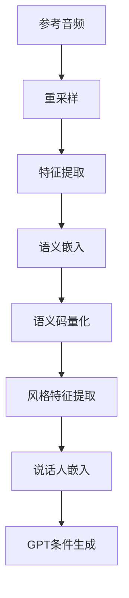

# 零样本语音克隆

<cite>
**本文档中引用的文件**  
- [infer_v2.py](file://indextts/infer_v2.py)
- [maskgct_utils.py](file://indextts/utils/maskgct_utils.py)
- [commons.py](file://indextts/s2mel/modules/commons.py)
</cite>

## 目录
1. [简介](#简介)
2. [零样本语音克隆机制](#零样本语音克隆机制)
3. [IndexTTS2类的推理流程](#indextts2类的推理流程)
4. [语义编码器MaskGCT的作用](#语义编码器maskgct的作用)
5. [公共工具函数在特征提取中的作用](#公共工具函数在特征提取中的作用)
6. [从参考音频到说话人嵌入的完整流程](#从参考音频到说话人嵌入的完整流程)
7. [功能局限性与参考音频要求](#功能局限性与参考音频要求)

## 简介
零样本语音克隆技术允许系统在没有目标说话人先验训练数据的情况下，仅通过一段参考音频即可合成出具有该说话人音色的语音。本技术基于深度学习模型，结合语义编码、声学建模和语音合成等多个模块，实现了高质量的个性化语音生成。本文将深入解析`IndexTTS2`类如何实现这一功能，重点分析其核心组件及工作流程。

## 零样本语音克隆机制
零样本语音克隆的核心在于从参考音频中提取说话人的声学特征，并将其作为条件输入到语音合成模型中。整个过程包括以下几个关键步骤：首先，系统加载预训练的语义编码器（如MaskGCT），用于将参考音频转换为语义特征向量；其次，利用公共工具函数对音频进行预处理和特征提取；最后，将提取的特征传递给GPT模型进行条件生成。这种方法无需针对每个说话人进行专门训练，大大提高了系统的灵活性和实用性。

## IndexTTS2类的推理流程
`IndexTTS2`类是实现零样本语音克隆的主要组件，其`inference`方法负责接收参考音频并提取说话人特征。该方法首先检查缓存中是否存在相同的参考音频，以避免重复计算。如果不存在，则调用`_load_and_cut_audio`方法加载并裁剪音频，然后使用`extract_features`方法提取音频特征。接着，通过`get_emb`方法获取语义嵌入，并结合`semantic_codec`量化器生成语义码。此外，还使用`campplus_model`提取全局风格特征，这些特征共同构成了说话人的嵌入表示。

**Section sources**
- [infer_v2.py](file://indextts/infer_v2.py#L37-L608)

## 语义编码器MaskGCT的作用
`indextts/utils/maskgct_utils.py`中的语义编码器（如MaskGCT）负责将参考音频转换为语义特征向量。具体来说，`build_semantic_model`函数构建了一个基于Wav2Vec2-BERT的语义模型，该模型能够从音频信号中提取高层次的语义信息。`build_semantic_codec`函数则创建了一个RepCodec实例，用于对语义特征进行量化。通过这两个组件的协同工作，系统可以有效地将参考音频映射到一个紧凑的语义空间中，从而为后续的语音合成提供可靠的条件输入。

**Section sources**
- [maskgct_utils.py](file://indextts/utils/maskgct_utils.py#L1-L260)

## 公共工具函数在特征提取中的作用
`indextts/s2mel/modules/commons.py`中的公共工具函数在特征提取和预处理过程中发挥着重要作用。例如，`load_checkpoint2`函数用于加载预训练模型的权重，确保模型能够在推理阶段正确运行。`MyModel`类定义了包含CFM（Conditional Flow Matching）和长度调节器的复合模型结构，其中`forward`方法实现了从输入特征到输出声学参数的映射。此外，`slice_segments`和`rand_slice_segments`等辅助函数提供了灵活的数据切片能力，有助于提高模型训练和推理的效率。

**Section sources**
- [commons.py](file://indextts/s2mel/modules/commons.py#L387-L437)

## 从参考音频到说话人嵌入的完整流程
从参考音频输入到生成说话人嵌入的完整流程如下：首先，系统读取参考音频文件并通过重采样将其转换为统一的采样率（16kHz或22kHz）。然后，使用SeamlessM4T特征提取器提取音频的频谱特征，并通过`get_emb`方法获得语义嵌入。接下来，利用`semantic_codec`对语义嵌入进行量化，得到离散的语义码。同时，通过`campplus_model`提取音频的全局风格特征。最后，将语义码和风格特征拼接起来，形成最终的说话人嵌入，该嵌入被用作GPT模型的条件输入，指导语音合成过程。

**Diagram sources**
- [infer_v2.py](file://indextts/infer_v2.py#L37-L608)
- [maskgct_utils.py](file://indextts/utils/maskgct_utils.py#L1-L260)
- [commons.py](file://indextts/s2mel/modules/commons.py#L387-L437)

## 功能局限性与参考音频要求
尽管零样本语音克隆技术具有很高的灵活性，但仍存在一些局限性。首先，参考音频的质量直接影响生成语音的效果，噪声较多或音量过低的音频可能导致特征提取不准确。其次，由于依赖于预训练模型，对于某些特殊口音或方言的支持可能不够理想。此外，长时间的参考音频可能会导致计算资源消耗过大，影响实时性能。因此，在实际应用中，建议使用清晰、无背景噪音且时长适中的参考音频，以获得最佳的合成效果。

**Section sources**
- [infer_v2.py](file://indextts/infer_v2.py#L37-L608)
- [maskgct_utils.py](file://indextts/utils/maskgct_utils.py#L1-L260)
- [commons.py](file://indextts/s2mel/modules/commons.py#L387-L437)