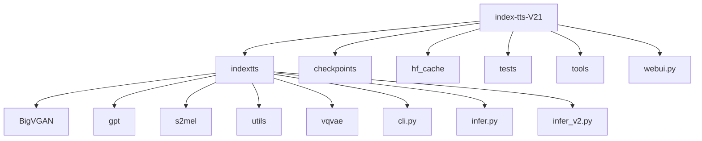
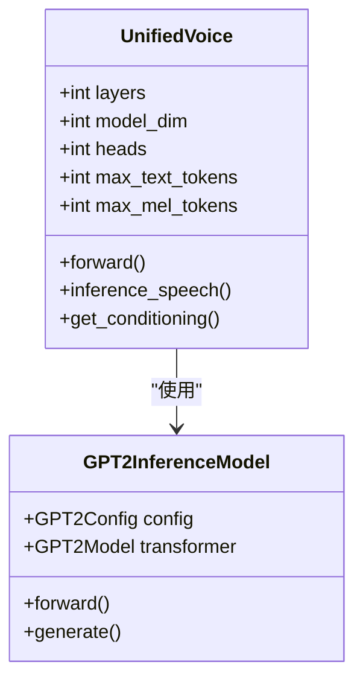
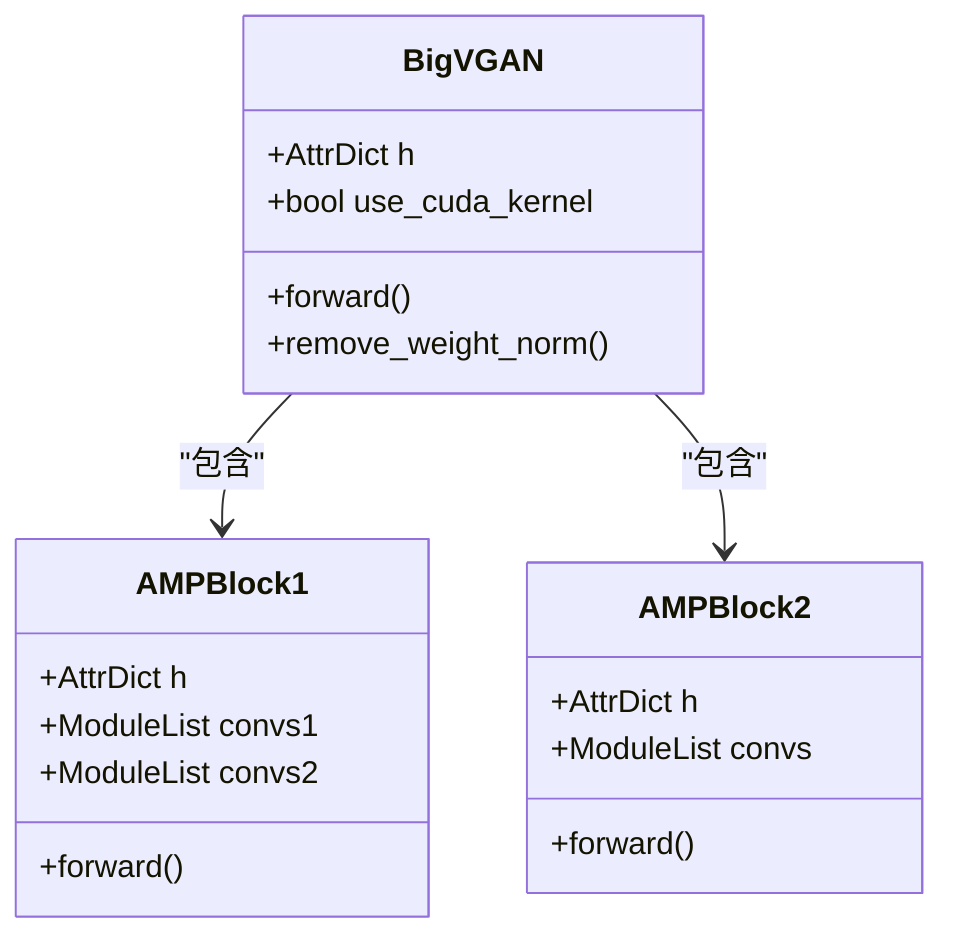
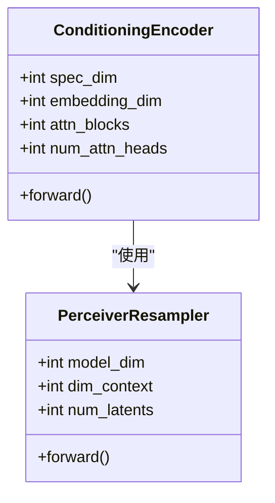

# 项目概述

<cite>
**本文档中引用的文件**   
- [README.md](file://README.md)
- [infer_v2.py](file://indextts/infer_v2.py)
- [model_v2.py](file://indextts/gpt/model_v2.py)
- [bigvgan.py](file://indextts/BigVGAN/bigvgan.py)
- [maskgct_utils.py](file://indextts/utils/maskgct_utils.py)
- [commons.py](file://indextts/s2mel/modules/commons.py)
- [text_utils.py](file://indextts/utils/text_utils.py)
</cite>

## 目录
1. [引言](#引言)
2. [项目结构](#项目结构)
3. [核心功能](#核心功能)
4. [架构设计理念](#架构设计理念)
5. [主要组件分析](#主要组件分析)
6. [使用指南](#使用指南)
7. [目标用户与应用场景](#目标用户与应用场景)
8. [结论](#结论)

## 引言

IndexTTS-V21 是一个先进的零样本语音合成系统，旨在实现高质量、高表现力的语音生成。该项目在语音合成领域具有突破性意义，特别是在情感控制和语音持续时间控制方面。系统通过结合多个深度学习模型，实现了对语音情感、音色和持续时间的精确控制，为研究人员、开发者和内容创作者提供了强大的工具。

## 项目结构



**图示来源**
- [README.md](file://README.md)

**本节来源**
- [README.md](file://README.md)

## 核心功能

IndexTTS-V21 提供了多项创新功能，使其在语音合成领域脱颖而出：

1. **零样本语音克隆**：系统能够通过少量参考音频快速学习并复制特定说话人的音色特征。
2. **情感控制合成**：用户可以通过多种方式控制合成语音的情感表达，包括使用情感参考音频、情感向量或文本描述。
3. **精确的语音持续时间控制**：系统支持两种生成模式，既能精确控制语音持续时间，又能自然地生成语音。
4. **多语言支持**：系统能够处理中英文混合文本，适应多种语言环境。

这些功能使得 IndexTTS-V21 在视频配音、虚拟助手、有声读物等应用场景中具有广泛的应用前景。

**本节来源**
- [README.md](file://README.md)
- [infer_v2.py](file://indextts/infer_v2.py)

## 架构设计理念

IndexTTS-V21 的架构设计体现了模块化和可扩展性的原则。系统采用分层架构，将语音合成过程分解为多个独立但相互协作的组件。这种设计不仅提高了系统的可维护性，还便于未来功能的扩展和优化。

系统的核心设计理念包括：
- **模块化设计**：将不同功能分离到独立的模块中，便于开发和维护。
- **可扩展性**：架构设计允许轻松添加新的功能模块或替换现有组件。
- **高性能**：通过优化模型结构和推理流程，确保系统在保持高质量输出的同时具有良好的性能。

**本节来源**
- [README.md](file://README.md)
- [infer_v2.py](file://indextts/infer_v2.py)

## 主要组件分析

### GPT 模型

GPT 模型是 IndexTTS-V21 的核心组件之一，负责处理文本输入并生成相应的语音表示。该模型基于 Transformer 架构，经过专门训练以适应语音合成任务。



**图示来源**
- [model_v2.py](file://indextts/gpt/model_v2.py)

**本节来源**
- [model_v2.py](file://indextts/gpt/model_v2.py)

### BigVGAN 声码器

BigVGAN 声码器负责将模型生成的语音表示转换为最终的音频波形。该组件采用了先进的神经声码器技术，能够生成高质量、自然的语音。



**图示来源**
- [bigvgan.py](file://indextts/BigVGAN/bigvgan.py)

**本节来源**
- [bigvgan.py](file://indextts/BigVGAN/bigvgan.py)

### 语义编码器

语义编码器负责提取输入音频的语义特征，为语音克隆和情感控制提供基础。该组件结合了多种先进的语音处理技术，能够准确捕捉语音的语义信息。



**图示来源**
- [model_v2.py](file://indextts/gpt/model_v2.py)

**本节来源**
- [model_v2.py](file://indextts/gpt/model_v2.py)

## 使用指南

### 环境设置

使用 IndexTTS-V21 需要以下步骤：

1. 安装必要的依赖：
```bash
uv sync --all-extras
```

2. 下载预训练模型：
```bash
hf download IndexTeam/IndexTTS-2 --local-dir=checkpoints
```

### 基本使用

```python
from indextts.infer_v2 import IndexTTS2
tts = IndexTTS2(cfg_path="checkpoints/config.yaml", model_dir="checkpoints")
text = "这是一个测试文本"
tts.infer(spk_audio_prompt='examples/voice_01.wav', text=text, output_path="gen.wav")
```

**本节来源**
- [README.md](file://README.md)
- [infer_v2.py](file://indextts/infer_v2.py)

## 目标用户与应用场景

### 目标用户

IndexTTS-V21 主要面向以下用户群体：
- **研究人员**：用于语音合成算法的研究和实验。
- **开发者**：集成到各种应用程序中，如虚拟助手、语音导航等。
- **内容创作者**：用于制作有声读物、视频配音等多媒体内容。

### 典型应用场景

1. **语音克隆**：创建个性化的语音助手或虚拟角色。
2. **视频配音**：为视频内容生成自然流畅的配音。
3. **有声读物**：将文本内容转换为高质量的有声读物。
4. **语言学习**：提供标准发音示范，辅助语言学习。

**本节来源**
- [README.md](file://README.md)

## 结论

IndexTTS-V21 作为一个高质量的零样本语音合成系统，在语音自然度、情感表现力和控制精度方面都达到了先进水平。其模块化的架构设计和丰富的功能特性，使其在语音合成领域具有重要的应用价值。随着技术的不断发展，IndexTTS-V21 有望在更多领域发挥重要作用，推动语音合成技术的进步。

**本节来源**
- [README.md](file://README.md)
- [infer_v2.py](file://indextts/infer_v2.py)